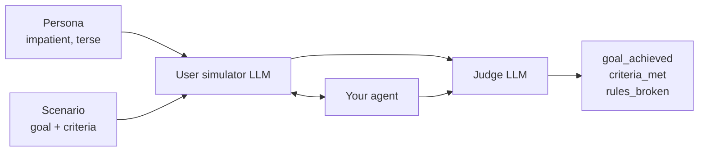

<p align="center">
  
</p>

<p align="center">
  <a href="https://pypi.org/project/evaluatorq/"></a>
  <a href="https://pypi.org/project/evaluatorq/"></a>
  <a href="https://github.com/orq-ai/evaluatorq/actions/workflows/ci.yml"></a>
  <a href="https://htmlpreview.github.io/?https://github.com/orq-ai/evaluatorq/blob/python-coverage-comment-action-data/htmlcov/index.html"></a>
  <a href="https://orq-ai.github.io/evaluatorq/"></a>
  <a href="https://github.com/orq-ai/evaluatorq/blob/main/LICENSE"></a>
</p>

<p align="center">
  <b>Find out how your AI agent breaks — before your users do.</b>
</p>

<p align="center">
  <a href="https://orq-ai.github.io/evaluatorq/">Documentation</a> ·
  <a href="https://orq-ai.github.io/evaluatorq/guides/getting-started/">Get Started</a> ·
  <a href="https://orq-ai.github.io/evaluatorq/guides/red-teaming/">Red Teaming</a> ·
  <a href="https://orq-ai.github.io/evaluatorq/guides/agent-simulation/">Agent Simulation</a> ·
  <a href="https://orq-ai.github.io/evaluatorq/dashboard/">Dashboard</a>
</p>

Shipping an agent means answering three questions no test suite answers: does it give good answers, can it be talked into doing something it shouldn't, and does it hold up over a real conversation with an impatient human? evaluatorq answers all three from Python. It scores your agent's outputs against your data, attacks it the way a bad actor would — jailbreaks, prompt injection, tool abuse, data exfiltration — and puts a simulated user in front of it for a few dozen turns. Then it hands you a report naming what broke and what to do about it.

It runs locally against any agent — LangChain, LangGraph, OpenAI Agents SDK, PydanticAI, CrewAI, a plain async function, or an Orq-hosted agent. Nothing leaves your machine unless you opt into the [Orq](https://orq.ai) platform.


## Install

```bash
uv add evaluatorq                     # core evaluation
uv add "evaluatorq[redteam]"          # + adversarial red teaming
uv add "evaluatorq[simulation]"       # + multi-turn agent simulation
uv add "evaluatorq[all]"              # everything, including the dashboard
```

New here? Take the first line — it and the quick start below need no API key and no account (set `ORQ_API_KEY` and results also upload to Orq). On pip: `python -m pip install evaluatorq`.

## Quick start

Two versions of a support agent, the same questions, one table telling you which one to ship:

```python
import asyncio

from evaluatorq import DataPoint, evaluatorq, job, string_contains_evaluator

POLICY = {
    "refund": "Refunds are available within 30 days of delivery.",
    "ship": "Orders ship within 2 business days.",
    "warranty": "Every device carries a 12 months warranty.",
}


@job("agent-v1")
async def agent_v1(data: DataPoint, _row: int) -> str:
    """Answers from memory — so it only really knows about refunds."""
    question = str(data.inputs["question"]).lower()
    if "refund" in question:
        return "Sure — you can request a refund within 30 days of delivery."
    return "Our support team is happy to help with that."


@job("agent-v2")
async def agent_v2(data: DataPoint, _row: int) -> str:
    """Looks the answer up in the support policy first."""
    question = str(data.inputs["question"]).lower()
    for topic, answer in POLICY.items():
        if topic in question:
            return answer
    return "Our support team is happy to help with that."


async def main():
    data = [
        DataPoint(inputs={"question": "How do I get a refund?"}, expected_output="30 days"),
        DataPoint(inputs={"question": "When will my order ship?"}, expected_output="2 business days"),
        DataPoint(inputs={"question": "How long is the warranty?"}, expected_output="12 months"),
    ]
    await evaluatorq(
        "support-agent-eval",
        data=data,
        jobs=[agent_v1, agent_v2],
        evaluators=[string_contains_evaluator()],
        parallelism=3,
    )


asyncio.run(main())
```

```bash
uv run support_agent_eval.py
```


Every job runs against every data point, so adding a variant adds a column. Swap the two function bodies for real model or agent calls and nothing else changes. The library returns results even when an evaluator returns `pass_=False`, so this example exits 0. To gate CI, check `pass_` with `check_pass_failures(results)` and raise `SystemExit(1)` in your script.

This is the repo's [`examples/lib/basics/support_agent_eval.py`](examples/lib/basics/support_agent_eval.py), minus its `__main__` guard.

→ [Getting Started](https://orq-ai.github.io/evaluatorq/guides/getting-started/) ·
[Evaluation reference](https://orq-ai.github.io/evaluatorq/evaluation-reference/) ·
[Structured scores](https://orq-ai.github.io/evaluatorq/structured-results/) ·
[LLM as a jury](https://orq-ai.github.io/evaluatorq/llm-as-a-jury/)

## Red teaming

**19 OWASP categories · 18 vulnerabilities · 45 curated attack strategies · 16 delivery methods · 18 LLM judges.** evaluatorq inspects the target, picks attack strategies per vulnerability, generates the prompts, runs them (single- or multi-turn), and judges each response with an evaluator written for that specific vulnerability.

| OWASP Agentic Top 10 | OWASP LLM Top 10 |
|---|---|
| ASI01 Agent Goal Hijacking | LLM01 Prompt Injection |
| ASI02 Tool Misuse & Exploitation | LLM02 Sensitive Information Disclosure |
| ASI03 Identity & Privilege Abuse | LLM03 Supply Chain Vulnerabilities |
| ASI04 Supply Chain Vulnerabilities | LLM04 Data and Model Poisoning |
| ASI05 Unexpected Code Execution | LLM05 Improper Output Handling |
| ASI06 Memory & Context Poisoning | LLM06 Excessive Agency |
| ASI07 Insecure Inter-Agent Communication | LLM07 System Prompt Leakage |
| ASI08 Cascading Failures | LLM08 Vector and Embedding Weaknesses |
| ASI09 Human-Agent Trust Exploitation | LLM09 Misinformation |
| ASI10 Rogue Agents | |

Each category maps to a vulnerability with its own judge. Categories without curated strategies get them generated per-run against the target's actual tools and system prompt — see the [strategy coverage table](https://orq-ai.github.io/evaluatorq/guides/red-teaming/#coverage).

```python
import asyncio

from evaluatorq.redteam import red_team


async def main():
    report = await red_team(
        "agent:my-agent-key",
        categories=["LLM01", "ASI01", "ASI02"],  # injection + agentic tool/memory abuse
        max_dynamic_datapoints=5,
        max_turns=3,
    )
    rate = report.summary.resistance_rate  # None when no attack could be evaluated
    print(f"Resistance rate: {rate:.0%}" if rate is not None else "Resistance rate: no verdict")
    print(f"Vulnerabilities found: {report.summary.vulnerabilities_found}")


asyncio.run(main())
```

Targets can be an Orq agent (`"agent:<key>"`), an Orq deployment (`"deployment:<key>"`), a raw model (`OpenAIModelTarget("openai/gpt-5.4-mini")`), or an agent from an external framework. Every attack, response and verdict is browsable afterwards:


Findings come back ranked by `risk = attack success rate × average severity`, each with a recommended fix — see [Focus areas](docs/assets/dashboard/redteam-05-focus-areas.png).

### What a run costs

Measured wall clock and token counts from two runs against Orq-hosted agents, attacked and judged by `gpt-5-mini` at `parallelism=10`:

| Run | Attacks | Wall clock | Tokens | Tokens per attack |
|---|---|---|---|---|
| Hybrid, 10 categories, 2 agents | 40 | 2m 26s | 481k | 12k |
| Dynamic, 3 categories, 1 agent | 10 | 2m 12s | 88k | 9k |

Attacks run concurrently, so wall clock tracks the slowest attack far more than the attack count — quadrupling the sweep cost twelve seconds. Budget a few cents for a run this size at `gpt-5-mini` prices; roughly 40% of the tokens are the judge's, and both the attacker and judge models are configurable, so pointing them at a cheaper model moves the bill directly. Two runs is not a benchmark — treat these as an order of magnitude.

To price a run you have not made yet, the [cost calculator](https://orq-ai.github.io/evaluatorq/guides/red-teaming/#ballpark-the-cost) takes the three numbers that vary — setup calls, attacks, turns — and a price tier.

→ [Red teaming guide](https://orq-ai.github.io/evaluatorq/guides/red-teaming/) ·
[Intro notebook](examples/red_teaming_intro.ipynb) ·
[Example scripts](examples/redteam/)

## Agent simulation

The non-adversarial counterpart: a user-simulator LLM plays a persona pursuing a goal across a multi-turn conversation, and a judge LLM scores each run against your criteria. Cross every persona with every scenario and the weak spot names itself:


An agent that looks fine on four scenarios falls over on the fifth. Fix it, re-run the same frozen set, and the difference is the point — and because the conversation runs to eight turns, it catches the failures that only appear deep in a dialogue, where single-prompt testing never looks.



```python
from evaluatorq.simulation import simulate

results = await simulate(
    evaluation_name="support-agent-sim",
    target="agent:my-support-agent",   # or any local async callable
    personas=[persona],
    scenarios=[scenario],
    max_turns=8,
)
print(results[0].goal_achieved, results[0].goal_completion_score)
```

Simulation owns its `exit_on_failure=True` gate for dropped rows, so it can drop straight into CI; evaluator score failures remain available in the returned results. The target can be an Orq agent or any local async callable, including agents built with the OpenAI Agents SDK, LangGraph, CrewAI or PydanticAI — [the examples](examples/agent_simulation/) cover each, with screen recordings.

→ [Agent simulation guide](https://orq-ai.github.io/evaluatorq/guides/agent-simulation/) ·
[Intro notebook](examples/agent_simulation_intro.ipynb) ·
[Example scripts](examples/agent_simulation/)

## Dashboard

Every red team and simulation run is saved locally. `eq dashboard` serves them all — filter findings, read transcripts, compare runs, export HTML/CSV/JSON.

```bash
eq dashboard
```


→ [Dashboard guide](https://orq-ai.github.io/evaluatorq/dashboard/)

## CLI

The package installs `eq` (and its longer alias `evaluatorq`):

```bash
eq redteam run --target agent:my-agent   # red team an agent
eq sim run --target agent:my-agent       # generate personas/scenarios and simulate
eq dashboard                             # browse saved runs
eq --help
```

→ [CLI reference](https://orq-ai.github.io/evaluatorq/cli-reference/overview/)

## Configuration

Everything is environment variables; none are required for local evaluation. `ORQ_API_KEY` unlocks Orq datasets, result upload and automatic tracing; `OPENAI_API_KEY` backs red teaming and simulation without Orq.

→ [Configuration](https://orq-ai.github.io/evaluatorq/configuration/) ·
[Tracing](https://orq-ai.github.io/evaluatorq/tracing/)

## Development

[uv](https://docs.astral.sh/uv/) manages the environment, [ruff](https://docs.astral.sh/ruff/) lints and formats, [basedpyright](https://docs.basedpyright.com/) type-checks, and pytest runs the suite:

```bash
uv sync --all-extras --all-groups   # every extra plus the dev tooling
uv run pytest -m 'not integration'  # the unit suite; integration tests need ORQ_API_KEY
uv run ruff check src && uv run ruff format src
uv run basedpyright                 # the whole repo, tests included
```

CI runs exactly those four commands, so a clean local run is a clean PR. The package supports Python 3.10 and up, and releases are cut from git tags — commit messages follow [Conventional Commits](https://www.conventionalcommits.org) and decide the next version, so `feat:` and `fix:` ship and `docs:` does not.

Contributions welcome — see [CONTRIBUTING.md](CONTRIBUTING.md). MIT licensed.
