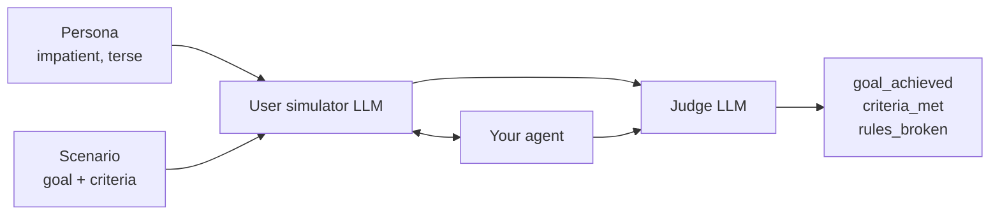

<p align="center">
  
</p>

<p align="center">
  <a href="https://pypi.org/project/evaluatorq/"></a>
  <a href="https://pypi.org/project/evaluatorq/"></a>
  <a href="https://github.com/orq-ai/evaluatorq/actions/workflows/ci.yml"></a>
  <a href="https://htmlpreview.github.io/?https://github.com/orq-ai/evaluatorq/blob/python-coverage-comment-action-data/htmlcov/index.html"></a>
  <a href="https://orq-ai.github.io/evaluatorq/"></a>
  <a href="https://github.com/orq-ai/evaluatorq/blob/main/LICENSE"></a>
</p>

<p align="center">
  <b>Find out how your AI agent breaks — before your users do.</b>
</p>

<p align="center">
  <a href="https://orq-ai.github.io/evaluatorq/">Documentation</a> ·
  <a href="https://orq-ai.github.io/evaluatorq/guides/getting-started/">Get Started</a> ·
  <a href="https://orq-ai.github.io/evaluatorq/guides/red-teaming/">Red Teaming</a> ·
  <a href="https://orq-ai.github.io/evaluatorq/guides/agent-simulation/">Agent Simulation</a> ·
  <a href="https://orq-ai.github.io/evaluatorq/dashboard/">Dashboard</a>
</p>

Shipping an agent means answering three questions no test suite answers: does it
give good answers, can it be talked into doing something it shouldn't, and does
it still hold up over a real multi-turn conversation with an impatient human?
evaluatorq answers all three from Python — score outputs against your data,
attack the agent with OWASP-mapped adversarial probes, and put a simulated user
in front of it — then hands you a report you can act on. It works against any
agent (LangChain, LangGraph, OpenAI Agents SDK, PydanticAI, CrewAI, a plain
async function, or an Orq-hosted agent); the [Orq](https://orq.ai) platform is
optional.


## Install

```bash
uv add evaluatorq                     # core evaluation
uv add "evaluatorq[redteam]"          # + adversarial red teaming
uv add "evaluatorq[simulation]"       # + multi-turn agent simulation
```

New here? `uv add evaluatorq` and the quick start below need no API key and no
account. Prefer pip: `python -m pip install evaluatorq`.

## Quick start

```python
import asyncio

from evaluatorq import DataPoint, evaluatorq, job, string_contains_evaluator


@job("uppercase-converter")
async def uppercase_job(data: DataPoint, _row: int) -> str:
    return str(data.inputs.get("text", "")).upper()


async def main():
    data = [
        DataPoint(inputs={"text": "hello world"}, expected_output="HELLO"),
        DataPoint(inputs={"text": "python is great"}, expected_output="PYTHON"),
    ]
    await evaluatorq(
        "simple-local-eval",
        data=data,
        jobs=[uppercase_job],
        evaluators=[string_contains_evaluator()],
        parallelism=3,
    )


asyncio.run(main())
```

```bash
uv run my_eval.py
```


Swap `uppercase_job` for your own agent call and you have a real evaluation.
When an evaluator returns `pass_=False` the process exits non-zero, so the same
script gates CI.

→ [Getting Started](https://orq-ai.github.io/evaluatorq/guides/getting-started/) ·
[Evaluation reference](https://orq-ai.github.io/evaluatorq/evaluation-reference/) ·
[Structured scores](https://orq-ai.github.io/evaluatorq/structured-results/) ·
[LLM as a jury](https://orq-ai.github.io/evaluatorq/llm-as-a-jury/)

## Red teaming

Adaptive adversarial testing mapped to the OWASP LLM Top 10 and OWASP Agentic
Security Initiative. evaluatorq inspects the target, picks attack strategies per
vulnerability, generates the prompts, runs them (single- or multi-turn), and
judges each response with an LLM evaluator.

```python
import asyncio

from evaluatorq.redteam import red_team


async def main():
    report = await red_team(
        "agent:my-agent-key",
        categories=["LLM01", "ASI01", "ASI02"],
        max_dynamic_datapoints=5,
        max_turns=3,
    )
    print(f"Resistance rate: {report.summary.resistance_rate:.0%}")
    print(f"Vulnerabilities: {report.summary.vulnerabilities_found}")


asyncio.run(main())
```

Targets can be an Orq agent (`"agent:<key>"`), an Orq deployment
(`"deployment:<key>"`), a raw model (`OpenAIModelTarget("openai/gpt-5.4-mini")`),
or an agent from an external framework. Every attack, response and verdict is
browsable afterwards:


→ [Red teaming guide](https://orq-ai.github.io/evaluatorq/guides/red-teaming/) ·
[Intro notebook](examples/red_teaming_intro.ipynb) ·
[Example scripts](examples/redteam/)

## Agent simulation

The non-adversarial counterpart: a user-simulator LLM plays a persona pursuing a
goal across a multi-turn conversation, and a judge LLM scores each run against
your criteria.



```python
from evaluatorq.simulation import simulate

results = await simulate(
    evaluation_name="support-agent-sim",
    target="agent:my-support-agent",   # or any local async callable
    personas=[persona],
    scenarios=[scenario],
    max_turns=8,
)
print(results[0].goal_achieved, results[0].goal_completion_score)
```

Runs exit non-zero on failure by default (`exit_on_failure=True`), so they drop
straight into CI. Recordings of simulations driving agents in four frameworks:
[OpenAI Agents SDK](docs/assets/sim-openai-agents.mp4) ·
[LangGraph](docs/assets/sim-langgraph.mp4) ·
[CrewAI](docs/assets/sim-crewai.mp4) ·
[PydanticAI](docs/assets/sim-pydantic-ai.mp4)

→ [Agent simulation guide](https://orq-ai.github.io/evaluatorq/guides/agent-simulation/) ·
[Intro notebook](examples/agent_simulation_intro.ipynb) ·
[Example scripts](examples/agent_simulation/)

## Dashboard

Every red team and simulation run is saved locally. `eq dashboard` serves them
all — filter findings, read transcripts, compare runs, export HTML/CSV/JSON.

```bash
eq dashboard
```


→ [Dashboard guide](https://orq-ai.github.io/evaluatorq/dashboard/)

## CLI

The package installs `eq` (and its longer alias `evaluatorq`):

```bash
eq redteam run -t agent:my-agent     # red team an agent
eq sim run -t agent:my-agent         # generate personas/scenarios and simulate
eq dashboard                         # browse saved runs
eq --help
```

→ [CLI reference](https://orq-ai.github.io/evaluatorq/cli-reference/overview/)

## Configuration

Everything is environment variables; none are required for local evaluation.
`ORQ_API_KEY` unlocks Orq datasets, result upload and automatic tracing;
`OPENAI_API_KEY` backs red teaming and simulation without Orq.

→ [Configuration](https://orq-ai.github.io/evaluatorq/configuration/) ·
[Tracing](https://orq-ai.github.io/evaluatorq/tracing/)

## Development

```bash
uv sync --all-extras --all-groups
uv run pytest -m 'not integration'
uv run ruff check src
uv run basedpyright
uv run --group docs mkdocs serve      # docs at http://127.0.0.1:8000/evaluatorq/
```

Contributions welcome — see [CONTRIBUTING.md](CONTRIBUTING.md).

## License

MIT — see [LICENSE](LICENSE).
