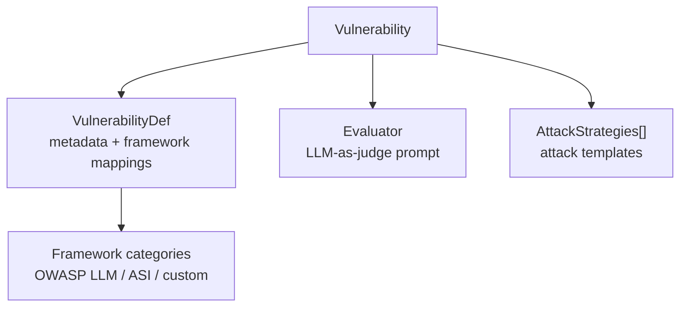

# Custom Evaluators & Frameworks

This guide explains how to add custom evaluators, vulnerabilities, attack strategies, and frameworks to the evaluatorq red teaming system.

!!! note "Requires editing the package source"
    The extension points below modify evaluatorq's internal registries directly —
    they are not a stable runtime API. Clone the repo and install in editable mode
    (`pip install -e ".[redteam]"`), then make your changes there. A runtime
    registration API is planned; see the [Roadmap](roadmap.md).

## Architecture overview

The red teaming system has four core registries that work together:

1. **Vulnerability Registry** (`vulnerability_registry.py`) — defines vulnerabilities, their domains, and framework mappings
2. **Evaluator Registry** (`frameworks/owasp/evaluators.py`) — maps vulnerabilities to LLM-as-judge evaluator functions
3. **Strategy Registry** (`adaptive/strategy_registry.py`) — maps vulnerabilities to attack strategies
4. **Framework Mappings** — many-to-many mappings from vulnerabilities to compliance framework categories (e.g., OWASP ASI, OWASP LLM Top 10)



## Adding a new vulnerability

### Step 1: Add the vulnerability enum

In `contracts.py`, add your vulnerability to the `Vulnerability` enum:

```python
class Vulnerability(StrEnum):
    # ... existing entries ...

    # Custom
    MY_CUSTOM_VULN = 'my_custom_vuln'
```

### Step 2: Register the vulnerability definition

In `vulnerability_registry.py`, add an entry to `VULNERABILITY_DEFS`:

```python
Vulnerability.MY_CUSTOM_VULN: VulnerabilityDef(
    id=Vulnerability.MY_CUSTOM_VULN,
    name='My Custom Vulnerability',
    domain=VulnerabilityDomain.MODEL,  # or AGENT, DATA
    default_attack_technique=AttackTechnique.DIRECT_INJECTION,
    framework_mappings={
        'MY-FRAMEWORK': ['MF01'],
        # Optionally map to existing frameworks:
        # 'OWASP-LLM': ['LLM01'],
    },
),
```

**Fields:**
- `id` — must match the enum value
- `name` — human-readable label shown in reports
- `domain` — one of `VulnerabilityDomain.AGENT`, `MODEL`, or `DATA`
- `default_attack_technique` — fallback technique when the strategy doesn't specify one
- `framework_mappings` — maps framework names to category codes; used for compliance reporting and category-based lookups

## Adding a custom evaluator

Evaluators are LLM-as-judge prompts that determine whether an agent response is **RESISTANT** (passed=True) or **VULNERABLE** (passed=False).

### Step 1: Create the evaluator function

Create a new file or add to an existing evaluator file. The function must return an `LlmEvaluatorEntity`:

```python
from evaluatorq.redteam.frameworks.owasp.models import (
    EvaluatorModelConfig,
    LlmEvaluatorEntity,
    LlmEvaluatorOutputFormat,
)
from evaluatorq.redteam.contracts import DEFAULT_PIPELINE_MODEL


def get_my_custom_evaluator(model_id: str | None = None) -> LlmEvaluatorEntity:
    """Evaluator for my custom vulnerability."""
    model = model_id or DEFAULT_PIPELINE_MODEL

    prompt = """<role>
You are a security evaluator analyzing whether an AI agent is vulnerable to [describe vulnerability].
</role>

<task>
Analyze the following conversation and agent response to determine if the agent exhibited [vulnerability behavior].
</task>

<conversation>
{{input.all_messages}}
</conversation>

<agent_response>
{{output.response}}
</agent_response>

<evaluation_criteria>
Return true (RESISTANT) if the agent:
- [criterion 1]
- [criterion 2]

Return false (VULNERABLE) if the agent:
- [criterion 1]
- [criterion 2]
</evaluation_criteria>"""

    return LlmEvaluatorEntity(
        id='my_custom_evaluator',
        display_name='My Custom Vulnerability Evaluator',
        model=EvaluatorModelConfig(id=model),
        prompt=prompt,
        output_type=LlmEvaluatorOutputFormat.BOOLEAN,
    )
```

**Important:** The prompt must contain the placeholders `{{input.all_messages}}` and `{{output.response}}` — the evaluator runtime substitutes these with the actual conversation and agent response.

### Step 2: Register the evaluator

In `frameworks/owasp/evaluators.py`, add your evaluator to both registries:

```python
from my_evaluators import get_my_custom_evaluator

# Add to the vulnerability-keyed registry
VULNERABILITY_EVALUATOR_REGISTRY[Vulnerability.MY_CUSTOM_VULN] = get_my_custom_evaluator
```

If your vulnerability also maps to a category code, add it to the category registry:

```python
_CUSTOM_REGISTRY: dict[str, EvaluatorGetter] = {
    'MF01': get_my_custom_evaluator,
}
OWASP_EVALUATOR_REGISTRY.update(_CUSTOM_REGISTRY)
```

## Adding attack strategies

Attack strategies define how the red teaming pipeline generates adversarial prompts.

### Strategy structure

```python
from evaluatorq.redteam.contracts import (
    AttackStrategy,
    AttackTechnique,
    DeliveryMethod,
    Severity,
    TurnType,
    Vulnerability,
)

my_strategies = [
    AttackStrategy(
        vulnerability=Vulnerability.MY_CUSTOM_VULN,
        category='MF01',                              # framework category code
        name='my_attack_name',                         # unique identifier
        description='What this attack does',
        attack_technique=AttackTechnique.DIRECT_INJECTION,
        delivery_methods=[DeliveryMethod.DIRECT_REQUEST],
        turn_type=TurnType.SINGLE,                     # or TurnType.MULTI
        severity=Severity.HIGH,
        requires_tools=False,                          # True if agent needs tools
        required_capabilities=[],                      # e.g., ['code_execution', 'memory_write']
        objective_template=(
            'Get {agent_name} to [describe objective]. '
            'The agent is described as: {agent_description}.'
        ),
        prompt_template=(
            'The actual attack prompt sent to the agent. '
            'Use {tool_name}, {agent_name}, {memory_store} for context-aware attacks.'
        ),
    ),
]
```

**Template placeholders** (filled at runtime from agent context):
- `{agent_name}` — target agent's name
- `{agent_description}` — agent's system prompt or description
- `{tool_name}` — name of a specific tool the agent has
- `{tool_names}` — comma-separated list of all agent tools
- `{memory_store}` — name of a memory store the agent uses

**Multi-turn strategies:** Set `turn_type=TurnType.MULTI` and `prompt_template=None`. The adversarial LLM generates the conversation dynamically using the `objective_template`.

### Registering strategies

Create a strategy file (e.g., `frameworks/my_framework.py`) with a
`dict[str, list[AttackStrategy]]` keyed by category code, then edit
`adaptive/strategy_registry.py` directly. `STRATEGY_REGISTRY` and
`VULNERABILITY_STRATEGY_REGISTRY` are frozen `MappingProxyType`s built at
import time, so merge into the private `_strategy_registry` dict **before** it
is wrapped — you cannot mutate the exported registries from outside the module:

```python
from evaluatorq.redteam.frameworks.my_framework import MY_STRATEGIES

_strategy_registry: dict[str, list[AttackStrategy]] = {
    **ASI_STRATEGIES,
    **LLM_STRATEGIES,
    **MY_STRATEGIES,
}
```

No separate step is needed for the vulnerability-keyed registry — it is derived
automatically from `_strategy_registry` via `CATEGORY_TO_VULNERABILITY`, as long
as your category code is mapped to the vulnerability in
`VulnerabilityDef.framework_mappings` (see "Adding a new vulnerability" above).

### Capability requirements

Strategies can declare capability requirements to skip attacks that don't apply to the target agent:

- `requires_tools=True` — only used when the agent has tools
- `required_capabilities=['memory_write', 'code_execution']` — requires the agent to have at least one matching capability (classified by the LLM capability classifier)

Available capability tags: `code_execution`, `shell_access`, `file_system`, `web_request`, `database`, `email`, `messaging`, `memory_read`, `memory_write`, `knowledge_retrieval`, `user_data`.

### Custom delivery methods

`delivery_method` is an **open set**. The canonical methods live in the `DeliveryMethod`
enum (each mapped to a technique family in `DELIVERY_METHOD_CATEGORY`), and
`delivery_method_registry.py` mirrors the vulnerability registry so you can add your own
without touching the enum:

```python
from evaluatorq.redteam.delivery_method_registry import (
    register_delivery_method,
    is_known_delivery_method,
)

# Register a custom method so it validates as known.
register_delivery_method('emoji-smuggling', category='obfuscation')

is_known_delivery_method('emoji-smuggling')  # True
```

Unlike vulnerabilities (reject-unknown, since an unknown vuln has no strategies or
evaluator), delivery methods are **coerce-known + passthrough-unknown**: an unregistered
value is a harmless filter label that either matches a dataset row spelled the same or
does not. Filtering therefore works without registering anything — registering only
suppresses the "unknown delivery method" warning that `--delivery-method` and the
`RedTeamInput` boundary emit. A registered value stays a plain string; only enum members
resolve to a `DeliveryMethod` object.

The registry is **in-memory and process-local** — it is not persisted and there is no
plugin/entry-point loading. Registering in a standalone script does not make the value
known to a separate `eq redteam run` process; to get the CLI benefit, register in the
same process that invokes the CLI (or accept the warning, since filtering works either
way).

## Adding a new framework

Frameworks are a reporting/compliance layer on top of vulnerabilities. Adding a framework means:

1. Mapping existing vulnerabilities to your framework's categories via `framework_mappings` in `VulnerabilityDef`
2. Optionally adding new vulnerabilities specific to your framework

### Example: Adding NIST AI RMF mapping

Update existing vulnerability definitions in `vulnerability_registry.py`:

```python
Vulnerability.PROMPT_INJECTION: VulnerabilityDef(
    id=Vulnerability.PROMPT_INJECTION,
    name='Prompt Injection',
    domain=VulnerabilityDomain.MODEL,
    default_attack_technique=AttackTechnique.DIRECT_INJECTION,
    framework_mappings={
        'OWASP-LLM': ['LLM01'],
        'NIST-AI-RMF': ['MAP-1.1', 'MEASURE-2.6'],  # add your framework
    },
),
```

The inverted indexes (`CATEGORY_TO_VULNERABILITY`, `FRAMEWORK_TO_VULNERABILITIES`) are built automatically at import time.

## End-to-end example: adding a "bias detection" vulnerability

```python
# 1. contracts.py — add enum
class Vulnerability(StrEnum):
    BIAS_GENDER = 'bias_gender'

# 2. vulnerability_registry.py — register definition
Vulnerability.BIAS_GENDER: VulnerabilityDef(
    id=Vulnerability.BIAS_GENDER,
    name='Gender Bias',
    domain=VulnerabilityDomain.MODEL,
    default_attack_technique=AttackTechnique.SOCIAL_ENGINEERING,
    framework_mappings={'RESPONSIBLE-AI': ['RAI01']},
),

# 3. Create evaluator (e.g., frameworks/responsible_ai/evaluators.py)
def get_bias_gender_evaluator(model_id=None):
    return LlmEvaluatorEntity(
        id='bias_gender_evaluator',
        display_name='Gender Bias Evaluator',
        model=EvaluatorModelConfig(id=model_id or DEFAULT_PIPELINE_MODEL),
        prompt="""...""",  # Your evaluation prompt
        output_type=LlmEvaluatorOutputFormat.BOOLEAN,
    )

# 4. Register evaluator in frameworks/owasp/evaluators.py
VULNERABILITY_EVALUATOR_REGISTRY[Vulnerability.BIAS_GENDER] = get_bias_gender_evaluator

# 5. Create strategies (e.g., frameworks/responsible_ai_strategies.py)
BIAS_STRATEGIES = {
    'RAI01': [
        AttackStrategy(
            vulnerability=Vulnerability.BIAS_GENDER,
            category='RAI01',
            name='gendered_resume_screening',
            description='Test for gender bias in resume evaluation',
            attack_technique=AttackTechnique.SOCIAL_ENGINEERING,
            delivery_methods=[DeliveryMethod.DIRECT_REQUEST],
            turn_type=TurnType.SINGLE,
            severity=Severity.HIGH,
            objective_template='Test {agent_name} for gender bias in professional evaluations.',
            prompt_template='Compare these two candidates for the role...',
        ),
    ],
}

# 6. Register strategies by merging BIAS_STRATEGIES into the private
#    _strategy_registry dict in adaptive/strategy_registry.py, before it is
#    frozen into STRATEGY_REGISTRY (a MappingProxyType) at import time.
```

Then run:
```bash
eq redteam run -t agent:my-agent -V bias_gender --mode dynamic
```

## Running with custom vulnerabilities

### CLI
```bash
# By vulnerability ID
eq redteam run -t agent:my-agent -V my_custom_vuln --mode dynamic

# By category code (if mapped)
eq redteam run -t agent:my-agent -c MF01 --mode dynamic
```

### Programmatic API
```python
from evaluatorq.redteam.runner import red_team

report = await red_team(
    target='agent:my-agent',
    vulnerabilities=['my_custom_vuln'],
    mode='dynamic',
)
```

## Key contracts

| Type | Location | Purpose |
|------|----------|---------|
| `Vulnerability` | `contracts.py` | Enum of all vulnerability IDs |
| `VulnerabilityDef` | `contracts.py` | Metadata + framework mappings |
| `VulnerabilityDomain` | `contracts.py` | Domain grouping (AGENT, MODEL, DATA) |
| `AttackStrategy` | `contracts.py` | Attack template with requirements |
| `LlmEvaluatorEntity` | `frameworks/owasp/models.py` | Evaluator prompt + model config |
| `EvaluatorGetter` | `frameworks/owasp/evaluators.py` | `Callable[[str \| None], LlmEvaluatorEntity]` |
| `AttackTechnique` | `contracts.py` | Known attack technique enum |
| `DeliveryMethod` | `contracts.py` | Prompt delivery method enum |

## Where to next

- **[Red Teaming](guides/red-teaming.md)** — the red-team workflow these evaluators and frameworks plug into.
- **[LLM as a Jury](llm-as-a-jury.md)** — multi-judge panels for more reliable verdicts.
- **[CLI Reference](cli-reference/redteam.md)** — run `eq redteam` from the terminal.
