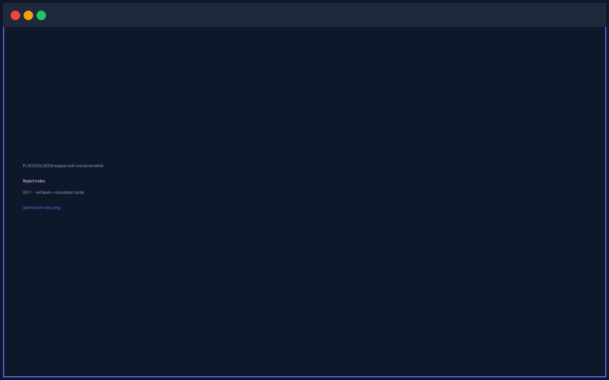
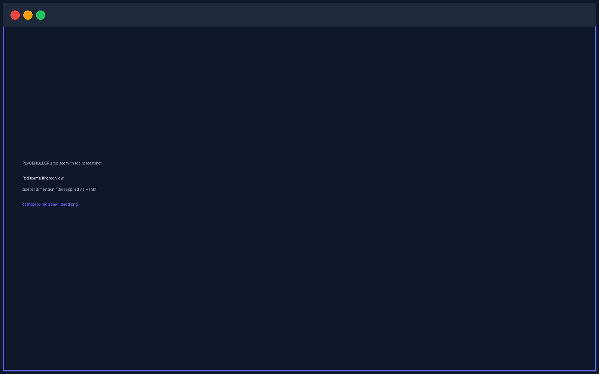
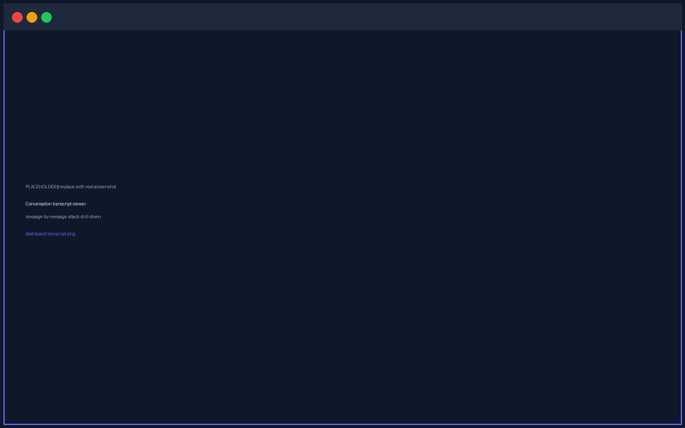

# Dashboard

evaluatorq ships a built-in web dashboard for browsing red team and simulation
reports.  It is powered by **FastHTML** (a lightweight Python web framework)
and served locally via **uvicorn**.  There is no external service dependency —
everything runs on your machine.

<!-- SCREENSHOT (replace placeholder file, keep the same name):
     the report index at GET / showing a mix of red team + simulation cards.
     Capture: `eq dashboard` with reports in .evaluatorq/runs (+ .evaluatorq/sim-runs). -->
{ .dashboard-shot }

## Install

The dashboard is an optional extra (it pulls in `python-fasthtml` and
`uvicorn`):

```bash
pip install "evaluatorq[dashboard]"
# or — if you already have the redteam / simulation extras:
pip install "evaluatorq[redteam,dashboard]"
```

With `uv`:

```bash
uv add "evaluatorq[dashboard]"
```

## Launch

Launch it with `eq dashboard` (the `evaluatorq` and `eq` entry points are
interchangeable):

```bash
# Browse both default stores at once — red team + simulation
eq dashboard

# Scope to a directory of exported reports, or a single report file
eq dashboard /path/to/my/reports
eq dashboard .evaluatorq/runs/red-team_20260626_143024.json

# Bind a custom host / port (default 127.0.0.1:8080)
eq dashboard --host 0.0.0.0 --port 8888
```

| Invocation | What it scans |
|---|---|
| `eq dashboard` | Both default stores: `.evaluatorq/runs` (red team) and `.evaluatorq/sim-runs` (simulation) |
| `eq dashboard PATH` | Only that directory; pass a file to scope to its parent and print the report's direct URL |

With no `PATH` the server prints the local URL to open. Pointing at a file
prints that report's direct URL so you land straight on it.

!!! note "Legacy Streamlit views"
    `eq redteam ui` and `eq sim ui` launch the older Streamlit dashboards,
    scoped to a single surface. The FastHTML `eq dashboard` documented here is
    the preview replacement that browses both surfaces together. The CLI surface
    is still being consolidated — see the [CLI Reference](cli-reference.md).

---

## What the dashboard browses

The dashboard auto-discovers JSON report files in the configured root
directories:

| Default store | Written by |
|---|---|
| `.evaluatorq/runs/*.json` | `red_team()` / `eq redteam run` |
| `.evaluatorq/sim-runs/*.json` | `eq sim run` (auto-saves unless `--no-save`); `simulate()` only when called with `save=True` |

Each report gets a stable URL for the lifetime of its file, so links you share
keep working.

### Supported surfaces

| Surface | JSON discriminator | Rendered by |
|---|---|---|
| Red team | `"pipeline"` key present | `redteam/reports/export_html.py` |
| Simulation | `"mode"` key present (`mode` wins over `pipeline`) | `simulation/reports/export_html.py` |

Files that cannot be parsed (invalid JSON) are silently skipped.  Files that
parse but fail model validation appear in the index as **broken cards** with an
error badge; their detail page shows a non-fatal error message instead of a
traceback.

---

## Report index (GET /)

The index lists all discovered reports sorted by creation time (newest first).
Each card shows:

- Surface type (Red Team / Simulation)
- Report name / description
- Creation timestamp
- Summary headline (attack count or conversation count)
- Error badge when the report JSON is partially valid

Clicking a card opens the embedded report view.  The **export** link on each
card downloads the standalone self-contained HTML for offline sharing.

---

## Filters

Both surfaces expose dimension filters in a sidebar:

### Red team filters (7 dimensions)

| Dimension | Values |
|---|---|
| `result` | VULNERABLE / RESISTANT |
| `severity` | critical / high / medium / low / info |
| `category` | framework category codes (ASI01, LLM01, …) |
| `vulnerability` | vulnerability enum values |
| `attack_technique` | technique identifiers |
| `delivery_method` | delivery method identifiers |
| `source` | dataset source identifiers |

### Simulation filters (4 dimensions)

| Dimension | Values |
|---|---|
| `goal_outcome` | achieved / not achieved |
| `persona` | persona names present in the run |
| `scenario` | scenario names present in the run |
| `evaluator` | evaluator names present in the run |

Filters are applied via HTMX (no page reload).  The report body, summary
aggregates, and download links all update in-place to reflect the active
filter state.

<!-- SCREENSHOT (replace placeholder file, keep the same name):
     a red team report with the sidebar filters open and one or two dimensions
     selected (e.g. result=VULNERABLE, severity=high), body filtered in place. -->
{ .dashboard-shot }

---

## Interactive views (red team)

The red team surface exposes four dashboard-only interactive panels alongside
the static report body:

1. **Interactive breakdown** — pick a group-by and stack-by dimension (7 × 7
   combinations); attack-success rate recomputed per (group, stack) cell.
2. **Agent heatmap** — select the pivot dimension (vulnerability / category /
   technique / severity) for the agent × dimension ASR heatmap.
3. **Conversation viewer** — drill into the full message-by-message transcript
   for any individual attack (system / user / assistant / tool messages plus
   evaluator explanation).
4. **Disagreement viewer** — for multi-agent runs, select any agent pair and
   page through attacks where their results differ (side-by-side transcripts).

### Simulation transcript viewer

Simulation reports expose a conversation transcript panel: select any
conversation entry from the run to see the full multi-turn exchange between the
simulated user and the target agent.

<!-- SCREENSHOT (replace placeholder file, keep the same name):
     the conversation/transcript viewer open on one attack or simulation,
     showing the message-by-message exchange and the evaluator explanation. -->
{ .dashboard-shot }

### Additional red team charts

Beyond the four panels above, the red team surface recomputes several charts
live that the static exported report does not carry:

- **Cumulative discovery curve** — vulnerabilities found as a function of
  conversation turn depth.
- **Attack-failure treemap** — vulnerability → technique, sized by attack count.
- **Token histograms** — prompt and completion token distributions per attack.
- **Vulnerability × severity** — a cross-join stacked bar.

---

## Downloads

Every report page includes a download sidebar with export links:

| Format | Red team | Simulation |
|---|---|---|
| HTML (standalone, self-contained) | yes | yes |
| Markdown | yes | — |
| CSV (filtered result rows) | yes | — |
| JSON (filtered result rows) | yes | yes |

Download links respect the currently active filter state — the CSV/JSON exports
contain only the rows visible in the filtered report body.
