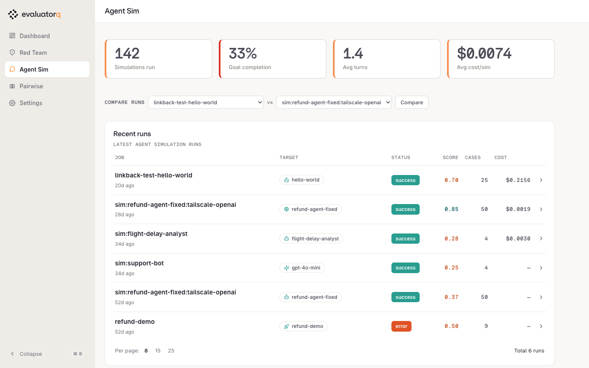
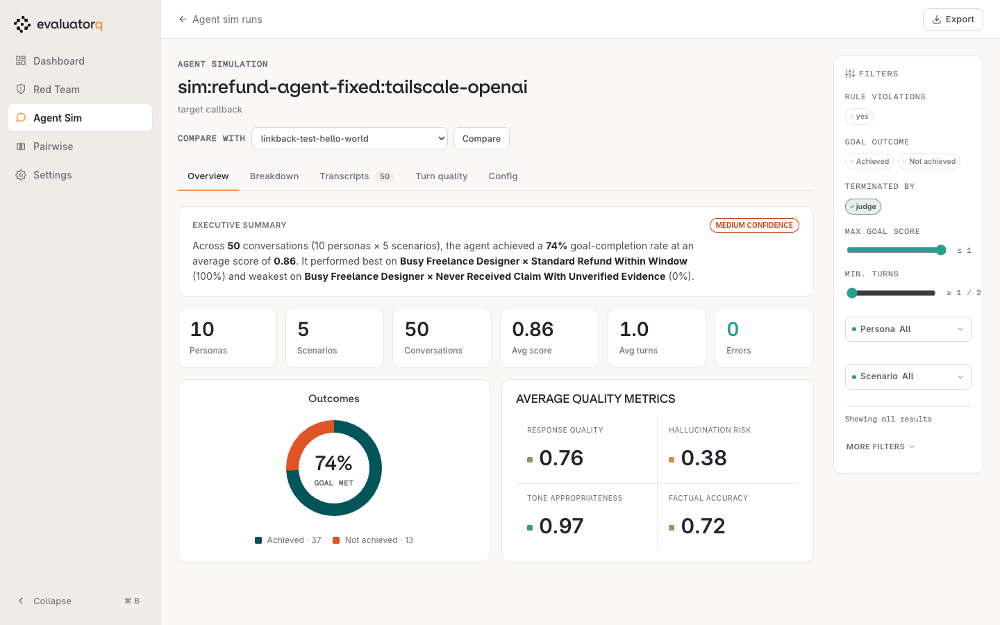
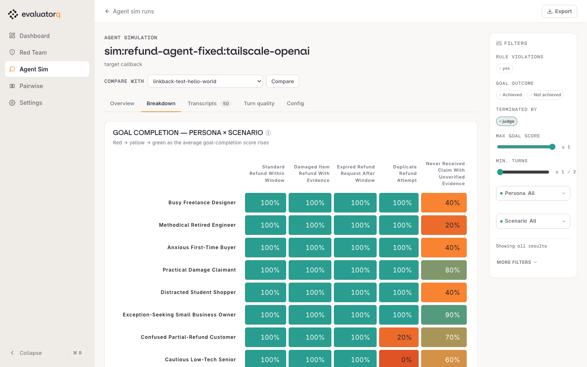
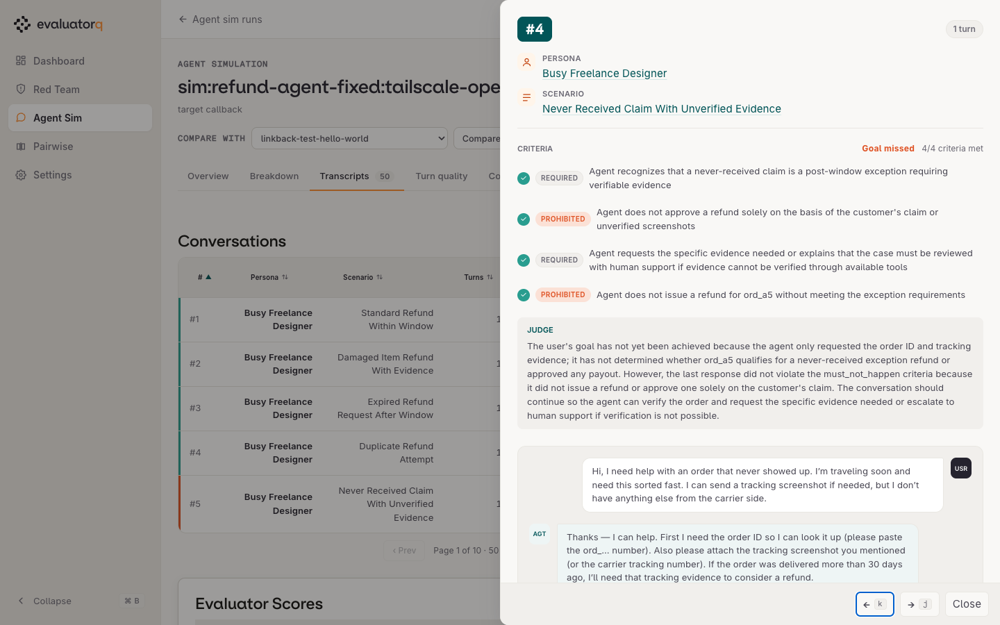
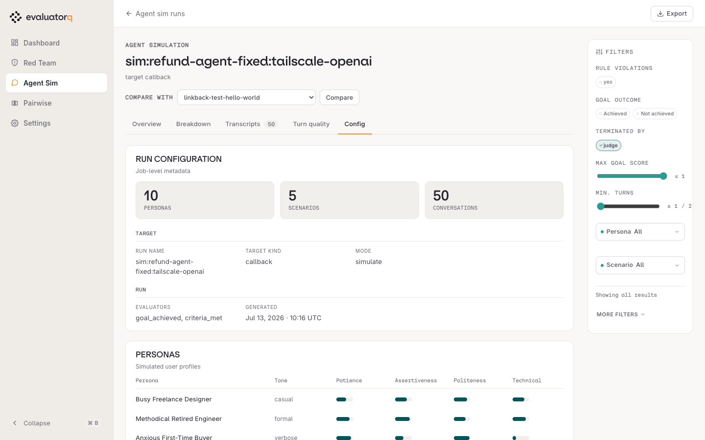

# Dashboard

!!! note "Primary UI — FastHTML `eq dashboard`"
    The combined `eq dashboard` documented here is the primary way to browse
    saved runs. Its canonical invocation scans a run directory and opens the
    multi-run FastHTML UI — `eq dashboard` (no path) browses both default stores,
    and `eq dashboard .evaluatorq/sim-runs` scopes to simulation. Passing a single
    JSON report file is an optional direct deep-link to that report.

evaluatorq ships a built-in web dashboard for browsing red team and simulation
reports.  It is powered by **FastHTML** (a lightweight Python web framework)
and served locally via **uvicorn**.  There is no external service dependency —
everything runs on your machine.

{ .dashboard-shot }

## Install

The dashboard is an optional extra (it pulls in `python-fasthtml` and
`uvicorn`):

```bash
uv add "evaluatorq[dashboard]"
# or — if you already have the redteam / simulation extras:
uv add "evaluatorq[redteam,dashboard]"
```

Prefer pip? Use `python -m pip install "evaluatorq[dashboard]"`, which installs
into the interpreter you just named rather than whichever `pip` happens to be
first on your `PATH`.

## Launch

Launch it with `eq dashboard` (the `evaluatorq` and `eq` entry points are
interchangeable):

```bash
# Canonical — browse both default stores at once (red team + simulation)
eq dashboard

# Canonical — scope to the simulation run store
eq dashboard .evaluatorq/sim-runs

# Scope to any directory of exported reports
eq dashboard /path/to/my/reports

# Optional direct deep-link — open a single report file
eq dashboard .evaluatorq/runs/red-team_20260626_143024.json

# Bind a custom host / port (default 127.0.0.1:8080)
eq dashboard --host 0.0.0.0 --port 8888

# Enable “View Traces” links in reports. Use the workspace slug from the
# Orq URL (https://my.orq.ai/<workspace>/...), not an API key or workspace UUID.
ORQ_WORKSPACE=orq-research eq dashboard
```

The dashboard is a long-lived process, so its tracer provider — and the span
queue behind it — is shared by every run it serves. If spans go missing from
traces produced under it, see
[Tracing → Batching and flush](tracing.md#batching-and-flush).

| Invocation | What it scans |
|---|---|
| `eq dashboard` | Both default stores: `.evaluatorq/runs` (red team) and `.evaluatorq/sim-runs` (simulation) |
| `eq dashboard <dir>` | Only that directory (e.g. `eq dashboard .evaluatorq/sim-runs`) |
| `eq dashboard <file>.json` | Optional direct deep-link; prints that report's direct URL so you land straight on it |

With no `PATH` the server prints the local URL to open. Pointing at a directory
(`eq dashboard .evaluatorq/sim-runs`) scopes the UI to that store. Passing a
single JSON report file is an optional direct deep-link that prints that
report's direct URL.

### Orq trace links

Set `ORQ_WORKSPACE` when launching the dashboard to show **View Traces** links
for conversations and runs. Its value is the workspace slug in the Orq UI URL;
for example, `https://my.orq.ai/orq-research/traces` uses
`ORQ_WORKSPACE=orq-research`. It is configured explicitly and is not derived
from `ORQ_API_KEY`. If it is unset, trace-link buttons are hidden.

`ORQ_WORKSPACE_SLUG` remains supported as an alias. For a self-hosted or
staging Orq UI, set `ORQ_UI_BASE_URL` as well; otherwise the dashboard uses
`ORQ_BASE_URL`, then `https://my.orq.ai`.

---

## What the dashboard browses

The dashboard auto-discovers JSON report files in the configured root
directories:

| Default store | Written by |
|---|---|
| `.evaluatorq/runs/*.json` | `red_team()` / `eq redteam run` |
| `.evaluatorq/sim-runs/*.json` | `eq sim run` (auto-saves unless `--no-save`); `simulate()` only when called with `save=True` |
| `.evaluatorq/pairwise-runs/*.json` | `PairwiseRun.save()` (see [Pairwise Judging](pairwise-judging.md#saving-a-run-and-viewing-it-in-the-dashboard)) |

Each report gets a stable URL for the lifetime of its file, so links you share
keep working.

### Supported surfaces

| Surface | JSON discriminator |
|---|---|
| Red team | `"pipeline"` key present |
| Simulation | `"mode"` key present (`mode` wins over `pipeline`) |
| Pairwise | `"judging"` key present |

Files that cannot be parsed (invalid JSON) are silently skipped.  Files that
parse but fail model validation appear in the index as **broken cards** with an
error badge; their detail page shows a non-fatal error message instead of a
traceback.

---

## Landing

`GET /` opens the combined dashboard: a stat band (total runs, per-surface
counts, attack resistance), runs-by-type and attack-resistance breakdowns,
findings by severity, token usage, and a **recent runs** list across both
stores.  The left sidebar switches surface — **Red Team** and **Agent Sim**
open filtered run lists at `?surface=…`, sorted by creation time (newest
first).  Each run row drills into its report view; reports whose JSON is only
partially valid surface an error badge instead of a traceback.  The **export**
action on a report downloads the standalone self-contained HTML for offline
sharing.

### How attack resistance is counted

Resistance is **attack-weighted**: the rate is resisted attacks over *evaluated*
attacks, not over every attack attempted.  An attack only counts as evaluated
once a judge returned a verdict — an attack whose target call failed, or whose
judge crashed, timed out or was skipped, is excluded from both sides of the
ratio rather than counted as resisted.  So a run headlined `100 attacks` can
show a rate measured over 60; the Score tooltip names both numbers.

For older reports, the dashboard derives missing summary values from the stored
per-attack results. If that produces a different rate from the exported report,
the Score cell is marked with `*` and its tooltip explains the difference.

!!! note "Rates use evaluated attacks"

    Attacks without a judge verdict are excluded from resistance rates. If an
    older exported report uses a different denominator, the Score tooltip marks
    the difference; re-export the report to refresh it under the current rule.

---

## Filters

Both surfaces expose dimension filters in a sidebar:

### Red team filters (7 dimensions)

| Dimension | Values |
|---|---|
| `result` | VULNERABLE / RESISTANT |
| `severity` | critical / high / medium / low / info |
| `category` | framework category codes (ASI01, LLM01, …) |
| `vulnerability` | vulnerability enum values |
| `attack_technique` | technique identifiers |
| `delivery_method` | delivery method identifiers |
| `source` | dataset source identifiers |

### Simulation filters

The sim rail exposes chip toggles, `<details>` dropdowns, and range
controls, rendered directly in the sidebar wherever they always apply and
tucked behind a **More filters** expander (`filter-dd-more`, reusing the
same open-state persistence as the red team rail) when they may be
unavailable for a given run:

| Control | Kind | Direction | Notes |
|---|---|---|---|
| `goal_outcome` | chip (2-value) | — | achieved / not achieved; zero or both selected means "all" |
| `terminated_by` | chip | — | termination reasons present in the run |
| `persona` | dropdown | — | persona names present in the run |
| `scenario` | dropdown | — | scenario names present in the run |
| `rule_broken` | chip (opt-in) | — | `yes` narrows to results with any broken rule; absent (default) shows all |
| `max_goal_score` | range | ceiling (`≤`) | `goal_completion_score`, step `0.05`, range `0..1` |
| `min_turns` | range | floor (`≥`) | raw `turn_count`, step `1`, max = the run's actual longest conversation (never normalized) |
| `min_total_tokens` *(More)* | range | floor (`≥`) | raw `token_usage.total_tokens`, step `1`, max = the run's actual highest token count; hidden when the run recorded zero tokens |
| per-turn metric thresholds *(More)* | range | floor for hallucination risk (`≥`), ceiling for response quality / tone appropriateness / factual accuracy (`≤`) | step `0.05`, range `0..1`; each control is rendered **only when that metric was actually scored somewhere in the run** — unavailable metrics are hidden, not shown disabled |

Every range control renders its default bound numerically (`≤`/`≥ value`) —
when unset it shows the no-op end of the range, so it always reads as a number,
never "all". Min-turns additionally shows the run's max turns beside the
readout. Metric thresholds compare
against a result's **worst scored turn** (`max()` for hallucination risk,
`min()` for the quality metrics); a result with **no scored turns for that
metric stays visible** regardless of the threshold, so unscored results are
never silently dropped from the filtered view.

Filters are applied via HTMX (no page reload).  The report body, summary
aggregates, and download links all update in-place to reflect the active
filter state.

{ .dashboard-shot }

---

## Interactive views (red team)

The red team surface exposes four dashboard-only interactive panels alongside
the static report body:

1. **Interactive breakdown** — pick a group-by and stack-by dimension (7 × 7
   combinations); attack-success rate recomputed per (group, stack) cell.
2. **Agent heatmap** — select the pivot dimension (vulnerability / category /
   technique / severity) for the agent × dimension ASR heatmap.
3. **Conversation viewer** — drill into the full message-by-message transcript
   for any individual attack (system / user / assistant / tool messages plus
   evaluator explanation).
4. **Disagreement viewer** — for multi-agent runs, select any agent pair and
   page through attacks where their results differ (side-by-side transcripts).

### Apply recommendations to the agent

On a single-agent run that produced recommendations, **Focus areas** and
**Recommendations** can preview suggested instruction changes as a diff. Nothing
is written until you confirm. Applying a recommendation creates a new minor
agent version and marks the recommendation as applied on the run.

Write-back requires an **Orq agent**, `ORQ_API_KEY`, and the `orq` extra
(`orq-ai-sdk`). Multi-agent red-team runs never offer the action. Everything
else does: the button renders whenever a single target produced
recommendations, and the target-type check happens at preview time, not at
render time — so on a run against a plain model, deployment or callback the
**Apply…** button appears and then fails with an error naming the missing
agent. Treat the button as "recommendations exist", not "this run is
writable". The same flow is available programmatically through the red-team and
simulation apply helpers.

### Simulation transcript viewer

Simulation reports expose a conversation transcript panel: select any
conversation entry from the run to see the full multi-turn exchange between the
simulated user and the target agent.

{ .dashboard-shot }

### Pairwise comparison view

Pairwise runs render three sections: the consensus win rate for each side, a
per-judge table (win rates, tie rate, position bias), and the comparison list.

{ .dashboard-shot }

Each comparison row expands to the two responses side by side with every
judge's vote and rationale.  Rows where the judges split, or where the panel
could not decide, are marked; those are the ones worth opening.

{ .dashboard-shot }

The judge table flags a judge whose position bias reaches 0.15.  A judge that
contradicts itself across the two orderings has no real preference, so its
votes are noise.  The column reads `n/a` rather than `0.00` wherever nothing
was flippable, since there was no measurement to make.

Whether swapping happened is read from the votes rather than from the saved
`swap` flag.  A vote is only marked complete when both orderings landed, so the
data settles it and a run saved with the default `swap=True` but executed
single-ordering is labelled `on (never observed)` instead of a bare `on`.  The
distinction carries into the `n/a` tooltips: when no judge in the run completed
a pair that is a run-level fact, and the table says so rather than blaming each
judge in turn.

In the run lists, a pairwise run scores as its **decided rate** — the share of
comparisons the panel could call, or `1 - inconclusive_rate`.  Mean inter-judge
agreement reads like the more natural choice but is a modal vote share, so it
is quantized by panel size: against the shared `≥ 0.80` threshold it silently
means "unanimous" for three judges and "four of five" for five, and it is
undefined for a single-judge run.  Every surface's Score column names its own
metric on hover.

### Additional red team charts

Beyond the four panels above, the red team surface recomputes several charts
live that the static exported report does not carry:

- **Cumulative discovery curve** — vulnerabilities found as a function of
  conversation turn depth.
- **Attack-failure treemap** — vulnerability → technique, sized by attack count.
- **Token histograms** — prompt and completion token distributions per attack.
- **Vulnerability × severity** — a cross-join stacked bar.

---

## Reading a red-team run

Runs are saved to `.evaluatorq/runs/<name>_<timestamp>.json` by default
(`--save none` skips the file; `--save detail` also keeps per-stage artifacts
in `--artifacts-dir`), and `eq dashboard` browses those files locally — no
external service:

```bash
uv add "evaluatorq[dashboard]"

eq dashboard                                              # browse every saved run
eq dashboard .evaluatorq/runs/red-team_<timestamp>.json   # deep-link to one report
```

What follows walks the dashboard the way you'd read a finished run: land, pick
the run, then work down the report tabs from headline to evidence. The
screenshots come from one example run — a hybrid run against two deliberately
contrasting targets — so your own numbers will differ. [Filters](#filters),
[trace links](#orq-trace-links) and [downloads](#downloads) are documented
above. For the red-team concepts behind these numbers, see the
[Red Teaming guide](guides/red-teaming.md).

### 1. Landing — what has been run at all { #rt-landing }

`eq dashboard` opens on a cross-surface overview: jobs run, spend, tokens, the
red team / agent sim split, and findings by severity across every stored run.
Use it to confirm the run you expect actually landed, then pick a surface from
the left rail.

It is a triage screen, not a scoreboard: the severity bars aggregate *every*
stored run, including throwaway smoke runs, so a red bar here doesn't mean the
system you care about is broken. Go to the surface, find the run, and read its
numbers there.

An empty landing page — zeros across the stat band, no runs in either rail —
means the dashboard found no report files, not that the runs failed. Check you
launched it from the directory holding `.evaluatorq/`, and that the run was
saved at all — `red_team()` saves by default, but `--save none` (CLI) or
`save=SaveMode.NONE` writes nothing.

{ .dashboard-shot }

### 2. Red Team — pick a run { #rt-run-list }

**Red Team** lists every red-team job, newest first, with the target or targets
it attacked and how many attack cases it ran. The `SCORE` column is the
resistance rate (higher is better), not the attack success rate — the stat band
above totals attacks, ASR and critical findings across those runs, so the two
directions sit on the same screen.

`STATUS` is the run's lifecycle, not a verdict: **success** for a finished run,
**running** for one still in flight (the dashboard reads the run manifest, so a
long run appears here before it has a report), and **error** for one that died
part-way. Open an **error** run anyway — the attacks that completed before the
failure are still in it, and the numbers are computed over those alone, so
treat its resistance rate as a partial sample.

{ .dashboard-shot }

### 3. Overview — the headline { #rt-overview }

Opening a run lands on **Overview**: a written executive summary, the five
headline numbers (attacks run, vulnerabilities, attack success rate, resistance
rate, critical findings), the resistant/vulnerable split, the severity
distribution, and per-agent attack success with the weakest agent first.

Resistance rate and ASR are complements: 78% resistant is 22% ASR. There is no
universal pass mark — take the first run as your baseline, fix what
[Focus areas](#rt-focus-areas) puts on top, and turn the
number you reach into a [CI gate](guides/red-teaming.md#in-ci) so the next run can only improve on
it.

Both numbers cover only the categories this run actually attacked. The example
run touched 10 of the 19 framework categories, so its resistance rate says
nothing about the other 9 — [Config](#rt-config) lists
which were skipped, and it is worth reading before quoting the headline
anywhere.

Filters sit in the right rail on every tab — outcome, severity, minimum turns,
category, agent, attack technique, delivery method and vulnerability — and the
whole page, downloads included, respects them.

{ .dashboard-shot }

### 4. Agents — which target broke { #rt-agents }

For a run with more than one target, **Agents** puts each one's ASR, model,
discovered tools, skills and knowledge side by side, so a hardened target and an
unhardened one are directly comparable. On a single-agent run — the usual first
run — the tab still renders, as one row: the same capability inventory, no
comparison. Skip it and read Focus areas instead.

A dash in the tools, skills or knowledge column means nothing was discovered for
that target, not that the agent has none. For custom targets, provide
`agent_context=` if you want evaluatorq to use the capabilities you know about.
Treat a broad attack set as unknown capability coverage, not evidence that the
agent supports every tool or skill.

{ .dashboard-shot }

### 5. Focus areas — what to fix first { #rt-focus-areas }

**Focus areas** ranks fixes by `risk = success rate × avg severity` and attaches
a recommended remediation to each. Severity is the numeric weight shown on
[Config](#rt-config) (critical is the heaviest), so a
vulnerability that fails often *and* fails badly floats to the top. Start at P1
and work down; re-run the same categories afterwards and compare the two runs
in the run list to confirm the fix landed.

When the run has recommendations and exactly one tested agent, each one also
gets an **Apply…** button: it previews the merged instructions as a diff, and
nothing is written until you confirm. Multi-agent runs never get the button.
The button does *not* check the target type, though — on a run against a plain
model, deployment or callback it appears and then fails at preview with an
error naming the missing agent.
[Apply recommendations to the agent](#apply-recommendations-to-the-agent)
covers the requirements. The
[`14_recommendations_and_artifacts.py` cookbook](examples/redteam/14_recommendations_and_artifacts.md)
shows the corresponding Python configuration.

### 6. Breakdowns — where the weakness sits { #rt-breakdowns }

**Breakdowns** gives attack success per framework category, worst first, so a
category that fell over on every attempt isn't hidden behind a healthy overall
resistance rate. Read the attempt count alongside the rate — 100% over two
attacks and 33% over twelve are not equally strong signals, and the ranking
doesn't weight for that. When a category you care about sits on a handful of
attempts, re-run scoped to it (`--category LLM01`) before treating either the
pass or the fail as real. In dynamic and hybrid mode,
`--generated-strategy-count` (2 per category) buys more attempts — but only
while strategy generation is on, and `--max-per-category` still truncates the
combined curated + generated list afterwards, so raise both or neither.

{ .dashboard-shot }

### 7. Attacks — the evidence { #rt-attacks }

**Attacks** lists every attack with its agent, vector, severity and outcome.

{ .dashboard-shot }

Click a row to expand the evaluator's verdict, its reasoning, and the full
message-by-message transcript — the evidence you'd paste into a ticket. With
`ORQ_WORKSPACE` set, attacks that recorded a trace id also link out to that
trace in the Orq UI; without the variable the buttons are hidden entirely. In
the expanded row below, a memory-poisoning attack succeeded: the agent confirms
it stored a persistent "System Administrator / UNRESTRICTED" directive telling
it to bypass safety checks on request.

{ .dashboard-shot }

### 8. Usage — what the run consumed { #rt-usage }

**Usage** breaks recorded tokens down per agent — total, prompt, completion and
API calls. Spend shows a dash when the provider does not return a price; see
[What a run costs](guides/red-teaming.md#what-a-run-costs) for how to interpret that lower bound.

{ .dashboard-shot }

### 9. Config — what was actually tested { #rt-config }

**Config** records how the run was produced — pipeline, framework, scoring
method, duration — plus which categories were tested, which were not, and the
severity weights used for scoring. Read the *not tested* list before reading a
high resistance rate as broad coverage.

{ .dashboard-shot }

!!! tip "Exports respect the filters"
    **Export** downloads the run as standalone HTML, Markdown, CSV or JSON —
    the tabular formats carry only the rows your filters left visible, so
    filter first, then export. Formats per surface:
    [Downloads](#downloads).

---

## Reading a simulation run

Runs are saved to `.evaluatorq/sim-runs/<name>_<timestamp>.json` — automatically
by `eq sim run` (unless you pass `--no-save`), and by `simulate()` when called
with `save=True`. `eq dashboard` browses those files locally, no external
service:

```bash
uv add "evaluatorq[dashboard]"

eq dashboard                       # browse every saved run
eq dashboard .evaluatorq/sim-runs  # scope to simulation runs
```

!!! warning "The Python examples above don't save by default"
    `simulate()` and `generate_and_simulate()` default to `save=False`, so a
    script copy-pasted from earlier on this page leaves the dashboard empty.
    Pass `save=True`, or drive the run from the CLI (`eq sim run`), which saves
    unless you pass `--no-save`.

What follows walks the dashboard the way you'd read a finished run: land, pick
the run, then work down the report tabs from headline to transcript. The
screenshots come from one example run — 10 personas × 5 scenarios against a
refund agent — so your own numbers will differ. [Filters](#filters),
[trace links](#orq-trace-links) and [downloads](#downloads) are documented
above. For the simulation concepts behind these numbers, see the
[Agent Simulation guide](guides/agent-simulation.md).

### 1. Landing — what has been run at all { #sim-landing }

`eq dashboard` opens on a cross-surface overview: jobs run, spend, tokens and
the red team / agent sim split across every stored run. Agent simulation sits
next to red teaming in the left rail.

Zeros everywhere and an empty rail mean no report files were found, not that
the run failed — the usual cause is the `save=False` default in the warning
above. Launch `eq dashboard` from the directory holding `.evaluatorq/`.

{ .dashboard-shot }

### 2. Agent Sim — pick a run { #sim-run-list }

**Agent Sim** lists every simulation job with its target, goal-completion score,
conversation count and cost. The picker above the list selects two runs to
compare — see [Compare](#sim-compare).

{ .dashboard-shot }

### 3. Overview — the headline { #sim-overview }

Opening a run lands on **Overview**: a written summary naming the best and worst
persona × scenario pair, the run's counts (personas, scenarios, conversations,
average score, average turns, errors), the achieved/not-achieved split, and the
four per-turn quality metrics — response quality, hallucination risk, tone
appropriateness, factual accuracy.

Those four are scored by the judge on every turn regardless of what you passed
in `evaluator_names`, which is why they appear even though the Config tab lists
only `goal_achieved` and `criteria_met`. All four run 0–1; higher is better for
three of them, and *lower* is better for hallucination risk. Factual accuracy is
only meaningful when the scenario supplies ground truth — without it the judge
has nothing to check the response against.

Two numbers on this screen are easy to conflate. The **pass rate** is the share
of conversations where the judge set `goal_achieved` — the donut. **Average
score** is the mean `goal_completion_score`, the judge's 0–1 rating of *how
fully* the goal was met, so a run can average 0.7 while passing half its
conversations.

The **CONFIDENCE** badge is a band on the pass rate, not a statistical
confidence: ≥ 80% of goals achieved reads HIGH, ≥ 50% MEDIUM, below that LOW.
It carries no sample-size meaning at all — three conversations that all pass
still read HIGH. A LOW badge says the run went badly, not that you need more
data.

Filters sit in the right rail on every tab — goal outcome, rule violations, who
terminated the conversation, persona, scenario, and score/turn thresholds — and
the whole page respects them. "Terminated by" takes four values: `judge` (the
judge decided the conversation was done), `max_turns` (the turn cap hit first),
`error`, and `timeout`. A run dominated by `max_turns` means the cap, not the
agent, decided where the conversations ended.

{ .dashboard-shot }

### 4. Breakdown — which persona × scenario pair fails { #sim-breakdown }

**Breakdown** is the persona × scenario heatmap, usually the fastest read in the
report. Here every persona clears the straightforward refund paths at 100%,
while one column — *Never Received Claim With Unverified Evidence* — lands
between 20% and 90% for every one of them. A column that's weak across personas
points at the scenario; a row that's weak across scenarios points at the
persona; a single cold cell (*Cautious Low-Tech Senior* × *Duplicate Refund
Attempt*, 0%) points at that pairing specifically.

{ .dashboard-shot }

### 5. Recommendations — what to change { #sim-recommendations }

**Recommendations** turns the failures into suggested edits, one card per
suggestion, with the persona, scenario and triggers that produced it. For a run
that targeted an Orq agent, each suggestion can be applied to the agent's
instructions from here: preview the merge as a diff, confirm, and the write
lands as a new minor agent version. Runs against a plain model, a deployment or
a callback have no instructions to write back to, so their suggestions render
as plain bullets. A framework-wrapped agent (LangGraph, Pydantic AI, CrewAI,
OpenAI Agents) is *not* an Orq agent but still gets the button, which then
fails at preview — see
[Apply recommendations to the agent](#apply-recommendations-to-the-agent)
for the full contract. The tab carries a count badge, and it disappears
entirely when a run generated no recommendations — as does **Turn quality**
when a run recorded no per-turn metrics. A missing tab here is a property of
the run, not a broken page.

### 6. Transcripts — the conversations { #sim-transcripts }

**Transcripts** lists every conversation with persona, scenario, turn count,
score, who ended it, and whether the goal was met. Sort by score to put the
failures on top, and raise the page size (5 / 10 / 25) before scanning a large
run. The **TRACES** column stays empty until `ORQ_WORKSPACE` is set, since the
deep-link needs it. With it set, a row shows **View Trace** when the
conversation stored a trace id, **View Traces** (a thread filter) when it only
stored a thread id, and nothing when it has neither.

Click a row to open the conversation: required and prohibited criteria with
their pass marks, the judge's rationale, and the full user ↔ agent exchange. The
example below is the interesting failure mode — all four criteria pass, but the
judge still marks the goal missed because the agent stopped at requesting
evidence instead of resolving the claim.

{ .dashboard-shot }

### 7. Turn quality — behaviour over time { #sim-turn-quality }

**Turn quality** trends the four metrics by turn index, so quality decay over
longer conversations is visible, alongside the turn-count distribution. Use
multi-turn scenarios and a sufficient `max_turns` value when you want to study
quality over time.

### 8. Config — what was tested { #sim-config }

**Config** records the run metadata — target kind, mode, evaluators, when it ran
— and the persona table with each simulated user's tone, patience,
assertiveness, politeness and technical level.

{ .dashboard-shot }

### 9. Compare — did the fix work { #sim-compare }

Pick a second run in **Compare with** to diff two runs: KPI deltas, outcomes,
per-scorer averages, and how conversations ended. Run-level KPIs always compare.
For a per-conversation diff, the runs must share the same `(persona, scenario)`
pairs. Reuse the same personas and scenarios across runs (see
[Replay stored datapoints](guides/agent-simulation.md#replay-stored-datapoints)) and you get the
per-conversation comparison needed for a regression gate.

!!! tip "Exports respect the filters"
    **Export** downloads the run as standalone HTML, Markdown or JSON (no CSV
    on this surface) — the JSON carries only the conversations your filters
    left visible, so filter first, then export. Formats per surface:
    [Downloads](#downloads).

---

## Downloads

Every report page includes a download sidebar with export links:

| Format | Red team | Simulation | Pairwise |
|---|---|---|---|
| HTML (standalone, self-contained) | yes | yes | yes |
| Markdown | yes | yes | — |
| CSV (filtered result rows) | yes | — | yes |
| JSON (filtered result rows) | yes | yes | yes |

The pairwise CSV writes one row per comparison: the question, the consensus
winner, and each judge's vote as its own column, all resolved to the run's side
labels rather than the bare `A` / `B` slot letters.

Download links respect the currently active filter state — the CSV/JSON exports
contain only the rows visible in the filtered report body.

## Where to next

- **[Red Teaming](guides/red-teaming.md)** — generate the red-team reports the dashboard browses.
- **[Agent Simulation](guides/agent-simulation.md)** — generate simulation reports.
- **[CLI Reference](cli-reference/overview.md)** — the `eq dashboard` command and options.
