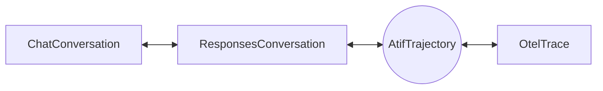

# Formats

`evaluatorq.formats` converts one agent run between four shapes: a chat message list, OpenResponses items, an OpenTelemetry GenAI trace and an ATIF trajectory.

Reach for it when a run is recorded in one shape and the tool you want to feed expects another, for example scoring a production trace with a chat-based judge, or exporting a chat transcript as a trajectory. It does not fetch traces (see [Trace finder](trace-finder.md)) and it does not run agents.

## The four formats

The same run has four natural records. Each answers a different question, so each keeps different things.

| Format | Class | Unit of data | Keeps | Drops |
|---|---|---|---|---|
| Chat | `ChatConversation` | One `Message` (`role`, `content`, `tool_calls`) | What was said, tool calls linked to results by id | Reasoning, timing, model, tokens, cost |
| OpenResponses | `ResponsesConversation` | One item (`message`, `function_call`, `function_call_output`, `reasoning`) plus an optional `Response` per model call whose `output` holds the output items that call produced | Reasoning items, usage per call, status and error | Timing between items, nesting |
| OTel GenAI trace | `OtelTrace` | One `OtelSpan` (an operation with start, end and attributes) | Timing, parent and child tree, per-span usage and cost, subagent nesting | A trajectory-level view; tool results with no call id have no place to live |
| ATIF trajectory | `AtifTrajectory` | One step (system, user or one agent turn) | Reasoning, tool call and result in the same step, per-step metrics, embedded subagents, audio (v1.8) | Span durations and non-LLM operations |

A **chat** list is the model's own input, the shape most evaluators and simulators already speak. **OpenResponses** is the open spec behind the OpenAI Responses API. An **OTel trace** is what observability tools such as Orq store. **ATIF** (Agent Trajectory Interchange Format, Harbor's standard) is a turn-by-turn record meant to be replayed, scored or trained on.

## Converting: ATIF is the hub

Every conversion between two different formats exists as a `to_*` method on the source object. ATIF is the hub: Responses and OTel convert to and from it directly, and chat reaches it through Responses.



Chat and Responses also convert directly to each other. Every other pair composes through ATIF, so `ChatConversation.to_otel()` is `to_atif().to_otel()`, and it loses whatever both legs lose.

| From \ To | Chat | Responses | OTel | ATIF |
|---|---|---|---|---|
| **Chat** | none | `to_responses()` | `to_otel()` | `to_atif()` |
| **Responses** | `to_chat()` | none | `to_otel()` | `to_atif()` |
| **OTel** | `to_chat()` | `to_responses()` | none | `to_atif()` |
| **ATIF** | `to_chat()` | `to_responses()` | `to_otel()` | none |

`to_atif()` and `to_otel()` on a non-ATIF source take `agent_name` and `agent_version`, which fill `AtifTrajectory.agent`. `OtelTrace.to_atif()` falls back to the `gen_ai.agent.name` and `gen_ai.agent.version` attributes of the root `invoke_agent` span when you leave them unset. Both default to `'unknown'` otherwise. `ChatConversation.to_atif()` and `ResponsesConversation.to_atif()` also take `session_id`; left unset, it is a hash of the conversation, so the same input always gets the same id.

## Wrap a dataset trajectory

A **dataset trace document** is a Pydantic `TraceDocument` containing an ATIF trajectory and separate dataset metadata. Use it when a benchmark row has ground truth, the known result of the run, that you need to compare with an evaluator's prediction. Dataset-specific loading, parsing, revision pinning, and freeze manifests stay in the consuming project; evaluatorq supplies the shared models and preservation check.

`metadata.dataset` identifies the dataset name, pinned revision, optional split, and row ID. Choose a row ID unique within that revision and include it in `trace_id`; a task ID alone can repeat across runs. `metadata.outcome` holds `passed`, an optional raw `score`, the result's `source` (`programmatic`, `human`, `judge`, or `none`), and its `definition`. A programmatic reward and a human annotation are different sources of ground truth; the definition says what passing means for this dataset. None of these fields is written into the ATIF trajectory.

This in-memory fixture wraps one parsed row and turns it into an evaluatorq `DataPoint`, the input row a job evaluates. It makes no source or model requests.

```python
from evaluatorq.formats.atif import (
    AtifAgent, AtifObservation, AtifObservationResult,
    AtifStep, AtifToolCall, AtifTrajectory,
)
from evaluatorq.insights import (
    DatasetRef, Outcome, TraceDocument, TraceMetadata,
    TrajectoryCounts, check_trace_document,
)

# In your parser, read these expectations from the raw dataset row.
expected_counts = TrajectoryCounts(tool_calls=1, tool_results=1, reasoning_steps=1)
expected_outcome = Outcome(
    passed=True, score=1.0, source="programmatic",
    definition="The fixture's repair test passed",
)
trajectory = AtifTrajectory(
    agent=AtifAgent(name="fixture-agent", version="1"),
    steps=[
        AtifStep(step_id=1, source="user", message="Repair the fixture"),
        AtifStep(
            step_id=2, source="agent", message="The repair passed",
            reasoning_content="Run the test to check the repair",
            tool_calls=[AtifToolCall(
                tool_call_id="call-1", function_name="test", arguments={},
            )],
            observation=AtifObservation(results=[AtifObservationResult(
                source_call_id="call-1", content="passed",
            )]),
        ),
    ],
)
document = TraceDocument(
    metadata=TraceMetadata(
        trace_id="fixture:row-1",
        dataset=DatasetRef(
            name="example/repair", revision="fixture-v1", split="test", row_id="row-1",
        ),
        outcome=expected_outcome,
    ),
    trajectory=trajectory,
)
check_trace_document(
    document=document, expected_counts=expected_counts, expected_outcome=expected_outcome,
)
datapoint = document.to_datapoint()
assert datapoint.inputs["dataset"]["row_id"] == "row-1"
assert AtifTrajectory.model_validate(datapoint.inputs["trajectory"]) == trajectory
assert datapoint.expected_output == expected_outcome.model_dump(mode="json")
print(datapoint.expected_output["passed"])
```

`to_datapoint()` puts the serialized trajectory in `inputs["trajectory"]`, dataset provenance in `inputs["dataset"]` when present, and the serialized outcome in `expected_output`. Your job reads the trajectory input; your evaluator can compare its prediction with the outcome. A non-dataset document without an outcome has `expected_output=None`.

A dataset row without `outcome` raises a Pydantic validation error. An unlabelled dataset must explicitly use `Outcome(passed=None, source="none", definition="No ground truth available")`; `passed=None` with any other source also fails validation. Keep a raw reward in `score` when converting it into pass/fail.

Benchmark rows can omit `span_id` and `timestamp`. Documents without a dataset still require both, and every supplied timestamp must include a timezone offset. A dataset document is a Python input contract; the dashboard's [local trace file](insights.md#local-trace-file-format) still expects the existing message-based snapshot schema.

In each dataset parser's tests, compute `expected_counts` and `expected_outcome` independently from the raw row and call `check_trace_document()`. It rejects changed tool-call, tool-result, or reasoning-step counts (including embedded subagents), a changed outcome, and a wrapper that changes during JSON serialization. Counts do not prove that call IDs, arguments, result text, reasoning text, or order survived: assert those against the raw row too. The check cannot recover information already lost by a parser.

## Add trajectory tags to an evaluation

`signal_evaluators()` turns trajectory tags into evaluatorq scorers. Use it when your output is ATIF, chat, Responses, OTel, or a chat message list and you want deterministic structural tags without an LLM judge. These tags describe execution patterns, not answer quality.

```python
from evaluatorq.signals import signal_evaluators

evaluators = signal_evaluators()  # every trajectory tag, bundled thresholds
print([evaluator['name'] for evaluator in evaluators])
```

Add the returned evaluators to an `evaluatorq()` run's `evaluators` list. Unsupported output shapes and signals without enough evidence produce an inconclusive score (`value=None`, `pass_=None`) with an explanation, so a missing transcript is visible instead of looking like a clean run.

## What each conversion loses

Every conversion is lossy in some direction. A dropped tool result, message, subagent or history block logs a `loguru` warning. OTel spans with operations other than `chat`, `execute_tool` and `invoke_agent` are ignored without a warning. Metadata that has no slot in the target is also dropped without a warning; [Field mapping](#field-mapping) shows where each field lands in every format, and each method's `Lost:` list names the rest.

- **Chat drops reasoning.** `ResponsesConversation.to_chat()` and `AtifTrajectory.to_chat()` count the reasoning items they discard and warn once. Keep the Responses or ATIF object if you need the reasoning.
- **Responses items alone merge consecutive agent steps.** Converting to ATIF closes an agent step at a tool result, and at the first output item of each `Response` when `responses` are set. Without responses, two assistant turns with no tool result between them become one step. `ResponsesConversation` checks that each `Response.output` matches the supported model output items (assistant messages, reasoning, function calls, custom tool calls and MCP calls) of `items`, in order, and raises `ValueError` when they disagree; a `Response` built with an empty `output` gets it filled from `items`, one response per run of consecutive output items. Compaction is a transcript marker, so a `Response.output` containing it raises a clear error. Custom tool and MCP calls and custom tool results stay in ATIF step `extra` for the return trip because ATIF has no matching typed call.
- **ATIF to Responses emits one `Response` per agent step**, with that step's output items as its `output`, so agent steps stay apart on the way back. Per-call metadata (model, usage, timing) comes from that step; a step without any gets a placeholder that reads back as absent. Responses usage has no unset token count, so an unset one is written as 0 and listed in `Response.metadata['atif_unset_usage']`, which reads back as unset. Step cost, token ids and logprobs have no Responses slot and are dropped with a warning.
- **A call's outcome survives every leg.** A step whose model call failed (an `error_type`, an OTel span status of `error`, or an `error` finish reason) becomes a Response with `status: failed` and an `error`. A `length` or `content_filter` finish reason becomes `status: incomplete` with the matching `incomplete_details.reason`. Responses error codes and incomplete reasons are closed lists, so an error type such as `timeout` is written as code `server_error`, and a finish reason such as `stop` has no field at all. Whatever the Response fields cannot hold exactly goes to `Response.metadata['atif_error_type']` and `['atif_finish_reasons']`, which win when the Response is read back. Reading a Response sets the step's `error_type` and `finish_reasons`, so a failed Response also becomes an `error` chat span in OTel.
- **ATIF to OTel drops results without a call id and unembedded subagents.** An observation result with no `source_call_id` has no tool message or `execute_tool` span to sit in, and a subagent reference whose trajectory is not embedded has nothing to render. Each logs a warning. User and system steps are all kept: a system step that opens the trajectory becomes the chat spans' `system_instructions`, a later one is a `system` input message, and steps after the last agent turn go into a final `chat` span that has input and no output. A trajectory with no agent step at all, such as a system prompt and one user message, converts the same way.
- **Multi-part text joins with newlines.** When one message has several text parts and the target holds a single string, every route joins them with `\n` and skips empty parts, so `to_chat()` and `to_atif().to_chat()` give the same text. A tool result with several text parts follows the same rule, so `a` and `b` become `a\nb` in Responses and OTel. Image and file parts in a Responses tool result stay typed in chat; a malformed optional media field is dropped while a valid source remains. Structured tool result lists become JSON text. Image URLs stay typed in ATIF, while files become warned text markers because ATIF has no file part. A Responses text part whose `text` is not a string is dropped with a warning rather than written as a Python repr.
- **OTel to ATIF reads cumulative and per-turn input.** New user, system and assistant messages become steps when a chat span repeats the full history or holds only the current turn. Edited or truncated history logs a warning naming the span; matching turns are aligned by occurrence and include tool arguments and non-text parts. Unmatched messages on either side of a replayed block remain new steps. A changed, nonempty `system_instructions` value becomes a new system step. A compaction (an OTel `compaction` part or a Responses `compaction` item) becomes a system step with `extra.context_management = {"type": "compaction", "boundary": "replace"}` and its original parts under `extra["evaluatorq.compaction"]`; a Responses compaction item is restored on the return trip to Responses. The first chat span's input is the conversation so far, so its earlier assistant turns become agent steps. Extra output choices are dropped with a warning. Spans that are not `chat`, `execute_tool` or `invoke_agent` are ignored.
- **OTel tool results link by call id, never by position.** A result in a chat input goes to the call with the same id: one issued earlier in the same input, else one issued by an earlier chat span. A result whose id matches no call, or that has no id, is kept on the nearest agent step with no `source_call_id` and its id in `extra.orphan_call_id`, and logs a warning. Such a result is dropped again by ATIF to OTel, since no tool message holds it there.
- **Tool results with no `tool_call_id` are unlinked.** Chat to Responses warns and cannot attach them.

The per-method `Lost:` list in the [API reference](reference/evaluatorq/formats.md) is the exact inventory for each edge.

### Free-form slots

When a source field has no typed home in the target, the converters keep it in the target's free-form slot instead of dropping it. ATIF keeps it in `extra` on the trajectory, step, tool call or metrics. OTel keeps it in a span's `attributes`. Reasoning token counts, response status and errors, and `fc_` item ids land there when converting Responses to ATIF. ATIF to OTel writes step, trajectory, tool-call and observation-result `extra`, and `final_metrics`, as JSON-string span attributes under `evaluatorq.atif.` (`evaluatorq.atif.step.extra` on the chat span, `evaluatorq.atif.trajectory.extra` and `evaluatorq.atif.final_metrics` on the `invoke_agent` span, `evaluatorq.atif.tool_call.extra` and `evaluatorq.atif.result.extra` on the `execute_tool` span), and OTel to ATIF reads them back. Additional observation results for one tool call use `evaluatorq.atif.additional_results` on its `execute_tool` span. Tool-result start and end timestamps and status map to the corresponding `execute_tool` span fields, and tool definitions map to `gen_ai.tool.definitions` on chat spans. Where the trace itself yields a key, such as a step's `invocation` timing, the trace's value wins and a differing carried value logs a warning. Nothing else reads the `evaluatorq.atif.*` keys, so treat them as round-trip storage, not as an interchange contract.

## Field mapping

Each row is one piece of an agent run and where every format keeps it. `none` means the format has no slot: converting into it drops the value. A value that a converter renames or moves into a free-form slot shows that slot.

| What | Chat | Responses | ATIF | OTel |
|---|---|---|---|---|
| User or system message | `Message(role='user')` or `'system'` | `message` item with the same role | step with `source='user'` or `'system'` | chat span input message; a system step that opens the run becomes `gen_ai.system_instructions` on every chat span |
| Developer message | `role='developer'`; `to_chat()` renames it to `system` (warned) | `message` item with `role='developer'` | system step with `extra.original_role='developer'` | input message with `role='developer'` |
| Assistant text | `role='assistant'`, `content` | `message` item with `output_text` parts | agent step `message` | chat span output message, `text` parts |
| Reasoning | none (dropped, warned) | `reasoning` item | `step.reasoning_content` | `reasoning` part of the output message |
| Tool call | `tool_calls[]`: `id`, `function.name`, `function.arguments` (JSON text) | `function_call`: `call_id`, `name`, `arguments` | `tool_calls[]`: `tool_call_id`, `function_name`, `arguments` (a dict) | output `tool_call` part: `id`, `name`, `arguments`; `execute_tool` span `gen_ai.tool.call.id` |
| Arguments that are not a JSON object | kept as the text | kept as the text | `arguments={}`, the text in the tool call's `extra['evaluatorq.raw_arguments']` | `gen_ai.tool.call.arguments` holds the text |
| Tool result | `role='tool'`: `tool_call_id`, `content`, `name` | `function_call_output`: `call_id`, `output` | `observation.results[]`: `source_call_id`, `content` | `execute_tool` span `gen_ai.tool.call.result`, and a `tool_call_response` part in the next chat input |
| Tool error | none | none | result `extra.error_type` and `extra.status` | `execute_tool` span `status='error'` and `error.type` |
| Image | `input_image` part | `input_image` part | image part, from `image_url` only (`detail` dropped) | `uri` part; read back into step `extra.non_text_parts` |
| File | `input_file` part | `input_file` part | text marker `[file: <name>]` | text |
| Audio | none | text marker | audio part (ATIF v1.8) | `uri` part |
| Model | none | `Response.model` | `step.model_name` | `gen_ai.response.model`; a different `gen_ai.request.model` goes to `extra.requested_model` |
| Token usage | none | `Response.usage`: `input_tokens`, `output_tokens`, `cached_tokens`, `reasoning_tokens` | `metrics`: `prompt_tokens`, `completion_tokens`, `cached_tokens`, `extra.reasoning_tokens` | `gen_ai.usage.input_tokens`, `output_tokens`, `cache_read.input_tokens`, `reasoning.output_tokens` |
| Cost | none | none (dropped, warned) | `metrics.cost_usd` | `gen_ai.usage.total_cost` |
| Time | none | `Response.created_at` | `step.timestamp`, and start and end in `extra.invocation` | span `start_time` and `end_time` |
| Finish reason | none | `status: incomplete` with `incomplete_details.reason` (`max_output_tokens` for `length`, `content_filter`); any other value in `metadata['atif_finish_reasons']` | `extra.finish_reasons` | `gen_ai.response.finish_reasons`; the output message's `finish_reason` holds the first |
| Failed model call | none | `status: failed` and `error.code`; an error type that is not a Responses code is written as `server_error`, with the original in `metadata['atif_error_type']` | `extra.error_type` | chat span `status: error` and `error.type` |
| Response id | none | `Response.id` | `extra.response_id` | inside the `evaluatorq.atif.step.extra` attribute |
| Subagent | none | none (dropped, warned) | `subagent_trajectories`, referenced by a result's `subagent_trajectory_ref` | nested `invoke_agent` span under the calling `execute_tool` span |
| Compaction | none (skipped) | `compaction` item | system step with `extra.context_management` | read from a `compaction` part; not written |
| Agent name and version | none | none; pass `agent_name` and `agent_version` to `to_atif()` | `agent.name`, `agent.version` | `invoke_agent` span `gen_ai.agent.name`, `gen_ai.agent.version` |
| Tool definitions | none | none (`Response.tools` is written empty) | `agent.tool_definitions` | chat span `gen_ai.tool.definitions` |
| Session id | none | none; a hash of the items on `to_atif()` | `session_id` | `invoke_agent` span `gen_ai.conversation.id`, else the trace id |

Field names in the Responses column follow the OpenResponses spec, and those in the OTel column follow the GenAI semantic conventions. ATIF to Responses drops a step's invocation start and end times without a warning, so a run that went OTel to ATIF to Responses keeps them only in the ATIF object.

## ATIF versions

Read an ATIF document with `AtifTrajectory.from_json(text)`, which takes a string, bytes or an already-parsed dict. It accepts `ATIF-v1.7` and `ATIF-v1.8`; any other `schema_version`, or none at the document root, raises `ValueError`, and so does an `ATIF-v1.7` document that contains an audio content part, embedded subagents included. Use `from_json` rather than `model_validate_json`, which checks neither. A trajectory built in code, and a subagent embedded in a document, may leave `schema_version` out and get `ATIF-v1.7`. The two versions differ only by the `audio` content part.

Writing keeps the trajectory's own `schema_version`, which is `ATIF-v1.7` for one built by a converter. `to_json()` upgrades to `ATIF-v1.8` when any content part in the document, embedded subagents included, is audio. Pass `version='1.7'` or `version='1.8'` to force one. Forcing `1.7` on a trajectory that holds audio raises `ValueError` instead of writing a document that older readers would reject. The chosen version is stamped on the whole document, embedded subagents included.

## Deterministic ids

The converters never call `uuid4`. Trace ids, span ids and call ids they have to invent are SHA-256 hashes of a seed: the source's session id or trajectory id when it has one, otherwise a hash of the whole document. Converting the same input twice gives the same output, so a diff between two conversions shows a real change and not fresh random ids.

## Real Orq exports

`OtelTrace.from_orq(spans)` takes the raw list of span dicts as Orq returns it (the `v3spans` list) and parses it into typed spans. It handles what real exports look like rather than what the semantic conventions describe: chat-shaped messages keyed by index, nested singular or plural message wrappers, the `chat-completion` operation name (read as `chat`), direct `gen_ai.input` and `gen_ai.output` messages on a root span, no `execute_tool` spans, and usage that lives only in the span summary. Orq's `agent` role is read as `assistant`. When a router trace root repeats the same chat input and output as one of its direct children, conversion reads that child once; other children remain separate calls.

Attribute values stay whole: supported message content is parsed into typed parts rather than flattened, so nothing in valid messages is lost on parse. Malformed messages or parts are skipped with a warning.

## Examples

Each snippet is self-contained. They use plain Python objects, so no API key is needed.

### Chat and Responses

```python
from evaluatorq.contracts import FunctionCall, Message, StrategyToolCall
from evaluatorq.formats import ChatConversation

chat = ChatConversation(
    messages=[
        Message(role='developer', content='Answer in one line.'),
        Message(role='user', content='Weather in Paris?'),
        Message(
            role='assistant',
            tool_calls=[
                StrategyToolCall(id='call_1', function=FunctionCall(name='get_weather', arguments='{"city": "Paris"}'))
            ],
        ),
        Message(role='tool', tool_call_id='call_1', content='{"temp": 18}'),
        Message(role='assistant', content='18C and sunny.'),
    ]
)

responses = chat.to_responses()
print(responses.items[2])  # {'type': 'function_call', 'call_id': 'call_1', 'name': 'get_weather', 'arguments': '{"city": "Paris"}'}

back = responses.to_chat()
print([message.role for message in back.messages])  # ['system', 'user', 'assistant', 'tool', 'assistant']
print(back.messages[3].name)  # get_weather
```

The return trip renames `developer` to `system` and logs a warning. The tool message gets its `name` back from the call with the same id.

### Chat to ATIF

```python
import json

from evaluatorq.contracts import FunctionCall, Message, StrategyToolCall
from evaluatorq.formats import ChatConversation

chat = ChatConversation(
    messages=[
        Message(role='user', content='Weather in Paris?'),
        Message(
            role='assistant',
            tool_calls=[
                StrategyToolCall(id='call_1', function=FunctionCall(name='get_weather', arguments='{"city": "Paris"}'))
            ],
        ),
        Message(role='tool', tool_call_id='call_1', name='get_weather', content='{"temp": 18}'),
        Message(role='assistant', content='18C and sunny.'),
    ]
)

trajectory = chat.to_atif(agent_name='weather-bot', agent_version='1.0')
print([(step.step_id, step.source) for step in trajectory.steps])  # [(1, 'user'), (2, 'agent'), (3, 'agent')]
print(json.loads(trajectory.to_json())['schema_version'])  # ATIF-v1.7
```

### ATIF to chat

```python
from evaluatorq.formats import AtifTrajectory

trajectory = AtifTrajectory.from_json({
    'schema_version': 'ATIF-v1.7',
    'agent': {'name': 'demo', 'version': '1'},
    'steps': [
        {'step_id': 1, 'source': 'user', 'message': 'Hi'},
        {'step_id': 2, 'source': 'agent', 'message': 'Hello.'},
    ],
})
chat = trajectory.to_chat()
print([message.role for message in chat.messages])  # ['user', 'assistant']
```

For a Harbor run or another saved ATIF document, pass the file's text to `AtifTrajectory.from_json` instead of the dict.

### Responses to OTel

```python
from evaluatorq.formats import ResponsesConversation

responses = ResponsesConversation(
    items=[
        {'type': 'message', 'role': 'user', 'content': [{'type': 'input_text', 'text': 'Weather in Paris?'}]},
        {'type': 'function_call', 'call_id': 'call_1', 'name': 'get_weather', 'arguments': '{"city": "Paris"}'},
        {'type': 'function_call_output', 'call_id': 'call_1', 'output': '{"temp": 18}'},
        {'type': 'message', 'role': 'assistant', 'content': [{'type': 'output_text', 'text': '18C and sunny.'}]},
    ]
)

trace = responses.to_otel(agent_name='weather-bot')
print([span.operation for span in trace.spans])  # ['invoke_agent', 'chat', 'execute_tool', 'chat']
```

### Orq spans to ATIF

```python
from evaluatorq.formats import OtelTrace

raw_spans = [
    {
        'span_id': 's1',
        'parent_span_id': None,
        'name': 'chat-completion',
        'started_at': '2026-04-20T10:00:00Z',
        'ended_at': '2026-04-20T10:00:02Z',
        'attributes': {
            'gen_ai.operation.name': 'chat-completion',
            'gen_ai.response.model': 'openai/gpt-5.6-luna',
            'gen_ai.input.messages': [{'role': 'user', 'parts': [{'type': 'text', 'content': 'Hi'}]}],
            'gen_ai.output.messages': [{'role': 'assistant', 'parts': [{'type': 'text', 'content': 'Hello.'}]}],
        },
    }
]

trajectory = OtelTrace.from_orq(raw_spans).to_atif()
print([(step.source, step.message) for step in trajectory.steps])  # [('user', 'Hi'), ('agent', 'Hello.')]
```

Orq router roots can also hold direct `gen_ai.input` and `gen_ai.output` messages, with a child span carrying the same call. A root span's `type: trace` identifies this wrapper shape:

```python
from evaluatorq.formats import OtelTrace

input_messages = [{'role': 'user', 'parts': [{'type': 'text', 'content': 'Hi'}]}]
output_messages = [{'role': 'agent', 'parts': [{'type': 'text', 'content': 'Hello.'}]}]
router_spans = [
    {
        'span_id': 'root',
        'type': 'trace',
        'attributes': {
            'gen_ai.operation.name': 'chat',
            'gen_ai.input': {'messages': input_messages},
            'gen_ai.output': {'messages': output_messages},
        },
    },
    {
        'span_id': 'call',
        'parent_span_id': 'root',
        'type': 'span.responses',
        'attributes': {
            'gen_ai.operation.name': 'chat',
            'gen_ai.input.messages': input_messages,
            'gen_ai.output.messages': output_messages,
        },
    },
]

trajectory = OtelTrace.from_orq(router_spans).to_atif()
print([(step.source, step.message) for step in trajectory.steps])  # [('user', 'Hi'), ('agent', 'Hello.')]
```

A trace with no chat span that yields a step raises `ValueError` from `to_atif()`, so check the span list is not empty or tool-only before converting.

An `OtelTrace` holds one trace. Spans that carry more than one distinct `trace_id` raise `ValueError` when the trace is built, by `from_orq` or directly, so group spans by trace id first. Spans with no trace id are accepted, and several root spans under one trace id are converted as one run in start-time order.
