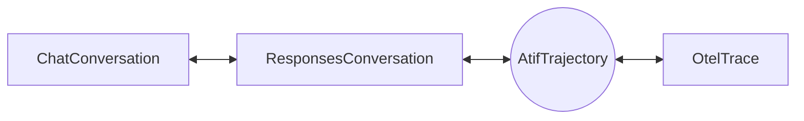

# Formats

`evaluatorq.formats` converts one agent run between four shapes: a chat message list, OpenResponses items, an OpenTelemetry GenAI trace and an ATIF trajectory.

Reach for it when a run is recorded in one shape and the tool you want to feed expects another, for example scoring a production trace with a chat-based judge, or exporting a chat transcript as a trajectory. It does not fetch traces (see [Trace finder](trace-finder.md)) and it does not run agents.

## The four formats

The same run has four natural records. Each answers a different question, so each keeps different things.

| Format | Class | Unit of data | Keeps | Drops |
|---|---|---|---|---|
| Chat | `ChatConversation` | One `Message` (`role`, `content`, `tool_calls`) | What was said, tool calls linked to results by id | Reasoning, timing, model, tokens, cost |
| OpenResponses | `ResponsesConversation` | One item (`message`, `function_call`, `function_call_output`, `reasoning`) plus an optional `Response` per model call whose `output` holds the output items that call produced | Reasoning items, usage per call, status and error | Timing between items, nesting |
| OTel GenAI trace | `OtelTrace` | One `OtelSpan` (an operation with start, end and attributes) | Timing, parent and child tree, per-span usage and cost, subagent nesting | A trajectory-level view; tool results with no call id have no place to live |
| ATIF trajectory | `AtifTrajectory` | One step (system, user or one agent turn) | Reasoning, tool call and result in the same step, per-step metrics, embedded subagents, audio (v1.8) | Span durations and non-LLM operations |

A **chat** list is the model's own input, the shape most evaluators and simulators already speak. **OpenResponses** is the open spec behind the OpenAI Responses API. An **OTel trace** is what observability tools such as Orq store. **ATIF** (Agent Trajectory Interchange Format, Harbor's standard) is a turn-by-turn record meant to be replayed, scored or trained on.

## Converting: ATIF is the hub

Every conversion between two different formats exists as a `to_*` method on the source object. ATIF is the hub: Responses and OTel convert to and from it directly, and chat reaches it through Responses.



Chat and Responses also convert directly to each other. Every other pair composes through ATIF, so `ChatConversation.to_otel()` is `to_atif().to_otel()`, and it loses whatever both legs lose.

| From \ To | Chat | Responses | OTel | ATIF |
|---|---|---|---|---|
| **Chat** | none | `to_responses()` | `to_otel()` | `to_atif()` |
| **Responses** | `to_chat()` | none | `to_otel()` | `to_atif()` |
| **OTel** | `to_chat()` | `to_responses()` | none | `to_atif()` |
| **ATIF** | `to_chat()` | `to_responses()` | `to_otel()` | none |

`to_atif()` and `to_otel()` on a non-ATIF source take `agent_name` and `agent_version`, which fill `AtifTrajectory.agent`. `OtelTrace.to_atif()` falls back to the `gen_ai.agent.name` and `gen_ai.agent.version` attributes of the root `invoke_agent` span when you leave them unset. Both default to `'unknown'` otherwise. `ChatConversation.to_atif()` and `ResponsesConversation.to_atif()` also take `session_id`; left unset, it is a hash of the conversation, so the same input always gets the same id.

## What each conversion loses

Every conversion is lossy in some direction. The loss is never silent for structure: a dropped tool result, message, subagent or history block logs a `loguru` warning. What is dropped without a warning is metadata that has no slot in the target, and each method's `Lost:` list names it.

- **Chat drops reasoning.** `ResponsesConversation.to_chat()` and `AtifTrajectory.to_chat()` count the reasoning items they discard and warn once. Keep the Responses or ATIF object if you need the reasoning.
- **Responses items alone merge consecutive agent steps.** Converting to ATIF closes an agent step at a tool result, and at the first output item of each `Response` when `responses` are set. Without responses, two assistant turns with no tool result between them become one step. `ResponsesConversation` checks that each `Response.output` matches the supported model output items (assistant messages, reasoning, function calls, custom tool calls and MCP calls) of `items`, in order, and raises `ValueError` when they disagree; a `Response` built with an empty `output` gets it filled from `items`, one response per run of consecutive output items. Custom tool and MCP calls stay in ATIF step `extra` for the return trip because ATIF has no matching typed call.
- **ATIF to Responses emits one `Response` per agent step**, with that step's output items as its `output`, so agent steps stay apart on the way back. Per-call metadata (model, usage, timing) comes from that step; a step without any gets a placeholder that reads back as absent. Responses usage has no unset token count, so an unset one is written as 0 and listed in `Response.metadata['atif_unset_usage']`, which reads back as unset. Step cost, token ids and logprobs have no Responses slot and are dropped with a warning.
- **ATIF to OTel drops results without a call id and unembedded subagents.** An observation result with no `source_call_id` has no tool message or `execute_tool` span to sit in, and a subagent reference whose trajectory is not embedded has nothing to render. Each logs a warning. User and system steps are all kept: a system step that opens the trajectory becomes the chat spans' `system_instructions`, a later one is a `system` input message, and steps after the last agent turn go into a final `chat` span that has input and no output. A trajectory with no agent step at all, such as a system prompt and one user message, converts the same way.
- **Multi-part text joins with newlines.** When one message has several text parts and the target holds a single string, every route joins them with `\n` and skips empty parts, so `to_chat()` and `to_atif().to_chat()` give the same text. A tool result with several text parts follows the same rule, so `a` and `b` become `a\nb` in Responses and OTel. Image and file parts in a Responses tool result stay typed in chat; image URLs stay typed in ATIF, while files become warned text markers because ATIF has no file part. A Responses text part whose `text` is not a string is dropped with a warning rather than written as a Python repr.
- **OTel to ATIF reads cumulative and per-turn input.** New user, system and assistant messages become steps when a chat span repeats the full history or holds only the current turn. Edited or truncated history logs a warning naming the span; matching turns are aligned by occurrence and include tool arguments and non-text parts. A changed, nonempty `system_instructions` value becomes a new system step. A compaction (an OTel `compaction` part or a Responses `compaction` item) becomes a system step with `extra.context_management = {"type": "compaction", "boundary": "replace"}` and its original parts under `extra["evaluatorq.compaction"]`; a Responses compaction item is restored on the return trip. Prior assistant and tool history in the first chat span and extra output choices are dropped with a warning. Spans that are not `chat`, `execute_tool` or `invoke_agent` are ignored.
- **Tool results with no `tool_call_id` are unlinked.** Chat to Responses warns and cannot attach them.

The per-method `Lost:` list in the [API reference](reference/evaluatorq/formats.md) is the exact inventory for each edge.

### Free-form slots

When a source field has no typed home in the target, the converters keep it in the target's free-form slot instead of dropping it. ATIF keeps it in `extra` on the trajectory, step, tool call or metrics. OTel keeps it in a span's `attributes`. Reasoning token counts, response status and errors, and `fc_` item ids land there when converting Responses to ATIF. ATIF to OTel writes step, trajectory, tool-call and observation-result `extra`, and `final_metrics`, as JSON-string span attributes under `evaluatorq.atif.` (`evaluatorq.atif.step.extra` on the chat span, `evaluatorq.atif.trajectory.extra` and `evaluatorq.atif.final_metrics` on the `invoke_agent` span, `evaluatorq.atif.tool_call.extra` and `evaluatorq.atif.result.extra` on the `execute_tool` span), and OTel to ATIF reads them back. Additional observation results for one tool call use `evaluatorq.atif.additional_results` on its `execute_tool` span. Where the trace itself yields a key, such as a step's `invocation` timing, the trace's value wins and a differing carried value logs a warning. Nothing else reads these keys, so treat them as round-trip storage, not as an interchange contract.

## ATIF versions

Read an ATIF document with `AtifTrajectory.from_json(text)`, which takes a string, bytes or an already-parsed dict. It accepts `ATIF-v1.7` and `ATIF-v1.8`; any other `schema_version`, or none at the document root, raises `ValueError`, and so does an `ATIF-v1.7` document that contains an audio content part, embedded subagents included. Use `from_json` rather than `model_validate_json`, which checks neither. A trajectory built in code, and a subagent embedded in a document, may leave `schema_version` out and get `ATIF-v1.7`. The two versions differ only by the `audio` content part.

Writing keeps the trajectory's own `schema_version`, which is `ATIF-v1.7` for one built by a converter. `to_json()` upgrades to `ATIF-v1.8` when any content part in the document, embedded subagents included, is audio. Pass `version='1.7'` or `version='1.8'` to force one. Forcing `1.7` on a trajectory that holds audio raises `ValueError` instead of writing a document that older readers would reject. The chosen version is stamped on the whole document, embedded subagents included.

## Deterministic ids

The converters never call `uuid4`. Trace ids, span ids and call ids they have to invent are SHA-256 hashes of a seed: the source's session id or trajectory id when it has one, otherwise a hash of the whole document. Converting the same input twice gives the same output, so a diff between two conversions shows a real change and not fresh random ids.

## Real Orq exports

`OtelTrace.from_orq(spans)` takes the raw list of span dicts as Orq returns it (the `v3spans` list) and parses it into typed spans. It handles what real exports look like rather than what the semantic conventions describe: chat-shaped messages keyed by index, the `chat-completion` operation name (read as `chat`), a singular `gen_ai.input.message` on the root span, no `execute_tool` spans, and usage that lives only in the span summary.

Attribute values stay whole: messages are parsed into typed parts rather than flattened, so nothing in them is lost on parse.

## Examples

Each snippet is self-contained. They use plain Python objects, so no API key is needed.

### Chat to ATIF

```python
import json

from evaluatorq.contracts import FunctionCall, Message, StrategyToolCall
from evaluatorq.formats import ChatConversation

chat = ChatConversation(
    messages=[
        Message(role='user', content='Weather in Paris?'),
        Message(
            role='assistant',
            tool_calls=[
                StrategyToolCall(id='call_1', function=FunctionCall(name='get_weather', arguments='{"city": "Paris"}'))
            ],
        ),
        Message(role='tool', tool_call_id='call_1', name='get_weather', content='{"temp": 18}'),
        Message(role='assistant', content='18C and sunny.'),
    ]
)

trajectory = chat.to_atif(agent_name='weather-bot', agent_version='1.0')
print([(step.step_id, step.source) for step in trajectory.steps])  # [(1, 'user'), (2, 'agent'), (3, 'agent')]
print(json.loads(trajectory.to_json())['schema_version'])  # ATIF-v1.7
```

### ATIF to chat

```python
from evaluatorq.formats import AtifTrajectory

trajectory = AtifTrajectory.from_json(open('trajectory.json').read())
chat = trajectory.to_chat()
print([message.role for message in chat.messages])
```

`trajectory.json` is any ATIF v1.7 or v1.8 document, such as one from a Harbor run or the output of `trajectory.to_json()` above.

### Responses to OTel

```python
from evaluatorq.formats import ResponsesConversation

responses = ResponsesConversation(
    items=[
        {'type': 'message', 'role': 'user', 'content': [{'type': 'input_text', 'text': 'Weather in Paris?'}]},
        {'type': 'function_call', 'call_id': 'call_1', 'name': 'get_weather', 'arguments': '{"city": "Paris"}'},
        {'type': 'function_call_output', 'call_id': 'call_1', 'output': '{"temp": 18}'},
        {'type': 'message', 'role': 'assistant', 'content': [{'type': 'output_text', 'text': '18C and sunny.'}]},
    ]
)

trace = responses.to_otel(agent_name='weather-bot')
print([span.operation for span in trace.spans])  # ['invoke_agent', 'chat', 'execute_tool', 'chat']
```

### Orq spans to ATIF

```python
from evaluatorq.formats import OtelTrace

raw_spans = [
    {
        'span_id': 's1',
        'parent_span_id': None,
        'name': 'chat-completion',
        'started_at': '2026-04-20T10:00:00Z',
        'ended_at': '2026-04-20T10:00:02Z',
        'attributes': {
            'gen_ai.operation.name': 'chat-completion',
            'gen_ai.response.model': 'openai/gpt-5.6-luna',
            'gen_ai.input.messages': [{'role': 'user', 'parts': [{'type': 'text', 'content': 'Hi'}]}],
            'gen_ai.output.messages': [{'role': 'assistant', 'parts': [{'type': 'text', 'content': 'Hello.'}]}],
        },
    }
]

trajectory = OtelTrace.from_orq(raw_spans).to_atif()
print([(step.source, step.message) for step in trajectory.steps])  # [('user', 'Hi'), ('agent', 'Hello.')]
```

A trace with no chat span that yields a step raises `ValueError` from `to_atif()`, so check the span list is not empty or tool-only before converting.

An `OtelTrace` holds one trace. Spans that carry more than one distinct `trace_id` raise `ValueError` when the trace is built, by `from_orq` or directly, so group spans by trace id first. Spans with no trace id are accepted, and several root spans under one trace id are converted as one run in start-time order.
