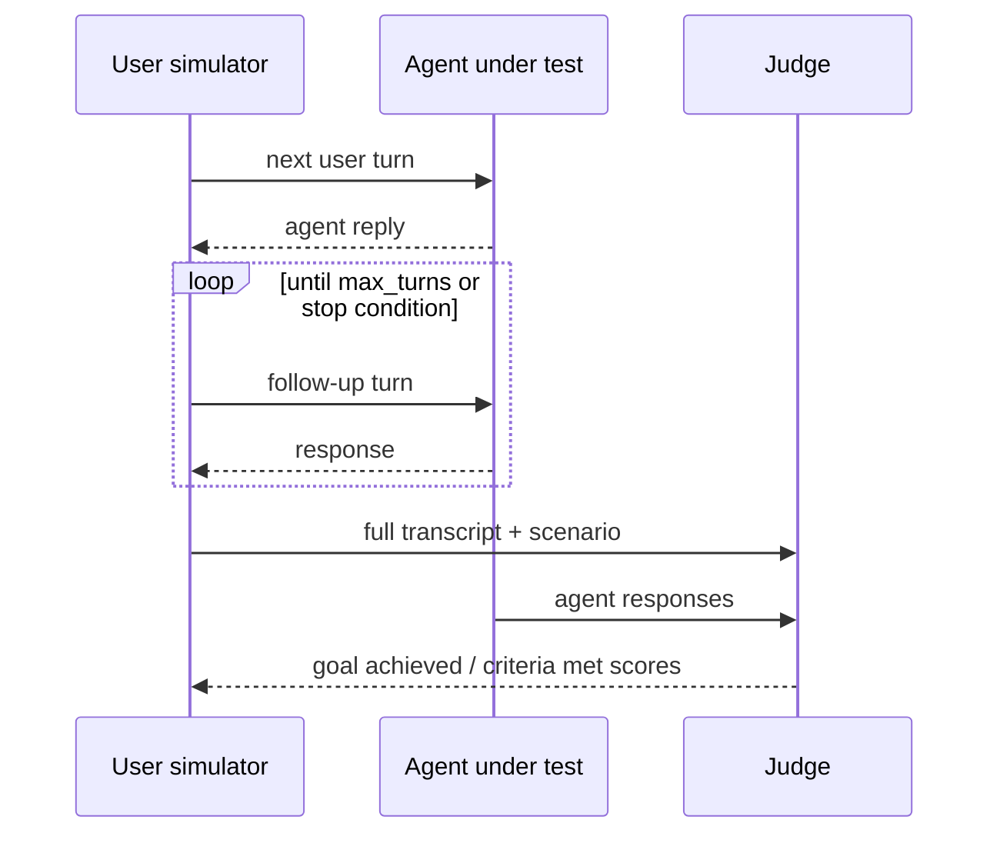

# Agent Simulation

Drive your agent through realistic multi-turn conversations without writing test
transcripts by hand. Three LLMs are in play:

- **Your agent** — the target under test (a callback, or an Orq deployment).
- **User simulator** — plays a **persona** pursuing a **scenario** goal, turn by turn.
- **Judge** — scores whether the goal was met and whether any rules were broken.

Requires the simulation extra and an `ORQ_API_KEY` — the example below targets an
Orq agent, and the simulator/judge LLMs route through Orq by default:

```bash
pip install "evaluatorq[simulation]"
export ORQ_API_KEY=...
```



## Generate from a one-line description

The fastest start: `generate_and_simulate()` synthesizes the personas, scenarios,
and opening messages from a short description of your agent — no hand-written
`Persona(...)` / `Scenario(...)`. Point it at an Orq deployment with `agent_key=`
(from AI Studio → Deployments).

```python
import asyncio

from evaluatorq.simulation import generate_and_simulate


async def main():
    results = await generate_and_simulate(
        evaluation_name="support-agent-sim",
        agent_key="my-support-agent",       # Orq deployment, routed via ORQ_API_KEY
        agent_description=(
            "Customer support agent for an e-commerce store; "
            "handles refunds, orders, and product questions."
        ),
        num_personas=3,
        num_scenarios=4,                     # → 12 persona × scenario simulations
        max_turns=6,
        evaluator_names=["goal_achieved", "criteria_met"],
    )

    passed = sum(r.goal_achieved for r in results)
    print(f"Pass rate: {passed}/{len(results)}")


if __name__ == "__main__":
    asyncio.run(main())
```

`agent_description` drives generation; `num_personas × num_scenarios` is how many
conversations run. Provider resolves `ORQ_API_KEY` → `OPENAI_API_KEY`.

## Seed by archetype

The middle ground between "just give me five" and specifying every trait: name
the archetype, and `generate_persona()` / `generate_scenario()` fill the rest.
You get back real `Persona` / `Scenario` objects to inspect, tweak, and pass to
`simulate()`.

```python
import asyncio

from evaluatorq.simulation import generate_persona, generate_scenario, simulate


async def main():
    persona = await generate_persona(
        "angry customer",
        agent_description="e-commerce support agent",
    )
    scenario = await generate_scenario("disputes a refund denial")

    results = await simulate(
        evaluation_name="seeded-simulation",
        agent_key="my-support-agent",
        personas=[persona],
        scenarios=[scenario],
        max_turns=6,
        evaluator_names=["goal_achieved", "criteria_met"],
    )
    print(f"Goal achieved: {results[0].goal_achieved}")


if __name__ == "__main__":
    asyncio.run(main())
```

Batch forms `generate_personas([...])` / `generate_scenarios([...])` take a list
of seeds and return one object each.

## Full control: hand-build personas

When you want exact personas and pass/fail criteria, build them yourself and call
`simulate()`. A **persona** is *who* is talking (patience, assertiveness, tone);
a **scenario** is *what they want* plus the **criteria** the agent must (or must
not) satisfy.

```python
import asyncio

from evaluatorq.simulation import simulate
from evaluatorq.simulation.types import (
    CommunicationStyle, Criterion, EmotionalArc, Persona, Scenario, StartingEmotion,
)


async def main():
    persona = Persona(
        name="Impatient Customer",
        patience=0.2, assertiveness=0.8, politeness=0.4, technical_level=0.3,
        communication_style=CommunicationStyle.terse,
        background="Received the wrong item and wants a refund urgently",
        emotional_arc=EmotionalArc.escalating,
    )
    scenario = Scenario(
        name="Wrong Item Refund",
        goal="Get a full refund for the wrong item received",
        context="Ordered headphones but received a phone case instead",
        starting_emotion=StartingEmotion.frustrated,
        criteria=[
            Criterion(description="Agent asks for order details", type="must_happen"),
            Criterion(description="Agent acknowledges the mistake", type="must_happen"),
            Criterion(description="Agent blames the customer", type="must_not_happen"),
        ],
    )

    results = await simulate(
        evaluation_name="basic-simulation-example",
        agent_key="my-support-agent",      # Orq deployment, routed via ORQ_API_KEY
        personas=[persona],
        scenarios=[scenario],
        max_turns=6,
        evaluator_names=["goal_achieved", "criteria_met"],
    )

    result = results[0]
    score = result.goal_completion_score or 0.0
    print(f"Goal achieved: {result.goal_achieved}  score={score:.2f}")
    for msg in result.messages:
        who = "User" if msg.role == "user" else "Agent"
        print(f"{who}: {msg.content}")


if __name__ == "__main__":
    asyncio.run(main())
```

One persona × one scenario yields one `SimulationResult` with `goal_achieved`,
`goal_completion_score`, `turn_count`, `rules_broken`, and the full message
transcript.

## Bring your own agent

Don't have an Orq deployment? `simulate()` also takes a `target_callback=` — any
async function that maps the conversation to your agent's reply, so you can
simulate a plain OpenAI model or any HTTP agent. See
[Simulate an OpenAI agent](agent-simulation-openai.md).

!!! tip "View results in the local dashboard"
    Run `eq ui` to browse saved red-team and simulation reports together, or use
    `eq redteam ui` / `eq sim ui` for a surface-specific view.

## Where to next

- **[Examples › Agent Simulation](../examples/index.md)** — tool simulation, hardening loops, LangGraph / CrewAI / OpenAI Agents targets.
- **[Red Teaming](red-teaming.md)** — adversarial, attack-driven testing.
