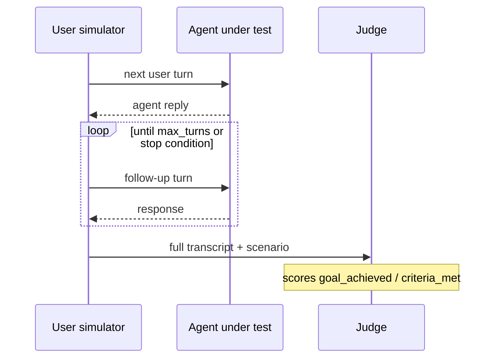

# Agent Simulation

Drive your agent through realistic multi-turn conversations without writing test
transcripts by hand. Three LLMs are in play:

- **Your agent** — the target under test (a hosted Orq agent, a callback, or an Orq deployment).
- **User simulator** — plays a **persona** pursuing a **scenario** goal, turn by turn.
- **Judge** — scores whether the goal was met and whether any rules were broken.

=== "Orq agent"

    Requires the simulation extra and an `ORQ_API_KEY`:

    ```bash
    uv add "evaluatorq[simulation]"
    export ORQ_API_KEY=...
    ```

    Prefer pip? Use `python -m pip install "evaluatorq[simulation]"`, which
    installs into the interpreter you just named rather than whichever `pip`
    happens to be first on your `PATH`.

=== "OpenAI"

    Requires the simulation extra, the `openai` package, and an `OPENAI_API_KEY`:

    ```bash
    uv add "evaluatorq[simulation]" openai
    export OPENAI_API_KEY=sk-...
    ```

    Prefer pip? Use `python -m pip install "evaluatorq[simulation]" openai`,
    which installs into the interpreter you just named rather than whichever
    `pip` happens to be first on your `PATH`.


```mermaid
sequenceDiagram
    participant U as User simulator
    participant A as Agent under test
    participant J as Judge

    U->>A: next user turn
    A-->>U: agent reply
    loop until max_turns or stop condition
        U->>A: follow-up turn
        A-->>U: response
    end
    U->>J: full transcript + scenario
    Note over J: scores goal_achieved / criteria_met
```

## Generate from a one-line description

The fastest start: `generate_and_simulate()` synthesizes the personas, scenarios,
and opening messages from a short description of your agent — no hand-written
`Persona(...)` / `Scenario(...)`.

=== "Orq agent"

    Point it at a hosted Orq agent with `target="agent:<key>"` (the agent key from
    AI Studio → Agents). The simulator and judge LLMs route through Orq by default.

    Agents with a memory store attached reject calls that carry no memory scope
    (a 400 with `memory_entity_id_required`). A fresh entity id is minted per
    conversation automatically, so parallel conversations never share memory;
    pass `memory_entity_id="..."` (CLI: `--memory-entity`) to run every
    conversation against one specific, e.g. pre-seeded, entity instead.

    ```python
    import asyncio

    from evaluatorq.simulation import generate_and_simulate


    async def main():
        results = await generate_and_simulate(
            evaluation_name="support-agent-sim",
            target="agent:my-support-agent",     # hosted Orq agent, routed via ORQ_API_KEY
            agent_description=(
                "Customer support agent for an e-commerce store; "
                "handles refunds, orders, and product questions."
            ),
            num_personas=3,
            num_scenarios=4,                     # → 12 persona × scenario simulations
            max_turns=6,
            evaluator_names=["goal_achieved", "criteria_met"],
        )

        passed = sum(r.goal_achieved for r in results)
        print(f"Pass rate: {passed}/{len(results)}")


    if __name__ == "__main__":
        asyncio.run(main())
    ```

=== "OpenAI"

    Pass `sim_model=` to route the simulator and judge through OpenAI directly.
    Use `target=` for the agent under test.

    ```python
    import asyncio

    from openai import AsyncOpenAI

    from evaluatorq.contracts import Message
    from evaluatorq.simulation import generate_and_simulate

    client = AsyncOpenAI()

    SYSTEM = "You are a customer support agent for Acme Corp. Be concise and helpful."


    async def openai_agent(messages: list[Message]) -> str:
        history = [{"role": "system", "content": SYSTEM}]
        history += [{"role": m.role, "content": m.content or ""} for m in messages]
        resp = await client.chat.completions.create(model="gpt-4o-mini", messages=history)
        return resp.choices[0].message.content or ""


    async def main():
        results = await generate_and_simulate(
            evaluation_name="support-agent-sim-openai",
            target=openai_agent,
            agent_description=(
                "Customer support agent for an e-commerce store; "
                "handles refunds, orders, and product questions."
            ),
            num_personas=3,
            num_scenarios=4,
            sim_model="gpt-4o-mini",             # simulator + judge on OpenAI directly
            max_turns=6,
            evaluator_names=["goal_achieved", "criteria_met"],
            upload_results=False,
        )

        passed = sum(r.goal_achieved for r in results)
        print(f"Pass rate: {passed}/{len(results)}")


    if __name__ == "__main__":
        asyncio.run(main())
    ```

`agent_description` drives generation; `num_personas × num_scenarios` is how many
conversations run. The simulator and judge LLMs resolve their provider by
precedence: if `ORQ_API_KEY` is set they route through the Orq AI Router;
otherwise they fall back to OpenAI via `OPENAI_API_KEY` (an explicitly passed
client always wins). See [Configuration](../configuration.md).

## Seed by archetype

The middle ground between "just give me five" and specifying every trait: name
the archetype, and `generate_persona()` / `generate_scenario()` fill the rest.
You get back real `Persona` / `Scenario` objects to inspect, tweak, and pass to
`simulate()`.

```python
import asyncio

from evaluatorq.simulation import generate_persona, generate_scenario, simulate


async def main():
    persona = await generate_persona(
        "angry customer",
        agent_description="e-commerce support agent",
    )
    scenario = await generate_scenario("disputes a refund denial")

    results = await simulate(
        evaluation_name="seeded-simulation",
        target="agent:my-support-agent",
        personas=[persona],
        scenarios=[scenario],
        max_turns=6,
        evaluator_names=["goal_achieved", "criteria_met"],
    )
    print(f"Goal achieved: {results[0].goal_achieved}")


if __name__ == "__main__":
    asyncio.run(main())
```

Batch forms `generate_personas([...])` / `generate_scenarios([...])` take a list
of seeds and return one object each.

## Full control: hand-build personas

When you want exact personas and pass/fail criteria, build them yourself and call
`simulate()`. A **persona** is *who* is talking (patience, assertiveness, tone);
a **scenario** is *what they want* plus the **criteria** the agent must (or must
not) satisfy.

A persona requires its core traits — `name`, `patience`, `assertiveness`,
`politeness`, `technical_level`, `communication_style`, and `background`. Only
`emotional_arc` and `cultural_context` default (to `None`). A scenario needs just
`name` and `goal`; everything else, including `criteria`, is optional.

=== "Orq agent"

    Pass `target="agent:<key>"` (the agent key from AI Studio → Agents) to route to a hosted Orq agent.

    ```python
    import asyncio

    from evaluatorq.simulation import simulate
    from evaluatorq.simulation.types import (
        CommunicationStyle, Criterion, EmotionalArc, Persona, Scenario, StartingEmotion,
    )


    async def main():
        persona = Persona(
            name="Impatient Customer",
            patience=0.2, assertiveness=0.8, politeness=0.4, technical_level=0.3,
            communication_style=CommunicationStyle.terse,
            background="Received the wrong item and wants a refund urgently",
            emotional_arc=EmotionalArc.escalating,
        )
        scenario = Scenario(
            name="Wrong Item Refund",
            goal="Get a full refund for the wrong item received",
            context="Ordered headphones but received a phone case instead",
            starting_emotion=StartingEmotion.frustrated,
            criteria=[
                Criterion(description="Agent asks for order details", type="must_happen"),
                Criterion(description="Agent acknowledges the mistake", type="must_happen"),
                Criterion(description="Agent blames the customer", type="must_not_happen"),
            ],
        )

        results = await simulate(
            evaluation_name="basic-simulation-example",
            target="agent:my-support-agent",    # hosted Orq agent, routed via ORQ_API_KEY
            personas=[persona],
            scenarios=[scenario],
            max_turns=6,
            evaluator_names=["goal_achieved", "criteria_met"],
        )

        result = results[0]
        score = result.goal_completion_score or 0.0
        print(f"Goal achieved: {result.goal_achieved}  score={score:.2f}")
        for msg in result.messages:
            who = "User" if msg.role == "user" else "Agent"
            print(f"{who}: {msg.content}")


    if __name__ == "__main__":
        asyncio.run(main())
    ```

=== "OpenAI"

    Use `target=` with any async function that maps the conversation to
    your agent's reply. Pass `sim_model=` to run the simulator and judge on OpenAI
    directly. Set `upload_results=False` for a local-only run.

    ```python
    import asyncio

    from openai import AsyncOpenAI

    from evaluatorq.contracts import Message
    from evaluatorq.simulation import simulate
    from evaluatorq.simulation.types import CommunicationStyle, Criterion, Persona, Scenario

    client = AsyncOpenAI()

    SYSTEM = "You are a customer support agent for Acme Corp. Be concise and helpful."


    async def openai_agent(messages: list[Message]) -> str:
        """Your agent under test — a raw OpenAI model."""
        history = [{"role": "system", "content": SYSTEM}]
        history += [{"role": m.role, "content": m.content or ""} for m in messages]
        resp = await client.chat.completions.create(model="gpt-4o-mini", messages=history)
        return resp.choices[0].message.content or ""


    async def main():
        persona = Persona(
            name="Impatient Customer",
            patience=0.2, assertiveness=0.8, politeness=0.4, technical_level=0.3,
            communication_style=CommunicationStyle.terse,
            background="Received the wrong item and wants a refund urgently",
        )
        scenario = Scenario(
            name="Wrong Item Refund",
            goal="Get a full refund for the wrong item received",
            criteria=[
                Criterion(description="Agent asks for order details", type="must_happen"),
            ],
        )

        results = await simulate(
            evaluation_name="openai-agent-simulation",
            target=openai_agent,                 # your OpenAI agent
            personas=[persona],
            scenarios=[scenario],
            sim_model="gpt-4o-mini",             # simulator + judge on OpenAI directly
            max_turns=6,
            evaluator_names=["goal_achieved", "criteria_met"],
            upload_results=False,                # local-only run, no Orq experiment
        )

        result = results[0]
        score = result.goal_completion_score or 0.0
        print(f"Goal achieved: {result.goal_achieved}  score={score:.2f}")


    if __name__ == "__main__":
        asyncio.run(main())
    ```

One persona × one scenario yields one `SimulationResult` with `goal_achieved`,
`goal_completion_score`, `turn_count`, `rules_broken`, and the full message
transcript.

### How criteria are scored

The judge audits every `Criterion` on every turn and the runner folds those
verdicts over the whole conversation, so a violation on turn 2 still shows up in a
run that ends on turn 6:

- **`must_happen`** passes if it occurred in *any* turn. Never occurring is a
  failure — intent, plans, and paraphrases do not count.
- **`must_not_happen`** fails if it was violated in *any* turn. One violation is
  permanent; a clean later turn does not clear it.

The judge is only ever asked **what occurred**, never what passed — a pass/fail
flag means the opposite thing for the two criterion types, and models invert it.
Occurrence is mapped to pass/fail in code, so `rules_broken` is derived, not
reported. Failures land in `rules_broken` (criterion ids), `criteria_results`
(description → passed), and the `criteria_met` score.

Once a criterion is confirmed to have occurred it is settled — stickiness means a
later turn cannot change it — so the judge is told to stop re-auditing it. It stays
in the prompt (the judge still needs it to decide whether to stop early) but drops
out of the per-turn audit payload, which otherwise costs an entry with an evidence
quote per criterion per turn.

Per-criterion detail is in `metadata['criteria_meta']`, where `audited` says whether
the judge actually returned a verdict for that criterion:

```python
for c in result.metadata['criteria_meta']:
    if not c['passed'] and not c['audited']:
        print(f"{c['id']} failed by default — the judge never reported on it")
```

A `must_happen` the judge confirmed never occurred and one it silently skipped both
show `passed: False`; only `audited` separates them. It is `None` for runs saved
before the field existed.

Each entry also carries **`evidence`** — the quote from the turn where the
criterion's occurrence first flipped, taken from the judge's `criteria_verdicts`
audit. It is `''` when the criterion never occurred (or occurred without a
tracked quote) and `None` when no tracker was available, same as `audited`.

!!! warning "A custom `judge=` must report per-criterion verdicts"

    The built-in `JudgeAgent` audits each unsettled criterion every turn. A custom
    judge that does not populate `Judgment.criteria_verdicts` falls back to the
    pre-1.3 behaviour: pass/fail is inferred from its `rules_broken` list, so a
    `must_happen` criterion **cannot fail**.

    That run is marked `SimulationResult.criteria_verified = False`, the runner logs
    a warning naming the scenario, and `criteria_met` scores it `0.0` — unknown, not
    met. Check the field, not the transcript:

    ```python
    if result.criteria_verified is False:
        print('criteria unverified — the judge returned no per-criterion audit')
    ```

    `criteria_verified` is `None` on runs saved before the field existed.

A run that ends in an error or a timeout never reaches the audit either. Those
results also score `criteria_met` as `0.0` (not `1.0`) and log a warning, so neither
a crashed run nor an unaudited one can inflate the average.

The callable passed to `target` is the only structural difference from the Orq path —
personas, scenarios, criteria, and the result shape are identical. Swap the
callback body for any HTTP/LLM agent.

## From existing traces and data

You do not have to invent every test case from scratch. If you already have
recorded conversations, real production traces, or a batch of datapoints from an
earlier run, you can feed that history back into simulation in two ways: replay
the exact same cases, or mine them for the archetypes that drive fresh ones.

### Replay stored datapoints

A `SimulationDatapoint` bundles one persona, one scenario, and the opening
message. Every case simulation runs is one of these, and you can persist them for
reuse. `eq sim generate` writes the cases it builds to a JSONL file with
`--datapoints PATH` (one datapoint per line); `eq sim run` does the same alongside a
live run with `--datapoints PATH`:

```bash
# Generate cases once and keep them
eq sim generate --agent-description "e-commerce support agent" \
  --num-personas 3 --num-scenarios 4 \
  --datapoints cases.jsonl

# Re-run the exact same cases against any target, as often as you like
eq sim simulate --input cases.jsonl --target agent:my-support-agent
```

Because the file pins the personas, scenarios, and first messages, the run is
reproducible. That makes it the natural way to compare two agent versions, or the
same agent under a new set of evaluators, on an identical bank of cases. From the
SDK the same file loads via `load_datapoints_from_jsonl()`:

```python
import asyncio

from evaluatorq.simulation import simulate
from evaluatorq.simulation.utils import load_datapoints_from_jsonl


async def main():
    datapoints = load_datapoints_from_jsonl("cases.jsonl")

    results = await simulate(
        evaluation_name="replay-v2",
        target="agent:my-support-agent-v2",   # new version, same cases
        datapoints=datapoints,
        max_turns=6,
        evaluator_names=["goal_achieved", "criteria_met"],
    )
    passed = sum(r.goal_achieved for r in results)
    print(f"Pass rate: {passed}/{len(results)}")


if __name__ == "__main__":
    asyncio.run(main())
```

If your cases already live in Orq as a dataset, point `simulate()` at it with
`dataset_id=` and skip the local file entirely. Each row's `inputs` should carry a
`datapoint` object (`persona`, `scenario`, `first_message`), or a `persona` +
`scenario` pair, matching the `SimulationDatapoint` shape above:

```python
results = await simulate(
    evaluation_name="dataset-replay",
    target="agent:my-support-agent",
    dataset_id="my-simulation-cases",       # named Orq dataset, routed via ORQ_API_KEY
    evaluator_names=["goal_achieved", "criteria_met"],
)
```

`simulate()` takes five mutually exclusive sources — `datapoints`, `dataset_id`,
`experiment_id`, `previous_run`, and `personas` + `scenarios`. Pass exactly one
per run.

### Ground new cases in real traces

Replay reruns what you already have. The other move is to generate *new* cases
that are shaped by what really happened. Production traces show you the user
archetypes and situations your agent actually meets.

The direct route is `eq sim from-traces`, which pulls recent traces from the Orq
traces API and writes one datapoint per conversation — persona and scenario
inferred from the transcript, first message taken from the real user verbatim:

```bash
eq sim from-traces --output traces_datapoints.jsonl --limit 50 --lookback-hours 24
eq sim simulate --input traces_datapoints.jsonl --target agent:my-agent
```

Add `--extend N` to also generate N new datapoints matching the traffic
distribution of the fetched traces, so you get cases *around* real traffic rather
than only the recorded ones. The same thing is available from Python as
`datapoints_from_traces()` and `extend_from_traces()`:

```python
from evaluatorq.simulation import datapoints_from_traces

datapoints = await datapoints_from_traces(limit=50, lookback_hours=24)
```

Full flag list: [`eq sim from-traces`](../cli-reference/simulation.md).

#### Hand-picked seeds

When you want curated archetypes rather than a straight pull from traffic, seed
generation yourself. Pull the recurring patterns out of your traces (the impatient
buyer disputing a charge, the confused first-time user, the edge case that broke
last week), then hand them to `generate_personas()` / `generate_scenarios()` as
short seed phrases:

```python
import asyncio

from evaluatorq.simulation import generate_personas, generate_scenarios, simulate

# Archetypes and situations distilled from real traces
persona_seeds = ["impatient repeat buyer", "confused first-time user", "polite but persistent negotiator"]
scenario_seeds = ["disputes a duplicate charge", "cannot find order confirmation", "asks for a discount after a late delivery"]


async def main():
    personas = await generate_personas(persona_seeds, agent_description="e-commerce support agent")
    scenarios = await generate_scenarios(scenario_seeds, agent_description="e-commerce support agent")

    results = await simulate(
        evaluation_name="trace-grounded-sim",
        target="agent:my-support-agent",
        personas=personas,                    # 3 personas × 3 scenarios → 9 simulations
        scenarios=scenarios,
        max_turns=6,
        evaluator_names=["goal_achieved", "criteria_met"],
    )
    passed = sum(r.goal_achieved for r in results)
    print(f"Pass rate: {passed}/{len(results)}")


if __name__ == "__main__":
    asyncio.run(main())
```

The seed is a steer, not a transcript: generation fills in the persona traits and
scenario criteria and writes a natural opening message, so each run explores the
space around the pattern rather than replaying one recorded conversation. Persist
the generated cases (`eq sim generate --datapoints`, or `eq sim run
--datapoints`) and they become a replayable bank for the section above.

!!! note "Seeds are a deliberate choice, not the only route"
    Writing seed phrases by hand means you decide which archetypes matter, rather
    than inheriting whatever your recent traffic happened to contain. When you'd
    rather start from real traffic, use `eq sim from-traces` above — it infers the
    personas and scenarios for you.

--8<-- "docs/_snippets/dashboard-tip.md"

## External framework demos

Each recording runs one framework's example end to end — the user simulator
drives the conversation, the agent under test responds, and the judge scores the
transcript. Sources live in `examples/agent_simulation/` (files `06`–`09`).

### LangGraph

<video controls muted playsinline preload="metadata" width="100%">
  <source src="../../assets/sim-langgraph.mp4" type="video/mp4">
  Your browser does not support the video tag —
  <a href="../../assets/sim-langgraph.mp4">download the recording</a>.
</video>

### OpenAI Agents SDK

<video controls muted playsinline preload="metadata" width="100%">
  <source src="../../assets/sim-openai-agents.mp4" type="video/mp4">
  Your browser does not support the video tag —
  <a href="../../assets/sim-openai-agents.mp4">download the recording</a>.
</video>

### Pydantic AI

<video controls muted playsinline preload="metadata" width="100%">
  <source src="../../assets/sim-pydantic-ai.mp4" type="video/mp4">
  Your browser does not support the video tag —
  <a href="../../assets/sim-pydantic-ai.mp4">download the recording</a>.
</video>

### CrewAI

<video controls muted playsinline preload="metadata" width="100%">
  <source src="../../assets/sim-crewai.mp4" type="video/mp4">
  Your browser does not support the video tag —
  <a href="../../assets/sim-crewai.mp4">download the recording</a>.
</video>

## Where to next

- **[Examples › Agent Simulation](../examples/index.md)** — tool simulation, hardening loops, LangGraph / CrewAI / OpenAI Agents targets.
- **[Red Teaming](red-teaming.md)** — adversarial, attack-driven testing.
