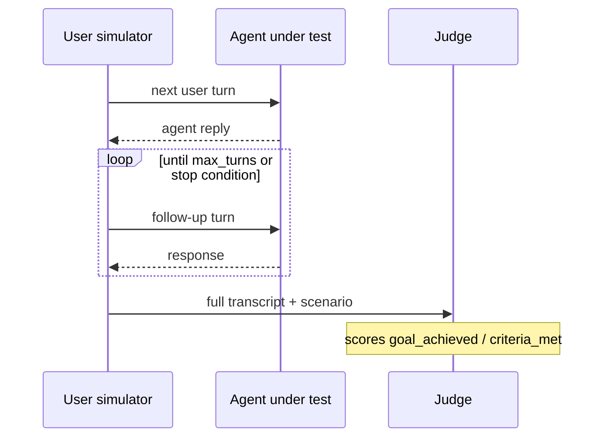
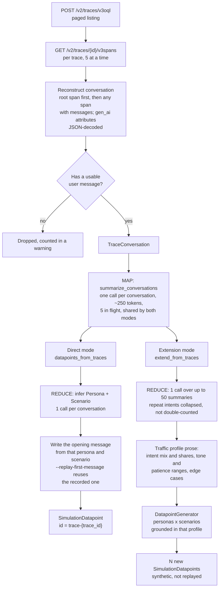

# Agent Simulation

Drive your agent through realistic multi-turn conversations without writing test
transcripts by hand. Three LLMs are in play:

- **Your agent** — the target under test (a hosted Orq agent, a callback, or an Orq deployment).
- **User simulator** — plays a **persona** pursuing a **scenario** goal, turn by turn.
- **Judge** — scores whether the goal was met and whether any rules were broken.

=== "Orq agent"

    Requires the simulation extra and an `ORQ_API_KEY`:

    ```bash
    uv add "evaluatorq[simulation]"
    export ORQ_API_KEY=...
    ```

    Prefer pip? Use `python -m pip install "evaluatorq[simulation]"`, which
    installs into the interpreter you just named rather than whichever `pip`
    happens to be first on your `PATH`.

=== "OpenAI"

    Requires the simulation extra, the `openai` package, and an `OPENAI_API_KEY`:

    ```bash
    uv add "evaluatorq[simulation]" openai
    export OPENAI_API_KEY=sk-...
    ```

    Prefer pip? Use `python -m pip install "evaluatorq[simulation]" openai`,
    which installs into the interpreter you just named rather than whichever
    `pip` happens to be first on your `PATH`.


```mermaid
sequenceDiagram
    participant U as User simulator
    participant A as Agent under test
    participant J as Judge

    U->>A: next user turn
    A-->>U: agent reply
    loop until max_turns or stop condition
        U->>A: follow-up turn
        A-->>U: response
    end
    U->>J: full transcript + scenario
    Note over J: scores goal_achieved / criteria_met
```

--8<-- "docs/_snippets/openai-direct-model.md"

## Generate from a one-line description

The fastest start: `generate_and_simulate()` synthesizes the personas, scenarios,
and opening messages from a short description of your agent — no hand-written
`Persona(...)` / `Scenario(...)`.

=== "Orq agent"

    Point it at a hosted Orq agent with `target="agent:<key>"` (the agent key from
    AI Studio → Agents). The simulator and judge LLMs route through Orq by default.

    Agents with a memory store attached reject calls that carry no memory scope
    (a 400 with `memory_entity_id_required`). A fresh entity id is minted per
    conversation automatically, so parallel conversations never share memory;
    pass `memory_entity_id="..."` (CLI: `--memory-entity`) to run every
    conversation against one specific, e.g. pre-seeded, entity instead.

    ```python
    import asyncio

    from evaluatorq.simulation import generate_and_simulate


    async def main():
        results = await generate_and_simulate(
            evaluation_name="support-agent-sim",
            target="agent:my-support-agent",     # hosted Orq agent, routed via ORQ_API_KEY
            agent_description=(
                "Customer support agent for an e-commerce store; "
                "handles refunds, orders, and product questions."
            ),
            num_personas=3,
            num_scenarios=4,                     # → 12 persona × scenario simulations
            max_turns=6,
            evaluator_names=["goal_achieved", "criteria_met"],
        )

        passed = sum(r.goal_achieved for r in results)
        print(f"Pass rate: {passed}/{len(results)}")


    if __name__ == "__main__":
        asyncio.run(main())
    ```

=== "OpenAI"

    Pass `sim_model=` to route the simulator and judge through OpenAI directly.
    Use `target=` for the agent under test.

    ```python
    import asyncio

    from openai import AsyncOpenAI

    from evaluatorq.contracts import Message
    from evaluatorq.simulation import generate_and_simulate

    client = AsyncOpenAI()

    SYSTEM = "You are a customer support agent for Acme Corp. Be concise and helpful."


    async def openai_agent(messages: list[Message]) -> str:
        history = [{"role": "system", "content": SYSTEM}]
        history += [{"role": m.role, "content": m.content or ""} for m in messages]
        resp = await client.chat.completions.create(model="gpt-4o-mini", messages=history)
        return resp.choices[0].message.content or ""


    async def main():
        results = await generate_and_simulate(
            evaluation_name="support-agent-sim-openai",
            target=openai_agent,
            agent_description=(
                "Customer support agent for an e-commerce store; "
                "handles refunds, orders, and product questions."
            ),
            num_personas=3,
            num_scenarios=4,
            sim_model="gpt-4o-mini",             # simulator + judge on OpenAI directly
            max_turns=6,
            evaluator_names=["goal_achieved", "criteria_met"],
            upload_results=False,
        )

        passed = sum(r.goal_achieved for r in results)
        print(f"Pass rate: {passed}/{len(results)}")


    if __name__ == "__main__":
        asyncio.run(main())
    ```

`agent_description` drives generation; `num_personas × num_scenarios` is how many
conversations run. The simulator and judge LLMs resolve their provider by
precedence: if `ORQ_API_KEY` is set they route through the Orq AI Router;
otherwise they fall back to OpenAI via `OPENAI_API_KEY` (an explicitly passed
client always wins). See [Configuration](../configuration.md).

!!! note "CI and local runs"
    Dropped simulations raise by default; ordinary failed goals remain in the
    returned results. Set `exit_on_failure=False` for exploratory runs. When
    `ORQ_API_KEY` is available, results upload to Orq by default; pass
    `upload_results=False` for a local-only run.

## Seed by archetype

The middle ground between "just give me five" and specifying every trait: name
the archetype, and `generate_persona()` / `generate_scenario()` fill the rest.
You get back real `Persona` / `Scenario` objects to inspect, tweak, and pass to
`simulate()`.

```python
import asyncio

from evaluatorq.simulation import generate_persona, generate_scenario, simulate


async def main():
    persona = await generate_persona(
        "angry customer",
        agent_description="e-commerce support agent",
    )
    scenario = await generate_scenario("disputes a refund denial")

    results = await simulate(
        evaluation_name="seeded-simulation",
        target="agent:my-support-agent",
        personas=[persona],
        scenarios=[scenario],
        max_turns=6,
        evaluator_names=["goal_achieved", "criteria_met"],
    )
    print(f"Goal achieved: {results[0].goal_achieved}")


if __name__ == "__main__":
    asyncio.run(main())
```

Batch forms `generate_personas([...])` / `generate_scenarios([...])` take a list
of seeds and return one object each.

## Full control: hand-build personas

When you want exact personas and pass/fail criteria, build them yourself and call
`simulate()`. A **persona** is *who* is talking (patience, assertiveness, tone);
a **scenario** is *what they want* plus the **criteria** the agent must (or must
not) satisfy.

A persona requires its core traits — `name`, `patience`, `assertiveness`,
`politeness`, `technical_level`, `communication_style`, and `background`. Only
`emotional_arc` and `cultural_context` default (to `None`). A scenario needs just
`name` and `goal`; everything else, including `criteria`, is optional.

=== "Orq agent"

    Pass `target="agent:<key>"` (the agent key from AI Studio → Agents) to route to a hosted Orq agent.

    ```python
    import asyncio

    from evaluatorq.simulation import simulate
    from evaluatorq.simulation.types import (
        CommunicationStyle, Criterion, EmotionalArc, Persona, Scenario, StartingEmotion,
    )


    async def main():
        persona = Persona(
            name="Impatient Customer",
            patience=0.2, assertiveness=0.8, politeness=0.4, technical_level=0.3,
            communication_style=CommunicationStyle.terse,
            background="Received the wrong item and wants a refund urgently",
            emotional_arc=EmotionalArc.escalating,
        )
        scenario = Scenario(
            name="Wrong Item Refund",
            goal="Get a full refund for the wrong item received",
            context="Ordered headphones but received a phone case instead",
            starting_emotion=StartingEmotion.frustrated,
            criteria=[
                Criterion(description="Agent asks for order details", type="must_happen"),
                Criterion(description="Agent acknowledges the mistake", type="must_happen"),
                Criterion(description="Agent blames the customer", type="must_not_happen"),
            ],
        )

        results = await simulate(
            evaluation_name="basic-simulation-example",
            target="agent:my-support-agent",    # hosted Orq agent, routed via ORQ_API_KEY
            personas=[persona],
            scenarios=[scenario],
            max_turns=6,
            evaluator_names=["goal_achieved", "criteria_met"],
        )

        result = results[0]
        score = result.goal_completion_score or 0.0
        print(f"Goal achieved: {result.goal_achieved}  score={score:.2f}")
        for msg in result.messages:
            who = "User" if msg.role == "user" else "Agent"
            print(f"{who}: {msg.content}")


    if __name__ == "__main__":
        asyncio.run(main())
    ```

=== "OpenAI"

    Use `target=` with any async function that maps the conversation to
    your agent's reply. Pass `sim_model=` to run the simulator and judge on OpenAI
    directly. Set `upload_results=False` for a local-only run.

    ```python
    import asyncio

    from openai import AsyncOpenAI

    from evaluatorq.contracts import Message
    from evaluatorq.simulation import simulate
    from evaluatorq.simulation.types import CommunicationStyle, Criterion, Persona, Scenario

    client = AsyncOpenAI()

    SYSTEM = "You are a customer support agent for Acme Corp. Be concise and helpful."


    async def openai_agent(messages: list[Message]) -> str:
        """Your agent under test — a raw OpenAI model."""
        history = [{"role": "system", "content": SYSTEM}]
        history += [{"role": m.role, "content": m.content or ""} for m in messages]
        resp = await client.chat.completions.create(model="gpt-4o-mini", messages=history)
        return resp.choices[0].message.content or ""


    async def main():
        persona = Persona(
            name="Impatient Customer",
            patience=0.2, assertiveness=0.8, politeness=0.4, technical_level=0.3,
            communication_style=CommunicationStyle.terse,
            background="Received the wrong item and wants a refund urgently",
        )
        scenario = Scenario(
            name="Wrong Item Refund",
            goal="Get a full refund for the wrong item received",
            criteria=[
                Criterion(description="Agent asks for order details", type="must_happen"),
            ],
        )

        results = await simulate(
            evaluation_name="openai-agent-simulation",
            target=openai_agent,                 # your OpenAI agent
            personas=[persona],
            scenarios=[scenario],
            sim_model="gpt-4o-mini",             # simulator + judge on OpenAI directly
            max_turns=6,
            evaluator_names=["goal_achieved", "criteria_met"],
            upload_results=False,                # local-only run, no Orq experiment
        )

        result = results[0]
        score = result.goal_completion_score or 0.0
        print(f"Goal achieved: {result.goal_achieved}  score={score:.2f}")


    if __name__ == "__main__":
        asyncio.run(main())
    ```

One persona × one scenario yields one `SimulationResult` with `goal_achieved`,
`goal_completion_score`, `turn_count`, `rules_broken`, and the full message
transcript.

### How criteria are scored

The judge audits every `Criterion` on every turn and the runner folds those
verdicts over the whole conversation, so a violation on turn 2 still shows up in a
run that ends on turn 6:

- **`must_happen`** passes if it occurred in *any* turn. Never occurring is a
  failure — intent, plans, and paraphrases do not count.
- **`must_not_happen`** fails if it was violated in *any* turn. One violation is
  permanent; a clean later turn does not clear it.

The judge is only ever asked **what occurred**, never what passed — a pass/fail
flag means the opposite thing for the two criterion types, and models invert it.
Occurrence is mapped to pass/fail in code, so `rules_broken` is derived, not
reported. Failures land in `rules_broken` (criterion ids), `criteria_results`
(description → passed), and the `criteria_met` score.

Per-criterion detail is in `metadata['criteria_meta']`, where `audited` says whether
the judge actually returned a verdict for that criterion:

```python
for c in result.metadata['criteria_meta']:
    if not c['passed'] and c.get('audited') is False:
        print(f"{c['id']} was not audited by the judge")
```

A `must_happen` the judge confirmed never occurred and one it did not audit both
show `passed: False`; use `audited` to distinguish them. It has three states, not
two: `True` audited, `False` not audited, and `None` on runs saved before the
field existed — which is why the example tests `is False` rather than `not
c['audited']`.

Each entry also carries **`evidence`** — the quote from the turn where the
criterion's occurrence first flipped, taken from the judge's `criteria_verdicts`
audit. It is `''` when the criterion never occurred (or occurred without a
tracked quote) and `None` when no tracker was available, same as `audited`.

Both keys reach the reports. A criterion that was not audited renders as **not
audited** (a neutral `?`, never a green tick) and is counted separately from the
"N/M criteria met" tally. A run with `criteria_verified = False` says so above
the criteria list.

The `criteria_met` score applies the same rule: an unaudited criterion is **not
met**, so the score and the tally beside it agree.

!!! warning "A custom `judge=` must report per-criterion verdicts"

    The built-in `JudgeAgent` audits each unsettled criterion every turn. A custom
    judge that does not populate `Judgment.criteria_verdicts` cannot provide a
    reliable per-criterion audit.

    That run is marked `SimulationResult.criteria_verified = False`, the runner logs
    a warning naming the scenario, and `criteria_met` scores it `0.0` — unknown, not
    met. Check the field, not the transcript:

    ```python
    if result.criteria_verified is False:
        print('criteria unverified — the judge returned no per-criterion audit')
    ```

A run that ends in an error or a timeout never reaches the audit either. Those
results also score `criteria_met` as `0.0` (not `1.0`) and log a warning, so neither
a crashed run nor an unaudited one can inflate the average. A target that dies
mid-run keeps whatever the judge had already **confirmed** — a `must_not_happen` it
saw violated stays failed — while a `must_happen` that simply had not happened yet
is reported as **unknown**, never as failed. The run was cut short before that
criterion had its chance: it is not the judge's verdict that nothing happened;
nobody looked.

The callable passed to `target` is the only structural difference from the Orq path —
personas, scenarios, criteria, and the result shape are identical. Swap the
callback body for any HTTP/LLM agent.

## The four built-in scorers

`evaluator_names` picks from four built-ins. Two read the judge's verdicts; two apply
a *policy* you can change with `scoring=`:

| Scorer | 0–1 meaning | Tunable |
|---|---|---|
| `goal_achieved` | `1.0` when the judge decided the persona's goal was reached, else `0.0`. | no |
| `criteria_met` | Fraction of the scenario's criteria the judge audited and found satisfied. | no |
| `turn_efficiency` | How few turns it took to reach the goal. `0.0` if the goal was missed. | yes |
| `conversation_quality` | Weighted composite of the other three. | yes |

The default is `["goal_achieved", "criteria_met"]` — the two that are meaningful for
every scenario. The other two are opt-in.

### What `turn_efficiency` actually measures

It is a **cost** proxy, conditioned on success: *given that the goal was reached, how
many conversational turns did it take?* The assumption behind "fewer is better" is that
the extra turns are usually the agent re-asking for something it could have inferred,
clarifying its own vague answer, or wandering — so a user who got what they came for in
two turns had a better experience, and cost less to serve, than one who needed twelve.
A run that did **not** reach the goal scores `0.0` outright: failing quickly is not
efficiency.

**Where that assumption breaks.** A task that legitimately needs many turns — a long
intake form, a multi-step troubleshooting tree, a negotiation — is penalised by this
metric for doing its job properly. If your scenarios look like that, either move the
cliffs out so the curve matches a realistic conversation length, or leave
`turn_efficiency` out of `evaluator_names` and ignore the score. Do not read a low
`turn_efficiency` as a quality problem without checking the transcript length you
actually expect.

The default curve is a set of cliffs, then a linear decay to a floor:

| Turns | 1–2 | 3–4 | 5–6 | 7 | 8 | 9 | 10+ |
|---|---|---|---|---|---|---|---|
| Score | 1.0 | 0.9 | 0.7 | 0.6 | 0.5 | 0.4 | 0.3 |

Past the last cliff each turn costs `turn_efficiency_decay_per_turn` (0.1), starting
from that cliff's score, until `turn_efficiency_floor` (0.3) — a very long conversation
that *did* reach the goal keeps a non-zero score, because it was inefficient, not
failed.

### The `conversation_quality` composite

One number per conversation, weighted across the other three scorers:

| Weight field | Default | What it weighs |
|---|---|---|
| `goal_achieved_weight` | `0.4` | Did the judge mark the persona's goal as reached? |
| `criteria_met_weight` | `0.3` | What share of the scenario's criteria were audited and satisfied? |
| `turn_efficiency_weight` | `0.3` | How few turns that took (the cost proxy above). |

The weights must sum to `1.0` — `SimulationScoringConfig` rejects any other sum at
construction, so the composite stays on the same 0–1 scale as its parts and remains
comparable across runs.

**Worked example.** A refund conversation runs 4 turns, the judge marks the goal
achieved, and 1 of the scenario's 2 criteria is met:

- `goal_achieved` = `1.0`
- `criteria_met` = `1/2` = `0.5`
- `turn_efficiency` = `0.9` (4 turns: past the `<= 2` cliff, inside the `<= 4` one)
- `conversation_quality` = `1.0 × 0.4 + 0.5 × 0.3 + 0.9 × 0.3` = `0.4 + 0.15 + 0.27` = **`0.82`**

### Changing the policy

```python
from evaluatorq.simulation import SimulationScoringConfig, simulate

results = await simulate(
    evaluation_name="onboarding-sim",
    target="agent:my-onboarding-agent",
    evaluator_names=["goal_achieved", "criteria_met", "turn_efficiency", "conversation_quality"],
    # A guided onboarding flow needs ~6 turns before anyone should call it slow.
    scoring=SimulationScoringConfig(
        turn_efficiency_cliffs=((6, 1.0), (10, 0.9), (16, 0.7)),
        # Criteria matter more than speed for this agent.
        goal_achieved_weight=0.4,
        criteria_met_weight=0.5,
        turn_efficiency_weight=0.1,
    ),
)
```

`scoring=` is accepted by both `simulate()` and `generate_and_simulate()`, and omitting
it uses the defaults above. The config is bounded and rejects unknown fields, so a typo
fails at construction rather than silently scoring with the shipped policy. Two shapes
it refuses on purpose, because both produce a report that is quietly wrong rather than
obviously broken:

- cliffs that are not ordered — turn thresholds must strictly increase and scores must
  not increase with them, so a longer conversation can never score higher than a
  shorter one;
- weights that do not sum to `1.0`.

## From existing traces and data

You do not have to invent every test case from scratch. If you already have
recorded conversations, real production traces, or a batch of datapoints from an
earlier run, you can feed that history back into simulation in two ways: replay
the exact same cases, or mine them for the archetypes that drive fresh ones.

### Replay stored datapoints

A `SimulationDatapoint` bundles one persona, one scenario, and the opening
message. Every case simulation runs is one of these, and you can persist them for
reuse. `eq sim generate` writes the cases it builds to a JSONL file with
`--datapoints PATH` (one datapoint per line); `eq sim run` does the same alongside a
live run with `--datapoints PATH`:

```bash
# Generate cases once and keep them
eq sim generate --agent-description "e-commerce support agent" \
  --num-personas 3 --num-scenarios 4 \
  --datapoints cases.jsonl

# Re-run the exact same cases against any target, as often as you like
eq sim simulate --input cases.jsonl --target agent:my-support-agent
```

Because the file pins the personas, scenarios, and first messages, the run is
reproducible. That makes it the natural way to compare two agent versions, or the
same agent under a new set of evaluators, on an identical bank of cases. From the
SDK the same file loads via `load_datapoints_from_jsonl()`:

```python
import asyncio

from evaluatorq.simulation import simulate
from evaluatorq.simulation.utils import load_datapoints_from_jsonl


async def main():
    datapoints = load_datapoints_from_jsonl("cases.jsonl")

    results = await simulate(
        evaluation_name="replay-v2",
        target="agent:my-support-agent-v2",   # new version, same cases
        datapoints=datapoints,
        max_turns=6,
        evaluator_names=["goal_achieved", "criteria_met"],
    )
    passed = sum(r.goal_achieved for r in results)
    print(f"Pass rate: {passed}/{len(results)}")


if __name__ == "__main__":
    asyncio.run(main())
```

If your cases already live in Orq as a dataset, point `simulate()` at it with
`dataset_id=` and skip the local file entirely. Each row's `inputs` should carry a
`datapoint` object (`persona`, `scenario`, `first_message`), or a `persona` +
`scenario` pair, matching the `SimulationDatapoint` shape above:

```python
results = await simulate(
    evaluation_name="dataset-replay",
    target="agent:my-support-agent",
    dataset_id="my-simulation-cases",       # named Orq dataset, routed via ORQ_API_KEY
    evaluator_names=["goal_achieved", "criteria_met"],
)
```

`simulate()` takes five mutually exclusive sources — `datapoints`, `dataset_id`,
`experiment_id`, `previous_run`, and `personas` + `scenarios`. Pass exactly one
per run.

### Ground new cases in real traces

Replay reruns what you already have. The other move is to generate *new* cases
that are shaped by what really happened. Production traces show you the user
archetypes and situations your agent actually meets.

The direct route is `eq sim from-traces`, which pulls recent traces from the Orq
traces API and writes one datapoint per conversation — persona and scenario
inferred from a short summary of it, opening message written from that persona
and scenario:

```bash
eq sim from-traces --output traces_datapoints.jsonl --limit 50 --lookback-hours 24
eq sim simulate --input traces_datapoints.jsonl --target agent:my-agent
```

Add `--extend N` to also generate N new datapoints matching the traffic
distribution of the fetched traces, so you get cases *around* real traffic rather
than only the recorded ones. The same thing is available from Python as
`datapoints_from_traces()` and `extend_from_traces()`:

```python
from evaluatorq.simulation import (
    datapoints_from_traces,
    fetch_trace_conversations,
    summarize_conversations,
)

conversations = await fetch_trace_conversations(limit=50)
summaries = await summarize_conversations(conversations)
datapoints = await datapoints_from_traces(conversations, summaries=summaries)
```

Full flag list: [`eq sim from-traces`](../cli-reference/simulation.md).

#### What happens between a trace and a datapoint

Fetching is shared; both modes are then map-then-reduce. Each conversation is
summarized on its own (the map), and the summaries — never the raw transcripts —
go into the call that produces the output (the reduce). That is what keeps a
prompt's size a function of *how many* traces there are rather than how long any
one of them ran: before it, a single long agentic session crowded out the twenty
short conversations it should have been weighed against.

Both modes summarize unconditionally: every conversation gets exactly one
summarize call, and nothing downstream reads the raw transcript again — direct
mode's persona/scenario inference reads the summary, and so does extension
mode's traffic-profile reduce. A run doing both calls `summarize_conversations`
once and passes the result as `summaries=` to each, so no conversation is
summarized twice.


```mermaid
flowchart TD
    A["POST /v2/traces/v3oql<br/>paged listing"] --> B["GET /v2/traces/{id}/v3spans<br/>per trace, 5 at a time"]
    B --> C["Reconstruct conversation<br/>root span first, then any span<br/>with messages; gen_ai attributes<br/>JSON-decoded"]
    C --> D{"Has a usable<br/>user message?"}
    D -- "no" --> E["Dropped, counted in a warning"]
    D -- "yes" --> F["TraceConversation"]

    F --> S["MAP: summarize_conversations<br/>one call per conversation, ~250 tokens,<br/>5 in flight, shared by both modes"]

    S --> G["Direct mode<br/>datapoints_from_traces"]
    S --> H["Extension mode<br/>extend_from_traces"]

    G --> I["REDUCE: infer Persona + Scenario<br/>1 call per conversation"]
    I --> J["Write the opening message<br/>from that persona and scenario<br/>--replay-first-message reuses<br/>the recorded one"]
    J --> K["SimulationDatapoint<br/>id = trace-{trace_id}"]

    H --> L["REDUCE: 1 call over up to 50 summaries<br/>repeat intents collapsed, not double-counted"]
    L --> M["Traffic profile prose:<br/>intent mix and shares, tone and<br/>patience ranges, edge cases"]
    M --> N["DatapointGenerator<br/>personas x scenarios<br/>grounded in that profile"]
    N --> O["N new SimulationDatapoints<br/>synthetic, not replayed"]
```

Every LLM-side limit lives on `TraceAnalysisConfig`, passed as `config=` to either
function; the fetch-side ones are fixed:

| Limit | Default | Why |
|---|---|---|
| Rows per listing page | 200 | The API's own cap; pagination continues until `--limit` is met or a page adds nothing new |
| Span fetches in flight | 5 | Politeness to the traces API |
| LLM calls in flight | 5 | Same width the datapoint generator uses |
| `summary_target_tokens` | 250 | Roughly how long a summary should be. **Soft** — it goes in the prompt, nothing cuts the result |
| `max_reduce_summaries` | 50 | How many summaries the profile call carries; the rest are dropped with a warning naming the count |
| `summary_max_tokens` | 10000 | Completion budget for a summarize call — reasoning headroom, not the length target |
| `max_tokens` | 10000 | Completion budget for the inference and profile calls |
| `generate_first_message` | `True` | Write the opening from the persona; `False` replays the recorded one |
| `redact_pii` | `True` | Instruct the model to replace identifying values with placeholders as it writes |

`summary_target_tokens` is a target, not a cut, and deliberately so. Truncating a
summary removes its end, which is exactly where the prompt puts what went wrong
and what was unusual — the two things the next step most needs. A length the
model can aim at (models reason in tokens, not characters) buys a soft bound that
keeps whole sentences. The reduce prompt's expected size is that target times
`max_reduce_summaries`.

The completion budgets, by contrast, are deliberately far above the answers they
bound. Reasoning models spend most of a budget thinking before emitting anything,
so a budget sized to the output gets consumed by reasoning tokens and truncates
the answer to nothing — the prompt bounds the length, the budget bounds the
failure. Truncation is never silent: `generate_structured` raises on a
length-finished response on every path rather than handing back a cut-off object.

Pagination stops when `--limit` is met, when the API says there is no more, or
when a page returns rows that all lack a `trace_id` — a page that adds nothing
cannot be followed by one that does, so that is where the loop ends, and it says
so in a warning. There is no fixed page ceiling, so a large `--limit` is honoured
for as many pages as it genuinely takes.

A trace that fails its span fetch, returns a non-list payload, or yields no user
message is dropped with a warning rather than failing the batch — likewise an
inference or summarize call that raises or returns nothing parseable. Extension
mode logs how many of the sampled conversations actually reached the profile,
because that count is the denominator its shares are computed over. A run that
produced fewer datapoints than traces has those warnings behind it.

Generation runs before a simulation exists, so its spend has no field on any
result. Each phase reports its own total to the run log instead — `Trace
summarization`, `Trace persona/scenario inference`, `Trace traffic profiling`,
`Persona/scenario generation` and `Simulation recommendations` each log the
tokens, the number of LLM calls, and the cost when the models are priced. The
call count includes the fallback rungs a structured-output call burned on the way
to an answer, and a rung whose usage the provider did not report is counted as
one unpriced call rather than as zero, so the figure reads as a lower bound
instead of a confident total.

##### What lands in the generated dataset

Trace-derived datapoints are built from real conversations, and a persona
background or scenario context written straight from one carries whatever was in
it — names, order numbers, emails — into a JSONL that then gets committed and
shared. By default both the summarize and the persona/scenario prompts are
instructed to redact as they write, replacing identifying values with
placeholders (`[CUSTOMER_NAME]`, `[ORDER_ID]`) that keep the meaning; the profile
prompt is told to carry placeholders through rather than invent concrete values.

`--no-redact-pii` (or `TraceAnalysisConfig(redact_pii=False)`) turns it off, for
when the concrete values are the point — reproducing a specific incident, or a
fixture where a changed order number breaks the comparison — and the dataset
stays somewhere the raw traffic could already go. With it off the profile prompt
also drops its "keep the placeholders" line, since telling a model to preserve
placeholders that were never introduced invites it to invent them, and invented
placeholders read as redaction that did not happen.

Either way this is an instruction to a model, not a guarantee. Treat a generated
dataset from production traffic as needing the same review any export of that
traffic would.

##### Why the opening message is generated, not replayed

Replaying the real user's first message looks like the faithful choice and
behaves worse. The simulated user is the *persona*; if turn one is production
text the persona would not have written, the conversation opens in one voice and
continues in another, and whatever the agent does with that mismatch is not
evidence about either. Reusing recorded text also carries any PII in it into a
generated dataset that then gets committed and shared.

`--replay-first-message` (or `TraceAnalysisConfig(generate_first_message=False)`)
is the opt-out, for when you are reproducing one specific recorded case and want
the exact opening back.

#### Hand-picked seeds

When you want curated archetypes rather than a straight pull from traffic, seed
generation yourself. Pull the recurring patterns out of your traces (the impatient
buyer disputing a charge, the confused first-time user, the edge case that broke
last week), then hand them to `generate_personas()` / `generate_scenarios()` as
short seed phrases:

```python
import asyncio

from evaluatorq.simulation import generate_personas, generate_scenarios, simulate

# Archetypes and situations distilled from real traces
persona_seeds = ["impatient repeat buyer", "confused first-time user", "polite but persistent negotiator"]
scenario_seeds = ["disputes a duplicate charge", "cannot find order confirmation", "asks for a discount after a late delivery"]


async def main():
    personas = await generate_personas(persona_seeds, agent_description="e-commerce support agent")
    scenarios = await generate_scenarios(scenario_seeds, agent_description="e-commerce support agent")

    results = await simulate(
        evaluation_name="trace-grounded-sim",
        target="agent:my-support-agent",
        personas=personas,                    # 3 personas × 3 scenarios → 9 simulations
        scenarios=scenarios,
        max_turns=6,
        evaluator_names=["goal_achieved", "criteria_met"],
    )
    passed = sum(r.goal_achieved for r in results)
    print(f"Pass rate: {passed}/{len(results)}")


if __name__ == "__main__":
    asyncio.run(main())
```

The seed is a steer, not a transcript: generation fills in the persona traits and
scenario criteria and writes a natural opening message, so each run explores the
space around the pattern rather than replaying one recorded conversation. Persist
the generated cases (`eq sim generate --datapoints`, or `eq sim run
--datapoints`) and they become a replayable bank for the section above.

!!! note "Seeds are a deliberate choice, not the only route"
    Writing seed phrases by hand means you decide which archetypes matter, rather
    than inheriting whatever your recent traffic happened to contain. When you'd
    rather start from real traffic, use `eq sim from-traces` above — it infers the
    personas and scenarios for you.

## Reading a run in the dashboard

Runs are saved to `.evaluatorq/sim-runs/<name>_<timestamp>.json` — automatically
by `eq sim run` (unless you pass `--no-save`), and by `simulate()` when called
with `save=True`. `eq dashboard` browses those files locally, no external
service:

```bash
uv add "evaluatorq[dashboard]"

eq dashboard                       # browse every saved run
eq dashboard .evaluatorq/sim-runs  # scope to simulation runs
```

!!! warning "The Python examples above don't save by default"
    `simulate()` and `generate_and_simulate()` default to `save=False`, so a
    script copy-pasted from earlier on this page leaves the dashboard empty.
    Pass `save=True`, or drive the run from the CLI (`eq sim run`), which saves
    unless you pass `--no-save`.

Land on the cross-surface overview, pick the run from **Agent Sim**, then work
down the report tabs from headline to transcript:

| Tab | What it answers |
|---|---|
| **Overview** | Summary, pass rate, average score, the four per-turn quality metrics |
| **Breakdown** | Persona × scenario heatmap — usually the fastest read |
| **Recommendations** | Suggested instruction edits, applicable to an Orq agent |
| **Transcripts** | Every conversation, expandable to criteria, rationale and messages |
| **Turn quality** | The four metrics trended by turn index |
| **Config** | Run metadata plus the persona dials |
| **Compare** | KPI and per-conversation deltas against a second run |

Two easily conflated numbers: **pass rate** is the share of conversations where
the judge set `goal_achieved`; **average score** is the mean
`goal_completion_score`, so a run can average 0.7 while passing half its
conversations. The **CONFIDENCE** badge is a band on the pass rate, not a
statistical confidence — it carries no sample-size meaning.

The tab-by-tab walkthrough, with screenshots, lives in the Dashboard reference:
[Reading a simulation run](../dashboard.md#reading-a-simulation-run). See also
[filters](../dashboard.md#filters), [trace links](../dashboard.md#orq-trace-links)
and [downloads](../dashboard.md#downloads).

## External framework demos

Each recording runs one framework's example end to end — the user simulator
drives the conversation, the agent under test responds, and the judge scores the
transcript. Sources live in `examples/agent_simulation/` (files `06`–`09`).

### LangGraph

<video controls muted playsinline preload="metadata" width="100%">
  <source src="../../assets/sim-langgraph.mp4" type="video/mp4">
  Your browser does not support the video tag —
  <a href="../../assets/sim-langgraph.mp4">download the recording</a>.
</video>

### OpenAI Agents SDK

<video controls muted playsinline preload="metadata" width="100%">
  <source src="../../assets/sim-openai-agents.mp4" type="video/mp4">
  Your browser does not support the video tag —
  <a href="../../assets/sim-openai-agents.mp4">download the recording</a>.
</video>

### Pydantic AI

<video controls muted playsinline preload="metadata" width="100%">
  <source src="../../assets/sim-pydantic-ai.mp4" type="video/mp4">
  Your browser does not support the video tag —
  <a href="../../assets/sim-pydantic-ai.mp4">download the recording</a>.
</video>

### CrewAI

<video controls muted playsinline preload="metadata" width="100%">
  <source src="../../assets/sim-crewai.mp4" type="video/mp4">
  Your browser does not support the video tag —
  <a href="../../assets/sim-crewai.mp4">download the recording</a>.
</video>

## Where to next

- **[Examples › Agent Simulation](../examples/index.md)** — tool simulation, hardening loops, LangGraph / CrewAI / OpenAI Agents targets.
- **[Red Teaming](red-teaming.md)** — adversarial, attack-driven testing.
- **[Tuning](../tuning.md)** — target timeouts, per-simulation wall clock, reasoning effort, and provider options.
