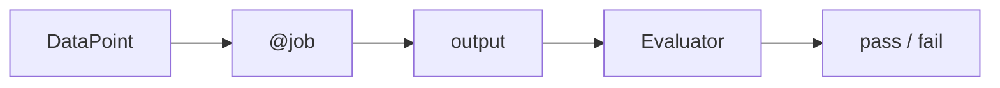

# Getting Started

Your first evaluation in five minutes. No dataset, no deployment — just local
data and a local scorer.

## Install

```bash
pip install evaluatorq
```

## The mental model

An evaluation has three parts:

- **`DataPoint`** — one row of input plus its `expected_output`.
- **`@job`** — an async function that turns a `DataPoint` into an output (your
  model call, agent, or — here — a trivial transform).
- **Evaluator** — a scorer that compares the output against the expectation and
  returns pass/fail.

`evaluatorq(...)` runs every job over every datapoint in parallel and applies
each evaluator to the results.



## A first evaluation

```python
import asyncio

from evaluatorq import DataPoint, evaluatorq, job, string_contains_evaluator


@job("uppercase-converter")
async def uppercase_job(data: DataPoint, _row: int) -> str:
    return str(data.inputs.get("text", "")).upper()


async def run():
    data = [
        DataPoint(inputs={"text": "hello world"}, expected_output="HELLO"),
        DataPoint(inputs={"text": "python is great"}, expected_output="PYTHON"),
        DataPoint(inputs={"text": "evaluatorq rocks"}, expected_output="EVALUATORQ"),
    ]
    return await evaluatorq(
        "simple-local-eval",
        data=data,
        jobs=[uppercase_job],
        evaluators=[string_contains_evaluator()],
        parallelism=3,
        print_results=True,
    )


if __name__ == "__main__":
    asyncio.run(run())
```

Run it:

```bash
python simple_local_eval.py
```

`print_results=True` renders a pass/fail table in the terminal. In this
example, `string_contains_evaluator()` checks whether the job output contains
the `expected_output`, so `HELLO WORLD` satisfies an expected output of `HELLO`.
Wire that pass/fail signal into CI to gate on quality regressions.

## Where to next

- **[Agent Simulation](agent-simulation.md)** — score multi-turn conversations.
- **[Red Teaming](red-teaming.md)** — adversarial security testing.
- **[Configuration](../configuration.md)** — API keys and environment variables for Orq/OpenAI backends.
- **[Examples](../examples/index.md)** — datasets, structured scoring, integrations.
- **[API Reference](../reference/evaluatorq.md)** — `evaluatorq`, `DataPoint`, `job`, evaluators.
