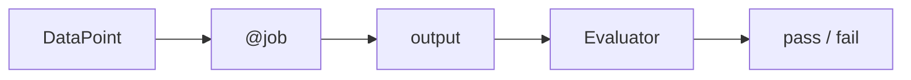

# Getting Started

Your first evaluation in five minutes. No dataset, no deployment — just local
data and a local scorer.

## Install

```bash
uv init my-evals && cd my-evals   # skip if you already have a uv project
uv add evaluatorq
```

Prefer pip? Use `python -m pip install evaluatorq`, which installs into the
interpreter you just named rather than whichever `pip` happens to be first on
your `PATH`.

## The mental model

An evaluation has three parts:

- **`DataPoint`** — one row of input plus its `expected_output`.
- **`@job`** — an async function that turns a `DataPoint` into an output (your
  model call, agent, or — here — a trivial transform).
- **Evaluator** — a scorer that compares the output against the expectation and
  returns pass/fail.

`evaluatorq(...)` runs every job over every datapoint in parallel and applies
each evaluator to the results.


```mermaid
flowchart LR
    D["DataPoint"]
    J["@job"]
    O["output"]
    E["Evaluator"]
    P["pass / fail"]

    D --> J --> O --> E --> P
```

## A first evaluation

```python
import asyncio

from evaluatorq import DataPoint, evaluatorq, job, string_contains_evaluator


async def support_agent(question: str) -> str:
    """Stand-in for your agent — replace the body with a model call."""
    if "refund" in question.lower():
        return "Sure — you can request a refund within 30 days of delivery."
    return "Our support team is happy to help with that."


@job("support-agent")
async def support_job(data: DataPoint, _row: int) -> str:
    return await support_agent(str(data.inputs["question"]))


async def run():
    data = [
        DataPoint(inputs={"question": "How do I get a refund?"}, expected_output="30 days"),
        DataPoint(inputs={"question": "When will my order ship?"}, expected_output="2 business days"),
        DataPoint(inputs={"question": "Is my warranty still valid?"}, expected_output="12 months"),
    ]
    return await evaluatorq(
        "support-agent-eval",
        data=data,
        jobs=[support_job],
        evaluators=[string_contains_evaluator()],
        parallelism=3,
        print_results=True,
    )


if __name__ == "__main__":
    asyncio.run(run())
```

Run it:

```bash
uv run support_agent_eval.py
```

`print_results=True` renders a pass/fail table in the terminal.
`string_contains_evaluator()` checks whether the job output contains the
`expected_output`, so the refund answer scores and the other two do not — the
stand-in agent only knows about refunds. Because two rows fail, the script exits
with status 1: that is the CI gate firing, not a crash. Replace `support_agent` with your own
model or agent call and wire that pass/fail signal into CI to gate on quality
regressions.

## Where to next

- **[Agent Simulation](agent-simulation.md)** — score multi-turn conversations.
- **[Red Teaming](red-teaming.md)** — adversarial security testing.
- **[Configuration](../configuration.md)** — API keys and environment variables for Orq/OpenAI backends.
- **[Examples](../examples/index.md)** — datasets, structured scoring, integrations.
- **[API Reference](../reference/evaluatorq.md)** — `evaluatorq`, `DataPoint`, `job`, evaluators.
