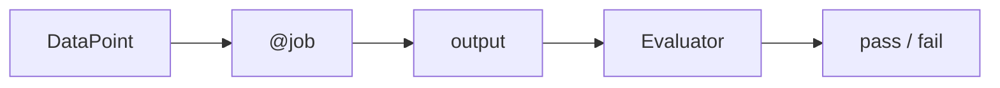

# Getting Started

Your first evaluation in five minutes. No dataset, no deployment — just local
data and a local scorer.

## Install

```bash
uv init my-evals && cd my-evals   # skip if you already have a uv project
uv add evaluatorq
```

Prefer pip? Use `python -m pip install evaluatorq`, which installs into the
interpreter you just named rather than whichever `pip` happens to be first on
your `PATH`.

## The mental model

An evaluation has three parts:

- **`DataPoint`** — one row of input plus its `expected_output`.
- **`@job`** — an async function that turns a `DataPoint` into an output (your
  model call, agent, or — here — a stand-in for one). Pass several and each
  becomes a column in the results table.
- **Evaluator** — a scorer that compares the output against the expectation and
  returns pass/fail.

`evaluatorq(...)` runs every job over every datapoint in parallel and applies
each evaluator to the results.


```mermaid
flowchart LR
    D["DataPoint"]
    J["@job"]
    O["output"]
    E["Evaluator"]
    P["pass / fail"]

    D --> J --> O --> E --> P
```

## A first evaluation

Two versions of a support agent, scored on the same three questions. `agent-v1`
answers from memory; `agent-v2` looks the answer up in the policy first.

```python
import asyncio

from evaluatorq import DataPoint, evaluatorq, job, string_contains_evaluator

POLICY = {
    "refund": "Refunds are available within 30 days of delivery.",
    "ship": "Orders ship within 2 business days.",
    "warranty": "Every device carries a 12 months warranty.",
}


@job("agent-v1")
async def agent_v1(data: DataPoint, _row: int) -> str:
    """Answers from memory — so it only really knows about refunds."""
    question = str(data.inputs["question"]).lower()
    if "refund" in question:
        return "Sure — you can request a refund within 30 days of delivery."
    return "Our support team is happy to help with that."


@job("agent-v2")
async def agent_v2(data: DataPoint, _row: int) -> str:
    """Looks the answer up in the support policy first."""
    question = str(data.inputs["question"]).lower()
    for topic, answer in POLICY.items():
        if topic in question:
            return answer
    return "Our support team is happy to help with that."


async def main() -> None:
    data = [
        DataPoint(inputs={"question": "How do I get a refund?"}, expected_output="30 days"),
        DataPoint(inputs={"question": "When will my order ship?"}, expected_output="2 business days"),
        DataPoint(inputs={"question": "How long is the warranty?"}, expected_output="12 months"),
    ]
    await evaluatorq(
        "support-agent-eval",
        data=data,
        jobs=[agent_v1, agent_v2],
        evaluators=[string_contains_evaluator()],
        datapoint_parallelism=3,
    )


if __name__ == "__main__":
    asyncio.run(main())
```

This is the repository's
[`examples/lib/basics/support_agent_eval.py`](https://github.com/orq-ai/evaluatorq/blob/main/examples/lib/basics/support_agent_eval.py) —
the same script the README quick start uses.

Run it:

```bash
uv run support_agent_eval.py
```

`string_contains_evaluator()` checks whether the job output contains the
`expected_output`, so `agent-v1` scores 0.33 — it only knows about refunds —
against `agent-v2`'s 1.00. Every job runs against every data point, so adding a
third variant adds a column.

Because `agent-v1` fails two rows, its results contain `pass_=False`, but the
library does not exit the process. For a CI gate, check `pass_` with
`check_pass_failures(results)` and raise `SystemExit(1)` yourself. Swap the two
function bodies for your own model or agent call and that same pass/fail signal
can gate quality regressions in CI.

## Where to next

- **[Agent Simulation](agent-simulation.md)** — score multi-turn conversations.
- **[Red Teaming](red-teaming.md)** — adversarial security testing.
- **[Configuration](../configuration.md)** — API keys and environment variables for Orq/OpenAI backends.
- **[Examples](../examples/index.md)** — datasets, structured scoring, integrations.
- **[API Reference](../reference/evaluatorq.md)** — `evaluatorq`, `DataPoint`, `job`, evaluators.
