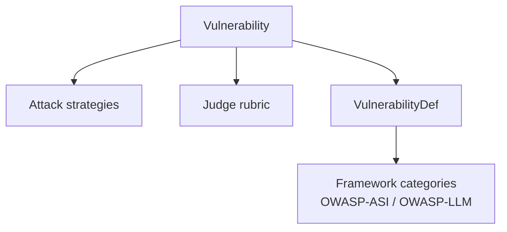

# Vulnerabilities & Frameworks

The red team runs on **vulnerabilities**. OWASP category codes like `ASI01` and `LLM01` are labels attached to those vulnerabilities for reporting, not a second set of things to test. This page explains the relation behind the coverage table.

## The model

`Vulnerability` is the atomic primitive. Everything that decides what an attack does binds to it:

- **Attack strategies** are keyed by vulnerability. Pick a vulnerability and you pick the curated strategies. In dynamic and hybrid mode you also pick what the planner generates.
- **The judge** is keyed by vulnerability. One LLM-as-judge rubric per vulnerability decides RESISTANT or VULNERABLE.

Each vulnerability has a `VulnerabilityDef` in `src/evaluatorq/redteam/vulnerability_registry.py`. Its `framework_mappings` field projects the vulnerability onto framework category codes. That projection is a labelling layer on top of the primitive — it feeds reporting and compliance views, and it lets you name a vulnerability by a code your security team already uses.



Two frameworks are registered today: `OWASP-ASI` and `OWASP-LLM`.

## Categories are labels, not the primitive

There are 18 vulnerabilities and 19 category codes. The codes are a projection of the vulnerabilities, which is why the counts differ.

The full enumeration — every code, the vulnerability behind it, its curated strategy count, and whether a judge exists — is the [Coverage table](red-teaming.md#coverage) in the red teaming guide. Read that table as 18 things wearing 19 labels.

## One vulnerability, two labels

`supply_chain` is mapped into both frameworks:

```python
framework_mappings={'OWASP-ASI': ['ASI04'], 'OWASP-LLM': ['LLM03']}
```

`ASI04` and `LLM03` are two names for the same vulnerability. Both codes share one judge rubric and one strategy set.

`supply_chain` is currently the only multi-mapped vulnerability. The mechanism is general — a `VulnerabilityDef` can list any number of frameworks and codes — but exactly one entry uses it today.

## Cross-framework codes report under their primary category

!!! note "`-c LLM03` reports as `ASI04`"
    `eq redteam run -c LLM03` runs exactly the attacks `-c ASI04` runs, because both codes resolve to `supply_chain`. The results are reported under **`ASI04`**, the primary category. The run logs the relabel at info level.

    `get_primary_category` returns the first code of the first framework mapping. For `supply_chain` that is `ASI04`, so `ASI04` is the label on every summary row and report heading for that vulnerability, whichever code you asked for.

    If you are assembling an OWASP LLM Top 10 view, filter on the vulnerability id `supply_chain` or on `ASI04`. The top-line label on those rows is `ASI04`, so a filter on the primary category alone will not surface `LLM03`.

## Domain is a different axis from framework

`VulnerabilityDomain` is `agent`, `model`, or `data`. It says which layer of the stack a fix belongs to — the agent's scaffolding and tools, the model itself, or the data and retrieval it sits on. It does not say which framework the vulnerability belongs to.

`excessive_agency` is the clearest case: its domain is `agent`, and its primary category is `LLM06`, a code from the LLM Top 10. The two axes disagree, and neither can be read off the other. Group by domain when you want to know who fixes something; group by category when you want a framework report.

## Summaries carry every mapped code

The top-line label on a result is the primary category, but the complete mapping is available too, on the per-vulnerability summary. `report.summary.by_vulnerability` is a `dict[str, VulnerabilitySummary]` keyed by the vulnerability id string, and each `VulnerabilitySummary` has a `framework_categories` field, a `dict[str, list[str]]` of every framework the vulnerability maps into:

```python
report.summary.by_vulnerability['supply_chain'].framework_categories
# {'OWASP-ASI': ['ASI04'], 'OWASP-LLM': ['LLM03']}
```

So you can build a compliance view keyed on `LLM03` from a report: read `framework_categories` on the vulnerability summary rather than the primary label.

## Where to next

- **[Red Teaming](red-teaming.md)** — the workflow, the modes, and the full coverage table.
- **[Custom Evaluators & Frameworks](../custom-evaluators-and-frameworks.md)** — add your own vulnerabilities, judges, strategies, and framework mappings.
- **[API Reference › redteam](../reference/evaluatorq/redteam.md)** — the `Vulnerability` enum and the category codes you can pass to `categories=`.
- **[CLI Reference › Red Teaming](../cli-reference/redteam.md#eq-redteam-run)** — the `--category` and `--vulnerability` flags.
