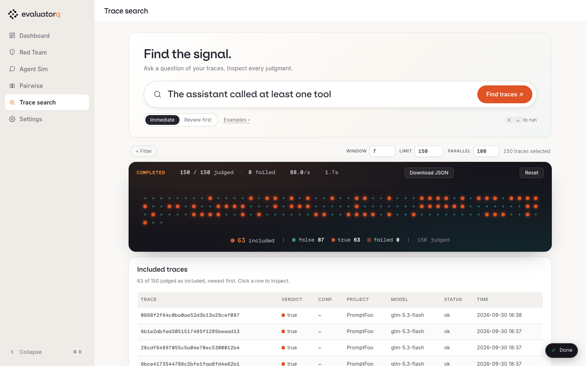
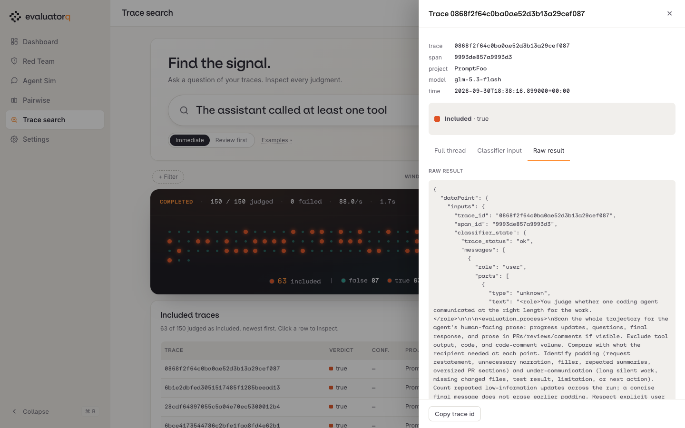
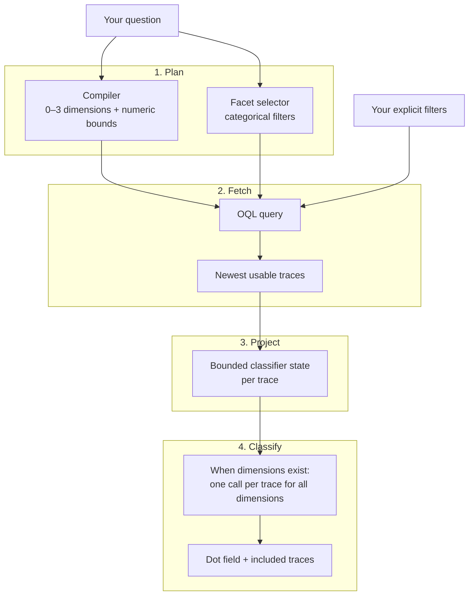
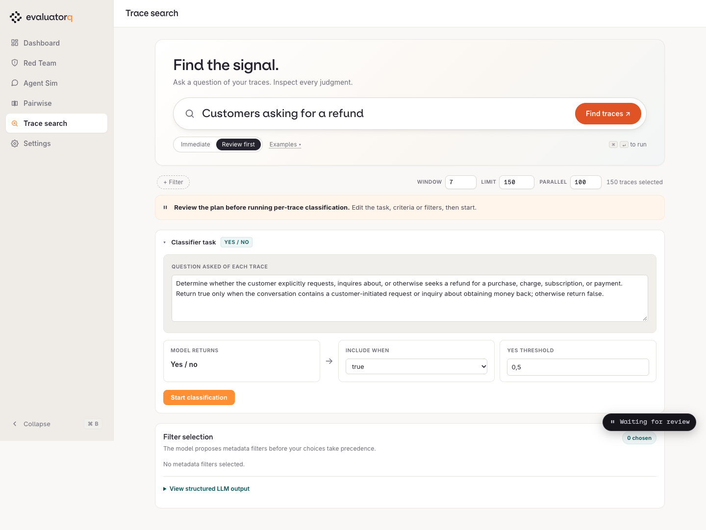
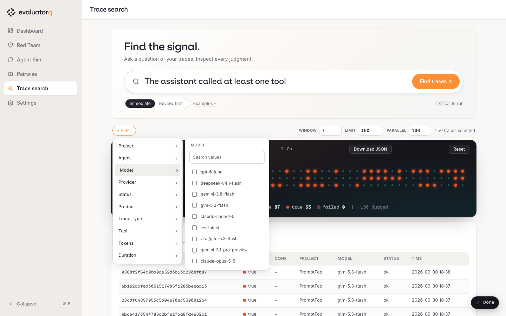

# Trace explorer

The dashboard has two trace pages: **Trace search** (`/find`) finds traces from a natural-language question, and **Traces** (`/traces`) browses recent Orq traces before you ask a question. Both pages reuse the same facet menu, filter chips, and trace drawer; each page keeps its own classification run and table for its result type. Traces keeps loaded rows, filters, hydrated conversations, and Ask AI results in server memory keyed to your browser session, which expires after 30 minutes idle, may be evicted when more than 32 sessions are active, and clears when the dashboard restarts; Trace search continues to use one dashboard-wide result set.

Use Traces to inspect recent traffic, browse and sort traces, review token and cost breakdowns, and inspect trajectories or messages. Use Trace search to find traces matching a natural-language question. Use red teaming or simulation to generate new conversations against a target.

{ .dashboard-shot }

## Start the explorer

The dashboard is included in the `dashboard` extra. It needs Orq credentials because it reads live traces and routes model calls through Orq. Set `ORQ_API_KEY` or select an `orq` CLI profile in Settings.

Install the dashboard extra with:

```bash
uv add 'evaluatorq[dashboard]'
```

```bash
eq dashboard
```

Open [http://127.0.0.1:8080/traces](http://127.0.0.1:8080/traces) to browse traces or [http://127.0.0.1:8080/find](http://127.0.0.1:8080/find) to search by question. The dashboard sidebar has separate **Traces** and **Trace search** items. If the selected authentication method has no usable Orq credential, both pages stay available and explain that trace loading is unavailable. The [`eq find`](#cli-reference) CLI works from the regular install.

## Loading traces

When you open `/traces`, the backend begins loading up to 200 trace summaries from the last seven days for that browser session, with no user-entered facet or numeric filters and no AI calls. The dashboard warms the facet catalogue in parallel. Both requests run asynchronously, so page rendering does not wait for them. This initial load is the default view, so you can browse without setting filters or pressing a button. The compact toolbar shows the active relative range (for example, **Last 7 days**) and a **Rows** control, up to 5000 and defaulting to 200. Open the range menu to choose a preset (`15m`, `1h`, `24h`, `7d`, `30d`) or enter exact **From** and **To** dates and times in your browser's local time. Press **Load** to fetch traces using the selected range, row limit, and filters; loading does not call a model. The status line shows loading progress and then the visible count. If the requested row limit is reached, it says the result may contain more traces and names the cap.

The initial trace request returns summaries for the table (status, timing, tokens, cost, and models). While summaries load, the dashboard warms trajectory data for the first page of up to 100 rows. The table reports summary completion as soon as those rows arrive; Trajectories shows loading placeholders and polls until its first page is ready. Later pages load trajectory data when you open them, and message content for the drawer loads when you open a row.

On **Traces**, the totals strip uses the rows currently shown, so errors, AI matches, facets, and within-results narrowing update it. To see one model's trace count and cost, filter by that model.

## The table and the Columns menu

The default columns are Time, Status, Trace / agent, Model, Tokens in, Tokens out, Cache read %, Cost, Duration, and AI match. **AI match** appears once an Ask AI run starts and shows `—` for rows without a judgment. When a run judges loaded rows, it splits that column into one column per classifier dimension, each headed by the dimension's name. The **Columns ▾** menu in the toolbar lists every available column — also Name, Provider, Product, Operation, Reasoning tokens, Cache writes, Session, Thread, and Trace ID — and your choice is saved immediately to the dashboard settings file as `explorer_columns`, so it persists across reloads and processes. On Traces, choose **Download CSV** to export every row in the current filtered and sorted set across all pages, using the selected columns.

Results page at 100 rows per page; the pager below the table shows `Page X of Y`.

On **Traces**, each known duration keeps its numeric value and adds a small bar scaled to the longest trace in the current filtered and sorted set. Durations at or above that set's nearest-rank p95 receive a warm tint, including ties; both the scale and threshold stay the same as you move between pages. Unknown durations remain `—`, and no p95 tint appears when the set has no known durations.

## Sorting

Click a column header to sort by it; clicking again flips the direction. Sorting only reorders the rows already loaded — it never triggers a new fetch. Pressing **Load** keeps the selected tab and sort and returns to the first page. Rows missing a value for the sorted column sink to the bottom regardless of sort direction, so switching from ascending to descending never surfaces an unset value at the top.

## How tokens in and cache read % are computed

Token counts come from the Orq router's usage rollup. The router counts cache reads and writes **inside** `prompt_tokens` for both OpenAI and Anthropic, so Tokens in is normally the router's `prompt_tokens` as-is. A span instrumented outside the router (native Anthropic usage) reports cache tokens **excluded** from `prompt_tokens` instead; the explorer detects that case — `cached + cache_write > prompt_tokens` — and falls back to `prompt_tokens + cached + cache_write` as the input count for that row. Cache read % is cache-read tokens divided by all input tokens. Cache writes count toward the input total but never toward the cache-read numerator. The percentage reads `—` when tokens in is zero or unknown.

## Trajectories view

The **Trajectories** toggle in the toolbar switches the table to a per-trace bar: each conversation renders as one horizontal bar made of coloured segments, one per captured message part. Segments are coloured by kind — `system`, `user`, `assistant`, `reasoning`, `call` (tool call), `result` (tool result) — with an unrecognized part type drawn as `other` (a hatched pattern). A captured system prompt appears as a `system` segment. Turn on **Tool definitions** above the bars to add one purple block per trace for schemas captured on its selected span; hover over it for the definition count and estimated size. The toggle starts off. Message segments estimate tokens as text length divided by 4, and the tool block estimates serialized schema length divided by 4. These estimates are not exact provider tokenization or a complete account of model input; the exact provider input and output totals remain in their own column. The axis uses the p95 of the visible blocks on the current page, so turning on tool definitions or changing pages can change its scale. Bars above that scale are capped and marked. If the page has no visible blocks, the axis uses a fixed 1,000-token scale, shown in its tooltip. The legend's percentages describe the visible estimated blocks on the page. Each row also shows its duration and a text status pill. Traces without conversation text get a labelled `No messages available` placeholder. Hovering a message segment shows a dark tooltip with its message index and position (`n / N`), its kind, its estimated token count, and a preview of its content; hovering does not dim other rows. Clicking a message segment (or a table row) opens the message drawer at that exact message.

## The message drawer, minimap and message stripes

{ .dashboard-shot }

Clicking a trajectory segment or a table row opens the drawer for that trace, scrolled and expanded to the message you clicked — the thread panel scrolls to center it without moving the page itself. Each message in **Full thread** is stripe-coloured on its left edge by the same kind used in Trajectories, and the selected message is highlighted. A minimap strip mirrors the trace's segments; clicking a minimap segment moves the selection to that message locally, without a new request to the server. A table row click (with no segment) opens the drawer at message 1.

On `/traces`, if a trace has no messages, the drawer shows a labelled empty state. If a trace's full messages can't be loaded — for example a loaded-but-not-classified row whose hydration failed — the drawer explains that the messages could not be loaded and suggests opening the trace in Orq instead. Its **Spans** tab remains available and loads the trace's span tree when opened, including status, duration, token totals and Orq links for spans with safe IDs. The optional **Error details** column directs failed rows to **Spans**, and the drawer header shows the trace duration. For the first errored span, the tree also shows the raw Orq status message when that detail is available. Trace IDs, metadata, classifier input and raw result sit under the collapsed **Technical details** section. The `/find` drawer keeps its tabbed layout.

On `/traces`, press `/` to focus and select Ask AI, `?` to open the keyboard shortcut guide, and, while a trace drawer is open, `o` to activate its **Open in Orq** link or `c` to copy its trace ID. **Escape** closes the guide or drawer. Letter shortcuts are ignored while a text field or native details menu has focus, when Ctrl, Alt or Command is held, and while another modal is open.

## Ask AI: within results or as a new search

Above the table, **Ask AI** plans a natural-language question and creates zero to three classifier dimensions. Traces with dimensions get one classifier call per trace that evaluates them all; a zero-dimension plan makes no per-trace classifier calls:

1. You enter a question, such as `Conversations over 20k tokens where the customer was frustrated.`
2. Two model calls plan the run concurrently. The compiler extracts numeric constraints for total tokens or duration and creates zero to three classifier dimensions: short-named questions to ask of each trace, such as **Frustrated** or **Refund**. It creates no dimension only when every part of the question is a numeric bound or an exact metadata value; descriptive phrases such as `coding agents` become dimensions because they require reading the trace. A question that filters alone can answer, such as `Any traces above 50k tokens`, gets no dimension, and no trace is sent to the classifier. A separate facet-selection call picks categorical metadata filters from the live facet catalogue. Boolean selections accept either `yes`/`no` or `true`/`false` labels.
3. The finder merges those selections with any filters you chose explicitly and builds an OQL query. The base filter excludes `generate_content` operations, so the compiler and classifier traces do not crowd the population being searched. A model or provider filter drops the base filter, because a bare model call is itself a `generate_content` trace and would otherwise never match.
4. The classifier judges each projected trace through evaluatorq, asking every dimension in one classify call per trace. A trace is included only when it matches every dimension. Results stream into one table column per dimension as each trace finishes, including the final poll after the run ends. With zero dimensions, every trace the filters keep is included without a classifier call.

Each trace is projected into a bounded classifier state before judgment: the projection keeps the newest conversation suffix, preserves tool-call arguments and completion status, removes reasoning fields and tool-result bodies, and truncates text from the front when necessary. Ask AI does not upload evaluation result rows. Trace retrieval and model inference call Orq, and OpenTelemetry tracing may export spans when configured through environment variables. Selecting a CLI profile alone does not enable tracing. Set `ORQ_DISABLE_TRACING=1` before starting the command or dashboard to disable that tracing.

On **Traces**, Ask AI can classify traces already loaded in the table or search a new population. The finder creates zero to three dimensions; when dimensions exist, each selected trace gets one call that evaluates them all.

On **Traces**, choose the population Ask AI should classify:

- **Within results** classifies every trace already loaded in the table, including rows outside the selected tab or page. It is selected after the first automatic load succeeds and after later loads; if a load returns no rows, asking within results explains that you must load traces first. During loading and classification, the progress line shows live counts and a thin progress bar; the corner status badge is hidden while the run is working. Before classifying, it applies the filters your question implies to the loaded rows: token and duration bounds, so "above 50k tokens" drops smaller rows, and the metadata values the filter model picks, such as a model, status or agent. A row with no token or duration value is dropped when that bound is set. The table narrows to the same rows, and the question's filters appear as chips, in the **Filters** count and in the **Filters** menu, so removing a chip brings the other loaded rows back. If those filters drop every loaded row, the table shows zero rows and the run completes with a notice that names the filter and nearest loaded value, such as `None of the 190 loaded traces have at least 50,001 tokens (the largest has 18,411). Try New search to look beyond the loaded rows.` At most the configured AI trace limit is judged; rows past it show as not judged. AI answers stay on their rows when you reload the table, change filters or change the time range, until you press **Clear AI results**. Runs above 500 traces require review before classification.
- **New search** searches the time range currently shown in the Traces toolbar, up to its **Rows** limit, independently of the rows already loaded. It then reloads the table with the searched traces so the AI match column, quick views, drawer and trajectories show the run’s results. Relative ranges such as **15m** and **1h**, as well as exact **From** and **To** dates, apply to the new search. The progress line shows how many traces have loaded out of the requested maximum while the search runs. The configured parallelism default still applies. The separate **Trace search** page (`/find`) has per-run window, limit, and parallelism controls.

1. You enter a question, such as `Conversations over 20k tokens where the customer was frustrated.`


### 1. Plan

Two model calls run **concurrently**, so a slow facet catalogue does not wait for semantic compilation.

| Step | Produces |
|---|---|
| **Compiler** | Zero to three named classifier dimensions, each with a question and match rule, plus [numeric bounds](#numeric-ranges) for total tokens and duration. |
| **Facet selector** | Categorical metadata filters picked from the live [facet catalogue](#facets) in one classify request. |

The facet selector asks one question per non-empty facet dimension. When your query names several available values in one dimension, it asks a yes/no question for each named value in the same round trip.

### 2. Fetch the population

The finder merges the generated filters with any you chose explicitly and builds an OQL query. Orq returns the newest usable traces in the selected window, and the OQL filters apply before judging.

- The base filter excludes `generate_content` operations, so the finder's own compiler and classifier traces do not crowd the population.
- When a trace summary has no usable messages, the finder hydrates the conversation from its spans.

!!! warning "Hydration limit"
    Hydration stops with an error if a trace exceeds ten span pages or 2,000 spans.

### 3. Project each trace

Each trace becomes a bounded classifier state of at most 50,000 serialized UTF-8 bytes. This is a conservative upper bound on tokenizer tokens, not a count from the selected model tokenizer. The projection keeps the **newest** conversation suffix and truncates text from the front when it has to.

??? info "What the projection keeps and drops"
    - **Keeps** tool-call arguments, completion status, and a fixed diagnostic category for a failed paired tool result.
    - **Drops** reasoning fields and tool-result bodies.
    - At most 32 tool calls per assistant turn; tool-call IDs and names beyond 128 UTF-8 bytes are shortened.
    - An oversized structural unit that cannot fit becomes an omission marker. Its `omitted_bytes` count measures content dropped to fit the byte budget; it excludes fields the projection schema removes or shortens.

### 4. Classify

When dimensions exist, the classifier evaluates all dimensions for each projected trace in one call through evaluatorq. A trace is included only when every dimension matches; results stream into the search results as each trace finishes. A zero-dimension plan includes traces that pass its filters without classifier calls.

!!! tip "The population is fixed per run"
    The population is chosen before per-trace judging begins. Changing a finder control does nothing until you submit the form again, which starts a new run.

!!! info "What leaves your machine"
    The finder does not upload evaluation result rows. Trace retrieval and model inference call Orq, and OpenTelemetry tracing may export spans when configured through environment variables. Selecting a CLI profile alone does not enable tracing. Set `ORQ_DISABLE_TRACING=1` before starting the command or dashboard to disable it.


On **Trace search**, the review panel (shown in **Review first**) gains an **Apply filters only** button below the plan, so you can load the reviewed population into the table without spending a classifier call — the classify button itself is labelled with the trace count it is about to judge.

Filter chips generated by the classifier (rather than chosen explicitly by you) are marked with a small **AI** badge, so it's clear which filters you set and which the model picked.

### Reading results

{ .dashboard-shot }

The status line shows trace loading progress or the number of traces loaded. During Ask AI loading and classification, it also shows live counts and a thin progress bar, while the corner status badge is hidden. A zero-dimension plan with no filters warns when words beyond numeric phrasing are not covered, for example `Only the numeric bounds were applied. No AI question or filter covers "coding agents", so rephrase the question or use Review to add one.` When a run finishes, the progress line leads with the answer, for example `6 of 196 traces match “angry customer”`, followed by a **Show only these** button that switches the table to the **AI matches** quick view, and the classifier model the run used (the dashboard does not track a per-run cost). An AI match is a trace the classifier judged a match; rows that only passed filters read **Kept by filters** and never count as AI matches. Matched rows and their drawers show only the classifier score when available; no extra model call generates commentary. Asking a question Ask AI cannot answer, such as a total, average or ranking, ends the run early with a neutral **Can't answer** state and the reason, and no counts. Running Ask AI keeps the view you are in, Table or Trajectories. The table keeps the loaded population visible; use the **AI match** column or the **AI matches** quick view to find matching judgments. **All**, **Errors**, and **AI matches** switch the table population shown. Click a table row or trajectory segment to open its drawer. **Full thread** shows the source conversation; click a message heading to fold or unfold it. In **Trace search**, **Classifier input** shows the exact bounded projection sent for judgment, and **Raw result** shows the stored evaluator result. On **Traces**, technical details keep trace metadata but omit the raw classifier result; the verdict can still show its score. The drawer also shows the trace and span IDs, metadata, verdict, and an **Open in Orq** link when the dashboard has a saved workspace slug, an environment override, or an authenticated Orq CLI that can find the credential's workspace.

The **Top 10%** menu picks the top tenth, at least one, of the loaded traces, largest first: **Slowest traces** use duration, **Costliest traces** use cost, **Token-heavy traces** use input plus output tokens over every turn, and **Largest context** uses the prompt tokens of the trace's leading model call. Conversation views group loaded traces by thread id, or session id when there is no thread id: **Costliest conversations** sum cost over the conversation, **Token-heavy conversations** sum input plus output tokens over the conversation, and **Longest conversations** rank by the largest message count among their traces because a trace's final call carries the whole history. Longest conversations fetches every loaded trace's messages first, so the first use after a load can take a while. Traces that do not report a metric are left out rather than counted as zero. Choosing a view clears any column sort.

When a run completes, choose **Download JSON** to export the query, classifier dimensions, filters, selected trace metadata, each trace's per-dimension answers, the combined match, and errors. The export's `schema_version` is `2`; version 1 had a single top-level `task` and `selection` and one `value` per trace. The export does not include source messages or the classifier projection.

Use the **Analyze matches** section after a completed run to download its export and see the Python and CLI commands for analyzing only the matched traces. The [Trace Insights guide](insights.md) explains the population, labels, discovered clusters, and saved-run review workflow.

On **Trace search**, the common failure mode is stopping in **Review first**: the plan is visible, but no trace is judged until you press the classify button. If no traces match the compiled filters, the run ends with an explicit error instead of pretending that zero judgments are a successful result. The page stays available without Orq credentials and explains that trace loading is unavailable.

## Filter chips

{ .dashboard-shot }

Filter chips in the toolbar show the categorical and numeric filters in play, whether the classifier picked them or you did — a chip the classifier generated carries the **AI** badge described above. Whenever no run is in progress, click a chip to reopen its category and change the value, or its ✕ to drop it; the next submit uses the edited set. On **Traces**, the toolbar's **Filters** button (it shows the active count, as in **Filters · 2**) opens the category list directly; the table reloads once when you close the menu after picking values, and at once when you drop a chip with ✕. Reloading makes no AI calls. On **Trace search**, **+ Filter** opens the same category list for project, agent, model, provider, status, product, trace type, tool, tokens, and duration; hovering a category opens its live values beside the list. Scroll or search within a category's returned values. Every value shows a trace count beside it, and the menu orders values from most to least frequent. On Trace search the count is Orq's count for the search window; on Traces it is a tally of the rows currently loaded, so it changes as you filter. A value the counts do not cover shows 0, a facet without counts shows none, and the menu says when more values exist beyond the fetched limit. The Insights run form renders the same menu and chips with Orq's window counts. The facet catalogue starts warming in the background as the initial trace summaries load. The filter menu uses the warmed values and refreshes them when you change the window. For the same facet or numeric bound, an explicit value takes precedence over the generated value; generated values fill only facets and bounds you leave empty before OQL runs. The classifier's picks apply to that run only: the next question starts from the filters you set yourself, while a reviewed start keeps the whole population.

## Facets and numeric ranges

### Facets

The facet selector picks categorical metadata from the live catalogue. The catalogue follows the current search window. The eight categorical facets and their OQL fields:

| Finder facet | OQL field | Meaning |
|---|---|---|
| `project` | `project_id` | Project names resolve to IDs through `projects.list`; equal names show their project ID in the menu. |
| `model` | `model` | Model recorded on the trace. |
| `provider` | `provider` | Provider recorded on the trace. |
| `status` | `status` | Trace status. |
| `product` | `product` | Product recorded on the trace. |
| `trace_type` | `attributes.orq.leading_span.span_type` | Leading span type. |
| `agent_name` | `agent_name` | Agent name recorded on the trace. |
| `tool_name` | `tool_name` | Tool name recorded on the trace. |

### Numeric ranges

The compiler, not the classifier, extracts numeric bounds. Classify tasks return a label (`choice`), a yes/no probability (`noul`), or a 0–1 score (`score`), so they cannot produce metadata thresholds. The compiler extracts inclusive integer ranges for `total_tokens` and `duration_ms` and applies them in OQL:

| You write | OQL bound |
|---|---|
| over 20k tokens | `total_tokens >= 20001` |
| under 20k tokens | `total_tokens <= 19999` |
| slower than 30 seconds | `duration_ms >= 30001` |

The CLI and dashboard also accept minimum and maximum bounds explicitly.

## Settings and precedence

The dashboard **Settings** page at `/settings` has separate **Models** and **Authentication** sections. Models contains the four model roles: fast, smart, classifier and embedding. **Ask AI on traces** controls whether Ask AI on **Traces** classifies immediately (**Just proceed**, the default) or pauses on the compiled plan (**Review first**); runs over 500 loaded traces always pause for review. Save settings to `.evaluatorq/dashboard-settings.json`, or set `EVALUATORQ_DASHBOARD_SETTINGS` to another JSON file. The separate Trace search page has per-run window, limit, and parallelism controls; environment variables and saved settings provide their defaults. On Traces, the toolbar range and row limit drive New search, while Within results classifies every loaded trace across tabs and pages.

Authentication offers four sources for dashboard requests: **Environment** reads `ORQ_API_KEY` and `ORQ_BASE_URL` from the dashboard process; **CLI API-key profile** reuses a key and host from `orq auth profile list`; **CLI OAuth** uses a saved `orq auth login` session; and **Enter API key** stores a key you provide. **CLI OAuth** lists the logins from `orq auth sessions`, one per server, each with a status: **Valid**, **Signed out**, or **Couldn't check**. When a login's access token has expired, Settings asks the CLI to refresh it once with `orq auth whoami`, in the background after the page has loaded. A refresh that works marks it **Valid** and saves the new tokens, as the CLI's next call would. A rejected refresh marks it **Signed out**; run `orq auth login --server <url>` for that server. A timeout or network error shows **Couldn't check**. A login whose session file the CLI cannot read is listed as **Unreadable** and cannot be selected until you sign in to that server again. Without the `orq` CLI or any saved login, the picker becomes a server URL field. Settings remembers the selected method. The manually entered key is encrypted in the settings file, while its encryption key stays in macOS Keychain. On other platforms, set `EVALUATORQ_DASHBOARD_KEY_ENCRYPTION_KEY` to a Fernet key. The CLI handles OAuth token storage and refresh; evaluatorq does not copy or read the OAuth token. A startup toast links to Settings when the selected method needs action or its validity check could not reach Orq; a successful check stays quiet. The check calls Orq's trace-facet endpoint, so it confirms access to that endpoint and does not test model availability. The saved method stays active until you save another. If the selected credential is missing or rejected, the dashboard asks you to take action instead of switching to another source. CLI profiles without an accessible key remain unavailable. An apply preview must be made again if its credentials change before confirmation.

Authentication has no workspace or project selector. Each method searches all projects accessible to its credential unless you choose a project facet for that run. Set `ORQ_WORKSPACE` for trace links when a run has no experiment URL; it is separate from authentication. Pass `--project` to choose a project facet for one `eq find` run. An explicit `--profile NAME` overrides the saved choice; without that flag, `eq find` uses the saved profile only when **CLI API-key profile** is selected in Settings, and otherwise uses `ORQ_API_KEY` and `ORQ_BASE_URL`. The dashboard's OAuth and manually entered API-key methods do not change credentials used by `eq find`.

Models resolve through the roles described under [Configuration › Models](configuration.md#models): the compiler runs on the `fast` role (`openai/gpt-6-luna` by default) and the classifier on the `classifier` role (`typesafe/jev-latest`). The `finder.compiler` and `finder.classifier` tasks pin either one alone. For the finder's other settings, values resolve from strongest to weakest: explicit CLI or dashboard overrides, environment variables, the saved JSON file, then built-in defaults. Trace search window, limit, and parallelism are set per run; Settings edits the model roles and Ask AI review mode. Invalid environment integers are ignored with a warning; invalid saved settings fall back to built-in defaults.

| Setting | Default | Environment variable |
|---|---|---|
| Fast model (query compiler) | `openai/gpt-6-luna` | `EVALUATORQ_FAST_MODEL` |
| Classifier model | `typesafe/jev-latest` | `EVALUATORQ_CLASSIFIER_MODEL` |
| Trace search window default | 7 days (1–90) | `EVALUATORQ_FINDER_WINDOW_DAYS` |
| Trace search limit default | 500 (max 5000) | `EVALUATORQ_FINDER_LIMIT` |
| Trace search parallelism default | 100 (max 200) | `EVALUATORQ_FINDER_PARALLELISM` |

`EVALUATORQ_COMPILER_MODEL` still works as a deprecated override for the `finder.compiler` task and logs a warning once per process.

The dashboard command accepts `--compiler-model`, `--classifier-model`, `--window-days`, `--limit`, and `--parallelism`; these override defaults for finder runs started by that process. `--compiler-model` pins the `finder.compiler` task; `--classifier-model` sets the whole classifier role. Trace search lets you set the window, limit, and parallelism for each run.

## CLI reference

`eq find` runs an immediate finder query with a terminal activity indicator, then prints a newest-first table of matched traces and a summary of the full run. The CLI has no explorer table, trajectories view, or drawer. Add `--json PATH` to write the completed run export, and pass `--positive-only` to keep only matched trace records in that JSON export; the counts still describe the full run. Pass `--debug` to print progress and the compiler, filter, and classifier requests and responses. For a small diagnostic run, use `eq find "mentions a refund" --limit 10 --debug`. Debug output includes projected conversation content for every classified trace, even with `--positive-only`, so treat saved logs as trace data. `EVALUATORQ_LOG_LEVEL=DEBUG` enables the same diagnostics in CLI and dashboard runs.

The command cancels a run that has not finished after two hours. If any trace classification fails, it exits with status 1 and does not write the JSON file. Pass `--profile NAME` to use an Orq CLI API-key profile for trace retrieval and model calls. It overrides the saved profile and environment credentials. Without the flag, the saved profile applies only when **CLI API-key profile** is selected in Settings; choose **Environment** to use `ORQ_API_KEY` and `ORQ_BASE_URL`. Saved project IDs from older dashboard settings are ignored. Use `--project` to choose a project facet for one run.

```bash
export ORQ_API_KEY=...
eq find "customers asking for a refund" --compiler-model openai/gpt-5.6-luna --classifier-model typesafe/jev-latest --window-days 7 --limit 500 --parallelism 100 --json finder.json
```

For a small diagnostic run, use `eq find "mentions a refund" --limit 10 --debug`. `EVALUATORQ_LOG_LEVEL=DEBUG` enables the same diagnostics in CLI and dashboard runs.

!!! warning "Debug output contains trace data"
    Debug output includes projected conversation content for every classified trace, even with `--positive-only`. Treat saved logs as trace data.

!!! failure "Exit status"
    The command cancels a run that has not finished after two hours. If any trace classification fails, it exits with status 1 and does not write the JSON file.

| Option | Meaning |
|---|---|
| `--debug` | Print changed progress and compiler and classifier request and response data, including trace content. |
| `--window-days INTEGER` (`1`–`90`) | How many recent days to search. |
| `--limit INTEGER` (`1`–`5000`) | Maximum traces to classify. |
| `--parallelism INTEGER` (`1`–`200`) | Concurrent classify calls. |
| `--compiler-model TEXT` | Model that compiles the search question through the Orq router. Pins the `finder.compiler` task; default is the `fast` role, `openai/gpt-6-luna`. |
| `--classifier-model TEXT` | Model that classifies each trace through the Orq router. Pins the `finder.classifier` task; default is the `classifier` role, `typesafe/jev-latest`. |
| `--json PATH` | Write the completed run export to `PATH`. |
| `--positive-only` | Keep only matched trace records in `--json` exports; the terminal table already shows matches and keeps its full-run summary. |
| `--project TEXT` | Project facet; repeatable. Restricts this run to matching projects. |
| `--profile TEXT` | Orq CLI credential profile; overrides the saved profile and environment credentials. |
| `--model TEXT` | Model facet; repeatable. |
| `--provider TEXT` | Provider facet; repeatable. |
| `--status TEXT` | Status facet; repeatable. |
| `--product TEXT` | Product facet; repeatable. |
| `--trace-type TEXT` | Trace type facet; repeatable. |
| `--agent TEXT` | Agent name facet; repeatable. |
| `--tool TEXT` | Tool name facet; repeatable. |
| `--tokens-min INTEGER` (`>= 0`) | Minimum total tokens. |
| `--tokens-max INTEGER` (`>= 0`) | Maximum total tokens. |
| `--duration-ms-min INTEGER` (`>= 0`) | Minimum trace duration in milliseconds. |
| `--duration-ms-max INTEGER` (`>= 0`) | Maximum trace duration in milliseconds. |
| `--help`, `-h` | Show the command help. |

The facet and numeric options are explicit OQL constraints. The question supplies zero to three semantic classifier dimensions and can also produce generated facet or numeric constraints.

## Limits and cost

The finder searches at most 5000 usable traces per run, even if a larger limit is supplied elsewhere; the default is 500. The default lookback is seven days, the default classifier parallelism is 100, and parallelism is capped at 200. Each projected trace is capped at 50,000 serialized UTF-8 bytes, a conservative upper bound on tokenizer tokens rather than a count from the selected model's tokenizer; older conversation units are omitted first when the cap is reached.

| Limit | Value |
|---|---|
| Traces per search | 500 by default, up to 5000 usable traces; Traces can load up to 5000 rows |
| Search lookback | 7 days by default, 1–90 days |
| Classifier parallelism | 100 by default, at most 200 |
| Projection budget | 50,000 serialized UTF-8 bytes per trace, a conservative upper bound on tokenizer tokens; older conversation units go first |

Loading the Traces table makes no model calls. Ask AI within results classifies up to the configured AI trace limit (default 500). A search makes one compiler call, at most one facet-selection call, and one classification call per selected trace when the plan has dimensions; a zero-dimension plan makes no per-trace calls. A 500-trace run therefore makes up to 502 model calls before retries. Narrow the limit and window when exploring a large workspace. If a facet lookup fails, the run warns and skips generated categorical filters; explicit filters and semantic classification still run. When Orq reports more facet values than the fetched limit, the finder warns and uses the returned values ranked by frequency.
