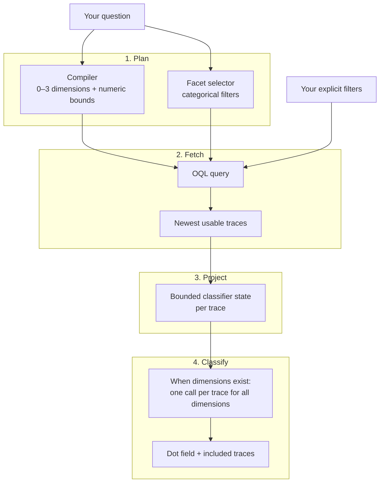

# Trace explorer

The dashboard has two trace pages: **Trace search** (`/find`) finds traces from a natural-language question, and **Traces** (`/traces`) browses recent Orq traces before you ask a question. Both pages reuse the same facet menu, filter chips, and trace drawer, while keeping separate tables and classification runs. Traces keeps loaded rows, filters, hydrated conversations, and Ask AI results in server memory keyed to your browser session; sessions expire after 30 minutes idle, may be evicted above 32 active sessions, and clear when the dashboard restarts. Trace search keeps one dashboard-wide result set.

Use it to inspect real traffic for a semantic pattern, such as frustrated customers or unsupported claims, without writing a dataset first. To generate *new* conversations against a target, use red teaming or simulation instead.

{ .dashboard-shot }

## Start the finder

```bash
eq dashboard
```

Open [http://127.0.0.1:8080/find](http://127.0.0.1:8080/find), type a question, and select **Find traces**. The **Trace search** item in the dashboard sidebar opens the same page.

!!! note "Before you run it"
    The dashboard needs the `dashboard` extra (`uv add "evaluatorq[dashboard]"`) and Orq credentials: `ORQ_API_KEY` in the environment or an `orq` CLI profile, because the finder reads live Orq traces and routes model calls through Orq. Without credentials the page still loads but shows that trace finding is unavailable. The [`eq find`](#cli-reference) CLI works from the regular install.

## Browse Traces

Opening `/traces` asynchronously loads up to 200 trace summaries from the last seven days and warms the facet catalogue; it makes no model calls. A project selected in Settings limits the load. Use the range and **Rows** controls to choose a preset or local **From** and **To** dates, set a cap up to 5000, then select **Load**. Loading shows progress and reports when the cap may have limited the population.

The table starts with time, trace or agent, status, model, input and output tokens, cache-read percentage, cost, duration, and AI match. **Columns** also offers provider, product, operation, reasoning tokens, cache writes, session, thread, and trace ID; selections persist in dashboard settings. Sort by a column header to reorder loaded rows without fetching again. **Download CSV** exports the filtered and sorted rows across all pages. The totals strip and **By model** summary reflect the rows currently shown.

The **Trajectories** view renders captured message parts as colored segments. Turn on **Tool definitions** to show captured tool schemas. Segment token sizes are estimates; provider token totals remain in the table. Click a segment or row to open the drawer at that message. The drawer includes the full thread and span tree; the minimap selects a message locally. On `/traces`, `/` focuses Ask AI, `?` opens shortcuts, `o` opens the Orq link, and `c` copies the trace ID.

Ask AI on **Traces** can classify **Within results**, which uses all loaded rows across tabs and pages, or start a **New search** using the toolbar's time range and row limit. Within-results questions apply their numeric bounds and selected metadata filters to loaded rows first; removing generated filter chips restores rows. New search fetches an independent population. Both use the configured classifier parallelism.

## How a query becomes matches

The finder plans the query once and creates zero to three classifier dimensions. Traces with dimensions get one call per trace that evaluates all of them; a zero-dimension plan makes no per-trace classifier calls.



### 1. Plan

Two model calls run **concurrently**, so a slow facet catalogue does not wait for semantic compilation.

| Step | Produces |
|---|---|
| **Compiler** | Zero to three named classifier dimensions, each with a question and match rule, plus [numeric bounds](#numeric-ranges) for total tokens and duration. |
| **Facet selector** | Categorical metadata filters picked from the live [facet catalogue](#facets) in one classify request. |

The facet selector asks one question per non-empty facet dimension. When your query names several available values in one dimension, it asks a yes/no question for each named value in the same round trip.

### 2. Fetch the population

The finder merges the generated filters with any you chose explicitly and builds an OQL query. Orq returns the newest usable traces in the selected window, and the OQL filters apply before judging.

- The base filter excludes `generate_content` operations, so the finder's own compiler and classifier traces do not crowd the population.
- When a trace summary has no usable messages, the finder hydrates the conversation from its spans.

!!! warning "Hydration limit"
    Hydration stops with an error if a trace exceeds ten span pages or 2,000 spans.

### 3. Project each trace

Each trace becomes a bounded classifier state of at most 25,000 tokens. The projection keeps the **newest** conversation suffix and truncates text from the front when it has to.

??? info "What the projection keeps and drops"
    - **Keeps** tool-call arguments and completion status.
    - **Drops** reasoning fields and tool-result bodies.
    - At most 32 tool calls per assistant turn; tool-call IDs and names beyond 128 UTF-8 bytes are shortened.
    - An oversized structural unit that cannot fit becomes an omission marker. Its `omitted_bytes` count measures content dropped to fit the token budget; it excludes fields the projection schema removes or shortens.

### 4. Classify

The compiler creates zero to three named classifier dimensions, each a short question about a trace. Descriptive phrases such as “coding agents” become dimensions; a question answered entirely by numeric bounds or exact metadata values can have none. The classifier asks all dimensions in one call per projected trace, and a trace is included only when every dimension matches. Results stream into the dot field and the included-traces table as each trace finishes, with one column per dimension. With zero dimensions, filtered traces are included without per-trace classifier calls.

!!! tip "The population is fixed per run"
    The population is chosen before per-trace judging begins. Changing a finder control does nothing until you submit the form again, which starts a new run.

!!! info "What leaves your machine"
    The finder does not upload evaluation result rows. Trace retrieval and model inference call Orq, and OpenTelemetry tracing may export spans when configured through environment variables. Selecting a CLI profile alone does not enable tracing. Set `ORQ_DISABLE_TRACING=1` before starting the command or dashboard to disable it.

## Dashboard workflow

### Immediate or Review first

| Mode | What happens |
|---|---|
| **Immediate** | Compiles the dimensions, loads the population, and classifies each trace when dimensions exist. A zero-dimension plan includes traces that pass its filters without per-trace classifier calls. |
| **Review first** | Stops after compilation and population selection, so you can edit the question, dimensions and their match rules, and filters before classification starts. |

{ .dashboard-shot }

The review shows the filter model's selected metadata values separately from the classifier dimensions and their match rules. Open **View structured LLM output** to see its complete structured response, including the dimensions it left unfiltered. If filter selection fails, the review shows the error and keeps your explicit filters.

!!! warning "Nothing is judged until you start it"
    In **Review first** the plan is visible, but no trace is judged until you press **Start classification**. This is the most common reason a run looks stuck.

### Filters

{ .dashboard-shot }

- **+ Filter** opens the categories: project, agent, model, provider, status, product, trace type, tool, tokens, and duration. Hover a category to see its live values, then scroll or search within them.
- Values are ordered by the frequency Orq reports, most frequent first. The menu says when more values exist beyond the fetched limit.
- Values load in the background after the page renders, and reload when you change the window.
- After a submit, chips above the field show every filter in play, whether the classifier picked it or you did. When no run is in progress, click a chip to change its value or its ✕ to drop it.

!!! note "Your filters win"
    For the same facet or numeric bound, an explicit value takes precedence over a generated one; generated values fill only what you left empty. The classifier's picks apply to that run only: the next question starts from your own filters, while a reviewed start keeps the whole population.

### Reading the dot field

Every dot is one trace in the selected population, including non-matches and failed judgments. The included-traces table below contains only successful matches, newest first.

| Dot | Meaning |
|---|---|
| Hollow | Waiting |
| Pulsing | Being classified |
| Colored, still | Finished; color follows the task's legend |
| Failure mark | Judgment failed |

A pulsing progress message shows while the finder plans the search, loads traces, or starts classification after review. The dots appear once the population is loaded. Submitting, starting a reviewed task, changing the window, cancelling, and resetting each show feedback while their request is pending.

### Inspecting a trace

Click a dot or a table row to open its drawer. A loading badge shows while the details are fetched.

{ .dashboard-shot }

| Tab | Shows |
|---|---|
| **Full thread** | The source conversation. Click a message heading to fold or unfold it. |
| **Classifier input** | The exact bounded projection sent for judgment. |
| **Raw result** | The stored evaluator result. |

The drawer also shows the trace and span IDs, metadata, the verdict, and an **Open in Orq** link when the dashboard has a workspace configured.

### Exporting a run

When a run completes, **Download JSON** exports the query, compiled task, filters, selected trace metadata (including each trace's agent and tool names), verdicts, and errors. The export does not include source messages or the classifier projection.

!!! failure "Zero traces is an error"
    If no traces match the compiled filters, the run ends with an explicit error rather than reporting zero judgments as a success.

## Facets and numeric ranges

### Facets

The facet selector picks categorical metadata from the live catalogue. The catalogue follows the current search window. The eight categorical facets and their OQL fields:

| Finder facet | OQL field | Meaning |
|---|---|---|
| `project` | `project_id` | Project names resolve to IDs through `projects.list`; equal names show their project ID in the menu. |
| `model` | `model` | Model recorded on the trace. |
| `provider` | `provider` | Provider recorded on the trace. |
| `status` | `status` | Trace status. |
| `product` | `product` | Product recorded on the trace. |
| `trace_type` | `attributes.orq.leading_span.span_type` | Leading span type. |
| `agent_name` | `agent_name` | Agent name recorded on the trace. |
| `tool_name` | `tool_name` | Tool name recorded on the trace. |

### Numeric ranges

The compiler, not the classifier, extracts numeric bounds. Classify tasks return a label (`choice`), a yes/no probability (`noul`), or a 0–1 score (`score`), so they cannot produce metadata thresholds. The compiler extracts inclusive integer ranges for `total_tokens` and `duration_ms` and applies them in OQL:

| You write | OQL bound |
|---|---|
| over 20k tokens | `total_tokens >= 20001` |
| under 20k tokens | `total_tokens <= 19999` |
| slower than 30 seconds | `duration_ms >= 30001` |

The CLI and dashboard also accept minimum and maximum bounds explicitly.

## Settings and precedence

Settings resolve from strongest to weakest:

1. Explicit CLI or dashboard overrides
2. Environment variables
3. The saved JSON file
4. Built-in defaults

Invalid environment integers are ignored with a warning; invalid saved settings fall back to built-in defaults.

| Setting | Default | Environment variable |
|---|---|---|
| Compiler model | `openai/gpt-5.6-luna` | `EVALUATORQ_COMPILER_MODEL` |
| Classifier model | `typesafe/jev-latest` | `EVALUATORQ_CLASSIFIER_MODEL` |
| Apply-recommendations model | `openai/gpt-5.6-luna` | `EVALUATORQ_APPLY_MODEL` |
| Search window | 7 days (1–90) | `EVALUATORQ_FINDER_WINDOW_DAYS` |
| Trace limit | 500 (max 5000) | `EVALUATORQ_FINDER_LIMIT` |
| Classifier parallelism | 100 (max 200) | `EVALUATORQ_FINDER_PARALLELISM` |

`eq dashboard` accepts `--compiler-model`, `--classifier-model`, `--window-days`, `--limit`, and `--parallelism`; they apply to finder runs started by that dashboard process.

### Settings page

The dashboard **Settings** page at `/settings` edits the compiler, classifier, and apply-recommendations models. **Save** persists them in `.evaluatorq/dashboard-settings.json`; point `EVALUATORQ_DASHBOARD_SETTINGS` at another JSON file to move it. The window, trace limit, and parallelism are edited per run in the Trace search controls row; their defaults come from the environment or the saved file.

### Workspace and project

**Advanced** saves the Orq workspace slug for trace links and a project for dashboard Trace search.

- The project menu comes from `orq projects list` under the active credential. A project key normally exposes one project; a broader key can expose more.
- The saved project ID limits the dashboard's trace query, even when another project has the same name. The active project appears beside the Trace search filters.
- Leave **All accessible projects** selected to search across the key's scope.
- If the CLI cannot resolve the workspace slug, enter the slug from your Orq URL.

### Credential profiles

When the `orq` CLI exposes API-key profiles (`orq auth profile list`), **Advanced** lets you pick one for the trace finder and apply flow in place of `ORQ_API_KEY` and `ORQ_BASE_URL`.

- Settings stores one active profile, workspace, and project together. Changing the profile clears the previous workspace and project in the preview and reloads choices from the new credential; the saved bundle stays active until you press **Save**.
- The CLI masks keys in its JSON output, so evaluatorq reads the real key from the CLI's private local credential file without writing it to dashboard settings. If that file is unavailable or readable by other users, the profile stays disabled.
- **Environment** uses the process environment without changing it; an exported `ORQ_API_KEY` takes precedence over `.env`.
- If a saved profile is unavailable, the dashboard blocks Orq requests and shows the missing profile in Settings.
- An apply preview must be made again if its credentials change before confirmation.

!!! note "`eq find` follows the saved profile"
    `eq find` uses the saved profile by default, for both trace retrieval and model calls. `--profile NAME` overrides it; choose **Environment** in Settings to make `eq find` use `ORQ_API_KEY` and `ORQ_BASE_URL`. None of these choices changes the process environment. A saved project ID limits the CLI population only while the profile, key, and API host still match the saved selection; after rotating a key or changing hosts, save the project again, or pass `--project` for one run.

## CLI reference

`eq find` runs an Immediate finder query with a terminal activity indicator, then prints a newest-first table of matched traces and a summary of the full run.

```bash
export ORQ_API_KEY=...
eq find "customers asking for a refund" --compiler-model openai/gpt-5.6-luna --classifier-model typesafe/jev-latest --window-days 7 --limit 500 --parallelism 100 --json finder.json
```

- `--json PATH` writes the completed run export; add `--positive-only` to keep only matched records (counts still describe the full run).
- `--debug` prints progress when it changes, the compiler request and structured output, and the filter and per-trace classifier requests and responses. For a small diagnostic run: `eq find "mentions a refund" --limit 10 --debug`. `EVALUATORQ_LOG_LEVEL=DEBUG` enables the same diagnostics in CLI and dashboard runs.

!!! warning "Debug output contains trace data"
    Debug output includes projected conversation content for every classified trace, even with `--positive-only`. Treat saved logs as trace data.

!!! failure "Exit status"
    The command cancels a run that has not finished after two hours. If any trace classification fails, it exits with status 1 and does not write the JSON file.

| Option | Meaning |
|---|---|
| `--debug` | Print changed progress and compiler and classifier request and response data, including trace content. |
| `--window-days INTEGER` (`1`–`90`) | How many recent days to search. |
| `--limit INTEGER` (`1`–`5000`) | Maximum traces to classify. |
| `--parallelism INTEGER` (`1`–`200`) | Concurrent classify calls. |
| `--compiler-model TEXT` | Model that compiles the search question through the Orq router. Default: `openai/gpt-5.6-luna`. |
| `--classifier-model TEXT` | Model that classifies each trace through the Orq router. Default: `typesafe/jev-latest`. |
| `--json PATH` | Write the completed run export to `PATH`. |
| `--positive-only` | Keep only matched trace records in `--json` exports; the terminal table already shows matches and keeps its full-run summary. |
| `--project TEXT` | Project facet; repeatable. Overrides the saved project ID for this run. |
| `--profile TEXT` | Orq CLI credential profile; overrides the saved profile and environment credentials. |
| `--model TEXT` | Model facet; repeatable. |
| `--provider TEXT` | Provider facet; repeatable. |
| `--status TEXT` | Status facet; repeatable. |
| `--product TEXT` | Product facet; repeatable. |
| `--trace-type TEXT` | Trace type facet; repeatable. |
| `--agent TEXT` | Agent name facet; repeatable. |
| `--tool TEXT` | Tool name facet; repeatable. |
| `--tokens-min INTEGER` (`>= 0`) | Minimum total tokens. |
| `--tokens-max INTEGER` (`>= 0`) | Maximum total tokens. |
| `--duration-ms-min INTEGER` (`>= 0`) | Minimum trace duration in milliseconds. |
| `--duration-ms-max INTEGER` (`>= 0`) | Maximum trace duration in milliseconds. |
| `--help`, `-h` | Show the command help. |

The facet and numeric options are explicit OQL constraints. The question still supplies the semantic classifier task and can add generated facet or numeric constraints.

## Limits and cost

| Limit | Value |
|---|---|
| Traces per run | 500 by default, at most 5000 usable traces even if a larger limit is supplied |
| Lookback | 7 days by default, 1–90 |
| Classifier parallelism | 100 by default, at most 200 |
| Projection budget | 25,000 tokens per trace, from the serialized UTF-8 estimate; older conversation units go first |

One completed run makes **one compiler call + at most one facet-selection call + one classification call per trace when the plan has dimensions**. All dimensions for a trace share that call; a zero-dimension plan makes no per-trace calls. A 500-trace run therefore makes up to 502 model calls before retries; narrow the limit and window when exploring a large workspace.

- If a facet lookup fails, the run warns and skips generated categorical filters. Your explicit filters and semantic classification still run.
- When Orq reports more facet values than the fetched limit, the finder warns and uses the returned values ranked by frequency.
