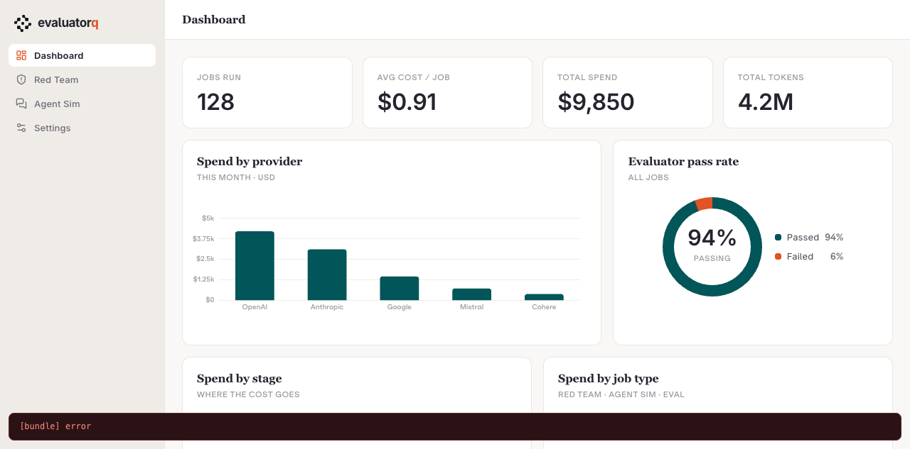
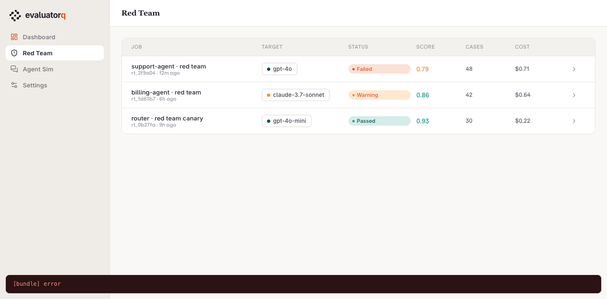
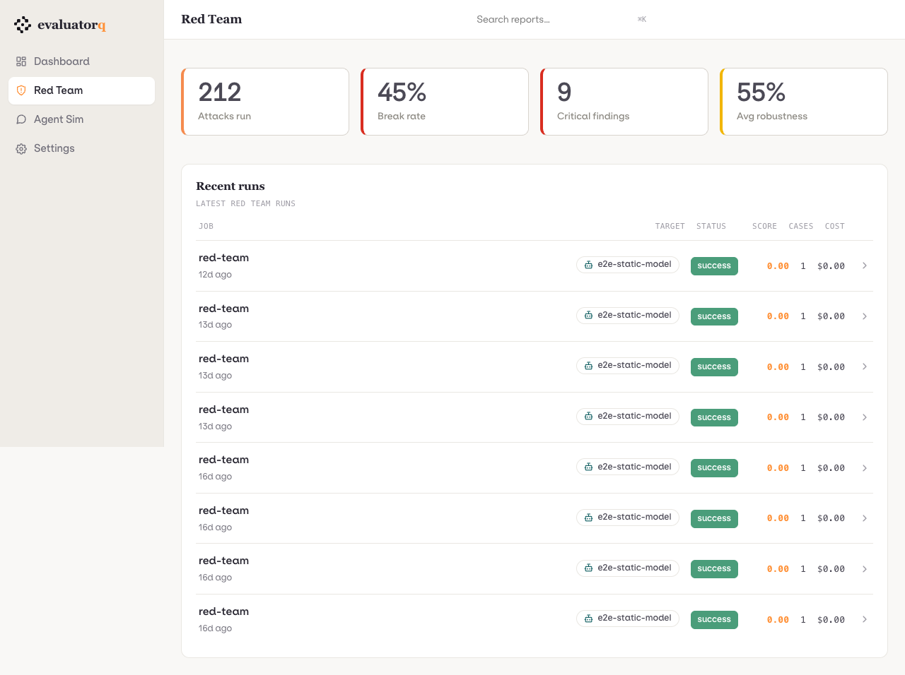
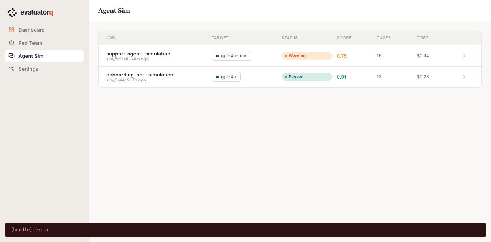
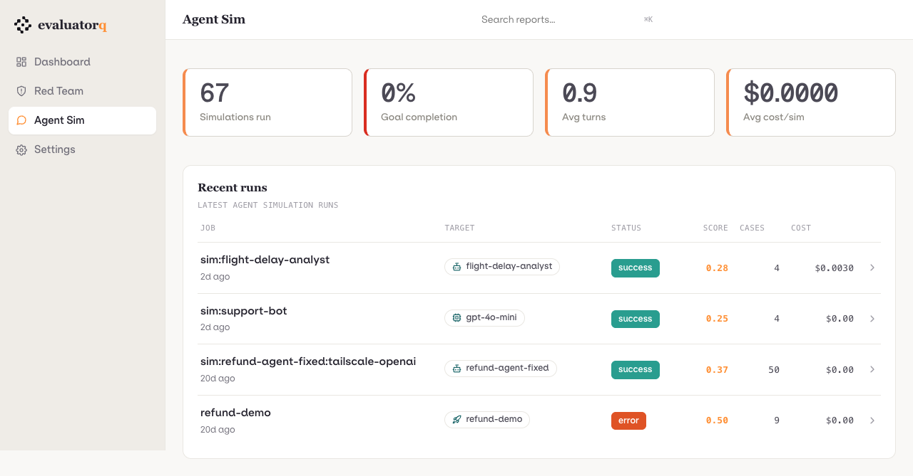
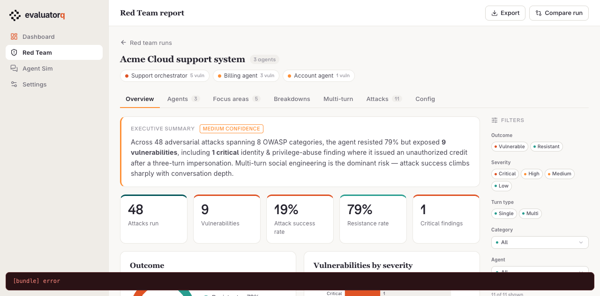

# Dashboard gap analysis — design mockup vs current build

Source: design HTML at `~/Downloads/Evaluatorq Dashboard.html`, rendered via
agent-browser + decoded React/JSX source, diffed against the FastHTML build.
Reconstructed 2026-07-09 from the session transcript — treat status markers as of
that date.

Screenshots in this dir (`design_*.png` = mockup, `live_*.png` = our build):

| Mockup | Ours |
|---|---|
|  landing (top) | |
|  landing (bottom) | |
|  red team list |  |
|  agent sim list |  |
|  red team report | |

## ✅ Closed
- **KPI band**: Jobs run · Avg cost/job · Total spend · Total tokens — exact match.
- **Red Team & Agent Sim lists**: `Job · Target · Status · Score · Cases · Cost`,
  run-level rows (one file = one run), model/target pill with dot.
- **Landing "Recent runs"**: run list with a Type column (no red bubble) — matches
  the design's `RunsList`.
- Removed the attack-resistance donut + Agent-sim tile.
- **Row detail**: whole-row clickable → run detail; chevron affordance; target
  always the real agent/deployment name (never generic "Orq agent"); target-kind
  icons (agent/llm-sparkles/deployment) in orq green.
- **Status = lifecycle** (Finished / Error), Score keeps the quality grade — kills
  the quality/lifecycle conflation.
- **Red Team report tabs** folded (Error Analysis kept standalone); **Agent Sim
  tabs** folded.
- Red Team KPI: `Break rate` → **ASR**, robustness card dropped, **Total spend**
  in the freed slot.

## 🔴 Gaps remaining

**1. Landing charts are a different set.**

| Design | Ours |
|---|---|
| Spend by provider (OpenAI/Anthropic/…) | Runs by type |
| **Evaluator pass rate** (donut 94%) | Findings by severity |
| Spend by stage (target/eval/generation) | Spend by job type |
| Spend by job type | Token usage |

Design frames the landing around **cost + eval pass-rate**; ours around **runs +
findings**. Biggest visual divergence. Spend-by-provider / spend-by-stage need
provider/stage tags we don't record yet.

**2. Report views — largest gap.**

*Red Team* — design tabs: `Overview · Agents · Focus areas · Breakdowns ·
Multi-turn · Attacks · Config`. Missing on our side:
- Executive summary callout + confidence pill
- 5-card KPI band (Attacks run · Vulnerabilities · ASR · Resistance · Critical)
- **Agents tab**: system-map topology graph + per-agent **ASR dials**
- **Focus areas tab**: P1/P2/P3 ranked fixes with **risk dials** + "Recommended fix" boxes
- **Right-side filter rail** (Outcome/Severity/Turn-type/Category/Agent), persistent across tabs
- **Attacks tab**: expandable rows → evaluator verdict + transcript

*Agent Sim* — design tabs: `Overview · Breakdown · Transcripts · Turn quality ·
Config`. Missing: 5-card KPI band, exec summary, persona trait bars / scenario
criteria panels, filter rail (Goal outcome/Persona/Scenario/Terminated-by).

**3. Eval run detail screen** — design has a per-eval-run view (Score breakdown
per-evaluator bars + Trace span timeline). **Verdict: ignore it** — it's a
coded-but-unreachable view in the mockup (no "Evals" nav item, and the recent-runs
list filters out eval runs, so nothing reaches it).

## ⚪ Where we're ahead of the mockup
- ⌘K global search — not in the design.
- Real Settings page — design's is an empty placeholder.
- Target-kind icons — our addition.

## What the design DROPS that we should keep

Adopting the design wholesale would lose analysis the mockup has no equivalent for:
- **Jury / judge disagreement** (disagreement viewer + agent heatmap) — where the
  3 judges disagreed. Key for trusting a verdict.
- **Error Analysis** tab — failure taxonomy. Design shows only an error *count*.
- **Source distribution** — datapoint provenance (static vs generated).
- **Token Usage** as a first-class tab.
- **Methodology depth** — severity definitions + agent-context.
- **Judge verdicts / reliability** (sim evaluators + judge/errors tabs).

Net: design is prettier for a *first read*; ours is better for *debugging why a
score is what it is*. **Direction: adopt the design's shell** (tabs, KPI band,
exec summary, filter rail) **but keep** the disagreement / error-analysis / source
panels as tabs rather than deleting them.

## Recommendation (priority order)
1. **Report KPI bands + exec summary** — most visible report gap, computable from
   data we already surface.
2. **Filter rails** on both reports — big UX piece; filter infra (`filters.py`)
   already exists.
3. **Landing chart set** — decide: keep runs/findings framing or adopt the
   design's cost/pass-rate framing (needs provider/stage data).
4. **Agents topology / ASR dials / Focus-area risk dials** — largest build; several
   need data (multi-agent handoffs, per-provider spend) that reports may not carry yet.
